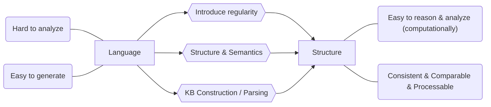

# Glossary

#### ILP

Inductive Logic Programming. // TODO

#### EBL

Explanation-based Learning.

#### Knowledge Base

Set of sentences in formal language.

#### Lexicon (词典)

Natural language description and meaning.

#### Ontology

A more complete definition of concept, graphical conceptual model.

#### Thesaurus (词库)

Simple relationship between words. (synonyms 同义词, antonyms 反义词, homonyms 同声异义词), often uses with taxonomy.

#### Taxonomy (分类)

Hierarchical arrangement of concepts, often uses as backbone for ontology

#### Lemma & Word form

e.g. ***bank*** and ***sing*** are lemma, but ***banks*** and ***sung*** are word-form.

#### Senses

A lemma can have different senses (i.e. meaning), a sense is discrete representation of one of the lemma's meaning.

#### Polysemy (多义性)

//TODO

#### Clause

A clause is a sentence with only one predicate (/one verb).

#### Simple Sentence

A sentence that only has one clause.

#### Complex Sentence

A sentence that contains coordinate clause or sub-coordinate clauses. Note that some subordinate clauses are required; a complex sentence only has one matrix/main clause be can have potentially many subordinate clauses.

#### Independent Sentence

//todo

# What is AI

There are many definitions of AI, addressing different aspects.

- Think humanly
- Think rationally
- Act humanly
- Act rationally

Rational means do the "right thing" with the given information, it is measured against an ***ideal result***. Humanly means can it do it like human, it measures the fidelity (保真度) when compared to ***human performance***. Thinking focus on ***thought process*** and ***reasoning***, while acting focus on ***behaviors***.

## Act Humanly: The Turing Test Approach

This covers most fields of AI, in order for a computer to pass Turing Test, it must be the case that the machine possess the following:

- **Natural Language Processing**: Understand what the person is talking.
- **Knowledge Representation**: Store information given by the person.
- **Automatic Reasoning**: Draw new conclusion from the information stored.
- **Machine Learning**: Adapt new circumstances and detect and extrapolate patterns.

Turing Test deliberately avoid physical contact, in the case of ***total Turing Test*** where video is included, the machine will need:

- **Computer Vision**: To perceive objects.
- **Robotics**: To stimulate humane movement.

## Act Rationally: The Rational Agent Approach

An agent is simply something that act. A rational agent is something that perform action that gives best outcome. One way is to draw logical conclusion with the given information. Note that correct inferences is not all of rationality, some rational acting cannot say that it is draw from logical reasoning, for example, snap finger away when it touch something hot.

All the skills needed for the Turing Test also allow machine to act rationally. This approach has two advantages over the others. Firstly, it is more general since "law of thought" is just one of the way to achieve rationality. Secondly, it is more amenable (适合的) to scientific development than other which based on human behaviors / thoughts.

## Think Humanly: The Cognitive Approach

If we say a machine think like a human, than it must be able to determining how human thinks. We have to get into the human brain and understand it. There are three ways to achieve it.

- Introspection: Capture your own thought.
- Psychological Experiments: Observe human in action.
- Brain Imaging: Observe human brain in action.

The distinction here is that the followings are separated:

- A good model of human performance
- Performs well on a task.

## Think Rationally: The Law of Thought Approach

This is about the "right thinking". In order to understand this we have to know what govern the thinking process, which I believe is --- logic. For example, if Rob is a man and all men are evil then Rob is evil. There are two main obstacles in this approaches.

- It is not easy to convert informal knowledge to formal representation as required by logical deduction to infer, particularly when the knowledge is less than 100% certain --- anything we deduce from incorrect knowledge will be incorrect.
- It is computationally expensive, simply a few thousand facts can exhaust computational resources unless there is some kind of guidance.

# Representation

Knowledge representation is important because it determine the information's fidelity and how easy we can make use of them --- we want a universal representation.



Sometimes we also remove some reality and enhance the other, for example, google map does not necessary show the landscape but it is a kind of representation of the locations.

Note that **representation deeply impact learning**, e.g. different coordinate systems can perform different task using different algorithms and comes with different efficiency and understanding.

Representing apple:

- Symbolic

  An apple is a sweet, edible fruit produced by an apple tree (Malus pumila). Apple trees are cultivated worldwide and are the most widely grown species in the genus Malus. The tree originated in Central Asia, where its wild ancestor, Malus sieversii, is still found today. Apples have been grown for thousands of years in Asia and Europe and were brought to North America by European colonists. Apples have religious and mythological significance in many cultures, including Norse, Greek and European Christian traditions.

- Embodied

  

How do we introduce regularity? We need to find regularities and create structural / logical form of the information, then we can perform logical inferences on it. But this is not the full story, we also need to combine the **formal meaning representation** and the **inference model** and form **semantics**, this is because we do not want something that is syntactically correct but meaningless.

## From text to structure

1. Named Entity recognition, disambiguation
2. Co-reference resolution
3. Relation extraction

After this we can have a semantic representation of then language and answer questions.


# Grammar

## POS-Tagging

So our first step is named entity recognition and disambiguation, first of all, why do we need this? Well, let see the word *book* in the following sentences:

- **Book** that flight - ***verb***

- hand me that **book** - ***noun***

  We see that although they are the same word, it plays different role in different context, thus we use POS-Tagging to determine the role of each word in the sentence.

## Equivalence

If different grammars can generate same set of sentences, it is **weak equivalence**, and every CFG has a weak equivalence form.

If different grammars can generate same set of derivation trees, it is **strong equivalence**, note that strong equivalence implies weak equivalence and two different grammars have strong equivalence implies that one of the grammar has useless rules and everything else in the grammar is the same.

### Normal Form

So we want to eliminate the useless rules in the grammar so that we can check if two grammars are identical.

**Chomsky Normal Form (CNF)** is a normal form that says all rules in CFG must be in these two forms:
$$
\begin{align*}
A \rightarrow\ &BC\ &\text{A,B,C are non-terminal}\\
A \rightarrow\ &a\ &\text{A is non-terminal and a is terminal}\\
\end{align*}
$$


### [Noun](https://en.wikipedia.org/wiki/Noun) NN(S) (名词)

Name of entities. Such as `cat` and `building`, tagged NN. When we have the plural form, `cats` and `buildings`, it is tagged NNS.

- The **cat** sat on the **mat**.
- Please hand in your **assignments** by the **end** of the **week**.
- **Cleanliness** is next to **godliness**.
- **Plato** was an influential **philosopher** in ancient **Greece**.

#### Proper Noun NNP(S)

When we refer to an unique entity such as person `John` and `Mary`, we have a proper noun, tagged NNP. When we have the plural form of them, such as `Johns` and `Marys`, it is tagged NNPS.

### [Pronoun](https://en.wikipedia.org/wiki/Pronoun) (代词)

Used to represent noun.

- **I** love **you**.
- **That** reminds **me** of **something**.
- **He** looked at **them**.
- Take **it** or leave **it**.
- **Who** would say such a thing?

#### Personal Pronoun PRP

This category includes personal pronoun proper such as `I`, `he` and `they` and reflexive pronoun ending `-self` or `-selves` such as `themselves` and `herself`. As well as `mine`, `hers`, `ours`, `theirs`.

#### Possessive Pronoun PRP$

This category includes adjective possessive forms such as `my`, `her`, `your`, `one's` `their` etc.

#### Possessive ending POS

the `'s` and `'` are tagged individually, such as `John\NNP 's\POS idea\NN`.

### [Verb](https://en.wikipedia.org/wiki/Verb) (动词)

Conveys an action.

- I **washed** the car yesterday.
- The dog **ate** my homework.
- John **studies** English and French.

#### Base form VB

For normal verbs.

#### Past tense VBD

For `-ed` verbs.

- He **rowed** the boat.
- She **rode** the horse.

#### Gerund / Present participle VBG

For `-ing` verbs.

#### Past participle VBN

For `-ed` verbs but follows words such as `have` and `has`.

- He has **rowed** the boat.
- She has **ridden** the horse.

#### non-3rd person singular present VBP

It is for verb that follows a singular 3rd person subject but precedes by a modal verb. 

- She can **speak** three languages.
- He must **like** football a lot. 

#### 3rd person singular present VBZ

It is a verb that adds an `-s` or `-es` because they follows a singular 3rd person subject.

- Man **hunts** and **searches** on his whirling globe and whenever he `unearths` a miniature truth within his environ, he **thinks** himself close to the peak of science.

#### Modal Verb MD

These are words that does not end with `-s` in their singular form, such as `could`, `shall` and `will`.

### [Adverb](https://en.wikipedia.org/wiki/Adverb) RB (副词)

Words that modify verb or verb phrase, this includes most words end with `-ly` as well as words like `quite`, `too` and `very`; post marker like `enough` in `good enough` and `indeed` in `very well indeed`; negative markers like `not` and `never`.

- She sang **loudly**.
- I worked **yesterday**.
- She drove us **almost** to the station.
- **Even** numbers are divisible by two.
- **Internationally** there is a shortage of protein for animal feeds.

#### RBR & RBS

Basically comparative & su perlative adverb that used to modify verb or verb phrases.

### [Adjective](https://en.wikipedia.org/wiki/Adjective) JJ (形容词)

Words that modify noun or noun phrase.

- That's an **interesting** idea.
- That idea is **interesting**.
- Tell me something **interesting**.

### Wh-words (疑问词？)

#### Wh-determiner WDT

For `Which`, and `that` when used as a relative pronoun.

- **Which** plane is he catching?
- **Which** one would you like?
- **Which** of these colors shall we use?
- A cake **that** shines.

#### Wh-pronoun WP

The pronouns `who`, `whose`, `which`, and `what` that can be the subject or object of a verb.

- **Who** can help me?
- **Whose** is the new sports car outside?
- **Which** was your best subject at school?
- To **whom** did you speak?
- With **whom** did she go?

#### Possessive wh-pronoun WP$

For word `whose`.

#### Wh-adverb WRB

The adverb `wh-` words, `when`, `where`, `how` and `why`, always make the sentence follow the interrogative word order.

- **When** will they arrive?
- **When** shall I see you again?
- **Why** is the baby crying?
- **Why** are you saving your money?
- **How** many packs do you want?
- **How** many do you want?

### Particle RP (助词)

words that do not change their form through inflection and does not easily fit into the part-of-speech system. For example, `up` in `look up` and `out` in `knock out`.

### TO TO

Infinitive `to`. 

- We started our journey early so as **to** avoid the traffic.
- They spoke quietly in order not **to** wake the children.

#### Comparative JJR

Words with comparative ending `-er` and comparative meaning are tagged as JJR, the exceptions are `more` and `less`, they have a strictly comparative meaning thus should be tagged as JJR; but word such as `superior` and `further` are tagged as JJ because they either does not have a strict comparative meaning or does not end with `-er`.

#### Superlative JJS

Words with superlative ending `-est` are tagged as JJS. For `most` and `least`, they are tagged as JJS when used as adjective but other words such as `first`, `last` and `unsurpassed` should be simply tagged JJ.

### [Conjunction](https://en.wikipedia.org/wiki/Conjunction_(grammar)) CC (连词)

Connect words, phrases or clauses.

- They do not gamble **or** smoke, for they are ascetics.
- You **either** do your work **or** prepare for a trip to the office.
- That's fine **as long as** you agree to our conditions.
- We'll do that **after** you do this.
- I really appreciate you waiting **while** I finish up.

### Determiner DT (冠词?)

It is a word, phrase or [affix](https://en.wikipedia.org/wiki/Affix) that attached to a noun or noun phrase which used to express reference to that noun or noun phrase.

- **The** girl is **a** student.
- I've lost **my** keys.
- Give **me** money.
- **Which** book is that?
- **Both** windows were open.

This category includes

- articles such as `a`, `an` and `every.`
- demonstratives such as `this` and `that.`
- quantifiers such as `all`, `some`.
- distributive determiner such as `each` and `either`.
- interrogative determiner such as `which` and `whose`.

####  Predeterminer PDT

When determiner precedes another determiner or  possessive pronoun it is called predeterminer. This is because any noun phrase can only has one determiner.

- **all** his marbles
- **both** the girls
- **half** his time
- **quite** a mess
- **rather** a nuisance

### [Preposition](https://en.wikipedia.org/wiki/Preposition_and_postposition) IN(介词)

Express spatial or temporal relation.

- the weather **in** March.
- The key is **under** the stone.
- sleep **throughout** the winter.
- sick **until** recently.

### [Interjection](https://en.wikipedia.org/wiki/Interjection) UH (感叹词)

Words that express spontaneous feeling.

- **Shh!**
- **Wow!**
- **ouch!**

### Existential `there` EX

It is an unstressed `there` which trigger invasion of the inflated verb and logical subject of the sentence. For example, `there was a party in progress`.

### Cardinal Number CD

For words such as `1`, `241` and `third`.

### Foreign Word FW

It is the foreign words, note that `e.g., etc., i.e.` are abbreviations of foreign terms so they are tagged FW.

### Symbol SYM

This tag is used for mathematical, scientific and technical words or expressions that aren't English, for example `/[=*`. Note that the English name of the symbol such as `Carbon Dioxide` should be tagged as NNP.

### List Item Marker LS

Letters and numerals used to identify item in a list.

### Differences

> There are [much more](http://groups.inf.ed.ac.uk/switchboard/POS-Treebank.pdf) than listed here.

#### JRR & RBR

- This is a **faster/JRR** car than the previous one.
- He has a **higher/JRR** degree than me.
- Can you speak **faster/RBR**.
- He can jump **higher/RBR** than me.

#### Number

- **One/CD** of the best reason.
- **One/NN** of a kind.
- **One-third/JJ** cup.
- **One-third/RB** the amount.

#### DT & NN & PDT

- **All/DT** girls.
- I can't stand **this/DT**.
- **All/PDT** the girls.

#### DT & WP$

DT precedes an noun while WP$ precedes a verb.

|             | **Determiner**           | **Possessive wh-Pronoun** |
| ----------- | ------------------------ | ------------------------- |
| ***what***  | What color is his house? | What did she buy for him? |
| ***which*** | Which side is better?    | Which do you prefer?      |
| ***who***   | -------                  | Who did you meet today?   |
| ***whose*** | Whose car is this?       | Whose is this car?        |
| ***whom***  | -------                  | To whom did you send it?  |

# First Order Logic (FOL)

Now we know what are the roles in a given sentence, in order to do semantic parsing, we have to convert/map it to some kind of formal representation.

# [Phrase Structure Parser](https://en.wikipedia.org/wiki/Phrase_structure_rules)

Basic clause structure is understood in terms of a binary division of the clause into subject (noun phrase NP) and predicate (verb phrase VP). The phrase structure rules are the following:
$$
\text{S} \rightarrow \text{NP VP} \\
\text{NP} \rightarrow \text{(Det) N} \\
\text{VP} \rightarrow \text{(AP) N (PP)}
$$

- **Subject** (主语)

  Subject can be view as the noun which controls the verb or verb phrase. If the sentence has no verb or verb has a different subject, for example *John* in *John --- I can't stand him!* is not grammatically subject but the topic of the sentence.

- **Predicate** (谓语)

- **Head** (中心词)

  Head of a phrase is the word that determine the syntactic category of the phrase. For example, *water* is the head in *boiling hot water*.

- [**Noun Phrase**](https://en.wikipedia.org/wiki/Noun_phrase) NP (名词词组)

  Noun phrase is a phrase that has a noun as its head or perform the same grammatical function as noun.

- [**Verb Phrase**](https://en.wikipedia.org/wiki/Verb_phrase) VP (主谓短语 / 动词词组)

  - Mary ***saw* the man through the window**.
  - David ***gave* Mary a book**.

- [**Adjective Phrase**](https://en.wikipedia.org/wiki/Adjective_phrase) AP (形容词短语)

  It is a phrase which the head is a adjective. For example, *very happy* and *quite upset about it*. 

  - Sentences can contain **tremendously *long*** phrases.
  - He is ***faster* than you**.
  - The people are ***angry* with the high prices**.

- [**Propositional Phrase**](https://en.wikipedia.org/wiki/Adpositional_phrase) PP (介词短语)

  - She walked ***to* his desk**.
  - They walk **up the stairs**.
  - ***As* a student**, I find that offensive.

- [**Adverb Phrase**](https://en.wikipedia.org/wiki/Adverbial_phrase) ADVP (状语?)

  - They repaired my car ***very* quickly**.
  - He worked ***extremely* hard** in the game.
  - She did ***really* well** in her race.
  - Why are you leaving ***so* soon**.

#### Dependency & Constituency Grammar

Dependency grammar connects words by their relationship; it forms a tree where each node is a word and children node depend on the parent node and the relationship is labeled on the edges.

Constituency grammar on the other hand forms a tree by breaking sentence into sub-phrases. Each sub-phrase is labeled by a non-terminating node and terminating nodes are words in the sentence.

# Open Information Extraction (OpenIE / OIE)

In Natural Language Processing (NLP), OIE is the task to generate machine-readable representation of information in text, usually in forms of triples and n-ary propositions. (e.g., "Dante wrote the Divine Comedy" is represented as ("Dante", "wrote", "Divine Comedy")).

# [Resource Description Framework](https://www.w3.org/TR/rdf11-primer/) (RDF)

This is a framework that express information about the resources. It is now commonly used for modeling information about web resource so that it is machine-readable. It provide a standard-compliant way for datasets to interlink, enrich each other and allow cross-dataset queries to be performed.

RDF allows us to make statements in the form of triple: *\<subject\> - \<predicate\> - \<object\>*. Subject and object denote the two resources being related and predicate denote the natural relationship between two resources. Note that  The relation goes in a directional way from subject to object and it is called a property. we can build a graph using triples and use [SPARQL](https://www.w3.org/TR/sparql11-overview/) (a language for querying RDF) to query things like people who interested in paintings by Da Vinci.


There are three types of data that can appear in the triple: International Resource Identifiers (IRIs), literals and blank node. 

- **IRIs**

  It can appear in **all three positions** of the triple, it is used to identify resources such as documents, people and object. For example IRI for Da Vinci in DBpedia is http://dbpedia.org/resource/Leonardo_da_Vinci.

- **Literals**

  Literals can only appear in the **object position**, they are used to denote basic values that are not IRIs, for example a date *20-July-2012* or a number *3.1415926*. It can be associate with a language tag such as *fr* for France and *zh* for China, if the literal text is from another language. 

- **Blank nodes**

  Sometimes we want to talk about a resources without bothering to use a global identifier. It can appear in the **subject and object position**. For example, a background tree in Da Vinci's painting which we know to be a cypress tree:

  

  This data model allowed us to form triples, but so far triples' content can be anything, therefore it is not very useful, so it is often combined with some form of schema that provide semantic meaning to component of triples. The RDF schema is one way of giving it some meaning.
  
  The RDF schema uses triples to categorize resources into classes, a **type** is used to represent what kind of categorization is used between triples and classes; and the type of categorization itself consists of two kinds of restrictions --- **range** and **domain**. The main modeling constructs are shown in the table below:
  
  | Construct                                                    | Syntactic form                     | Description                                                  |
  | ------------------------------------------------------------ | ---------------------------------- | ------------------------------------------------------------ |
  | [Class](http://www.w3.org/TR/rdf-schema/#ch_classes) (a class) | **C** `rdf:type rdfs:Class`        | **C** (a resource) is an RDF class                           |
  | [Property](http://www.w3.org/TR/rdf-schema/#ch_property) (a class) | **P** `rdf:type rdf:Property`      | **P** (a resource) is an RDF property                        |
  | [type](http://www.w3.org/TR/rdf-schema/#ch_type) (a property) | **I** `rdf:type` **C**             | **I** (a resource) is an instance of **C** (a class)         |
  | [subClassOf](http://www.w3.org/TR/rdf-schema/#ch_subclassof) (a property) | **C1** `rdfs:subClassOf` **C2**    | **C1** (a class) is a subclass of **C2** (a class)           |
  | [subPropertyOf](http://www.w3.org/TR/rdf-schema/#ch_subpropertyof) (a property) | **P1** `rdfs:subPropertyOf` **P2** | **P1** (a property) is a sub-property of **P2** (a property) |
  | [domain](http://www.w3.org/TR/rdf-schema/#ch_domain) (a property) | **P** `rdfs:domain` **C**          | domain of **P** (a property) is **C** (a class)              |
  | [range](http://www.w3.org/TR/rdf-schema/#ch_range) (a property) | **P** `rdfs:range` **C**           | range of **P** (a property) is **C** (a class)               |

\*Don't worry about *rdf* and *rdfs*, they are essentially the same but left different for backward compatibility.

> Informal RDF schema triples examples

```rdf
<Person> <type> <Class>
<is a friend of> <type> <Property>
<is a friend of> <domain> <Person>
<is a friend of> <range> <Person>
<is a good friend of> <subPropertyOf> <is a friend of>
```

Note that although `is a friend of`  is often used as a predicate, it can be used as a subject as well.

> Formal example of N-triples

```rdf
01    <http://example.org/bob#me> <http://www.w3.org/1999/02/22-rdf-syntax-ns#type> <http://xmlns.com/foaf/0.1/Person> .
02    <http://example.org/bob#me> <http://xmlns.com/foaf/0.1/knows> <http://example.org/alice#me> .
03    <http://example.org/bob#me> <http://schema.org/birthDate> "1990-07-04"^^<http://www.w3.org/2001/XMLSchema#date> .
04    <http://example.org/bob#me> <http://xmlns.com/foaf/0.1/topic_interest> <http://www.wikidata.org/entity/Q12418> .
05    <http://www.wikidata.org/entity/Q12418> <http://purl.org/dc/terms/title> "Mona Lisa" .
06    <http://www.wikidata.org/entity/Q12418> <http://purl.org/dc/terms/creator> <http://dbpedia.org/resource/Leonardo_da_Vinci> .
07    <http://data.europeana.eu/item/04802/243FA8618938F4117025F17A8B813C5F9AA4D619> <http://purl.org/dc/terms/subject> <http://www.wikidata.org/entity/Q12418> .
```

Each IRI is enclosed in `<>` and literal can be follow by `^^<IRI to datatype>` to specify the datatype of the literal, for example `"1990-07-04"^^<http://www.w3.org/2001/XMLSchema#date>`. Because the datatype string is ubiquitous, N-triples allow user to omit its datatype, so `"Mona Lisa"` is same as `"Mona Lisa^^xsd:string"`, in case of language tag, it is appended directly after the string separated by `@` symbol: `"La Joconde"@fr`.

# Verb Net Semantics

- The role refers to relationship between arguments and predicates.
- The features of the parent class is shared in the child class. e.g. *abcd-9.2* is parent of *abcd-9.2-1*.


# Miscellaneous

#### lec2

- Syntax define the formation of sentences, it is very useful as it allow us to breakdown and parse the sentence, it is a very precise and provides an interface to connect morphological component (形态) to semantic component (语义).

  But syntax is different in every language, ideally we want an universal representation --- what do different language have in common?

  - Sentences can be analyze into subject, verb and object.
  - Nouns can be seems as agent or patient.

  *A sentence with one predicate is called a clause (predicate sometimes means verb).

  And they are different in:
  
- Linear order of elements.
  - Lexicons.
  
  Our goal is to find a syntax for universal (human) grammar.
  
#### lec3

- To understand human language, we want to build a representation of knowledge that allow us to do semantic references. In the simplest form, we can have an **atomic preposition** which consists of a predicate and argument.

  - If we take a sentence and remove the entities, we have the notion of a **predicate**, it express the relationship between entities. The entities bound in a relationship by its predicate are entities, for example, `TALLER(a,b)`, `NEAR(x,y)` are predicates, more specifically, they are binary predicate, because they takes two arguments to form a coherent proposition. 

    Predicates comes in different number of arguments and can be nested such as `PROUD(s, GRADUATE(s))`.

    We can have quantifier on predicate, e.g. $\forall x(MAKE(g,x))$, and variable that does not bound by a quantifier is a **free variable**. A proposition that has free variable is called a **open proposition**, it cannot be stated whether truth or false; no free variable is called a **close proposition**, they have different semantic properties.

    We also have negation `~` , `&` and `->` for expressing $\neg$ , $\and$ and $\rightarrow$.

  - Sometimes, the argument can be missing in natural language (i.e. used **elliptically**), for example `Denny is taller` is a valid sentence, but for preposition, we cannot form something meaningful. This is not an easy problem, it can be hard to figure out which entity a sentence is refering to and do the right binding to predicate.

  - Another problem when we map natural language and logical form is that same predicate can have different number of arguments, it is not easy to decide which predicate to use.

  Some examples:

  - Bill hates all reporters.
    $∀x(REPORTER(x) → HATE(b, x))$
  - Clive gave a bone to every dog.
    $∀x(DOG(x) → GIVE(c, a bone, x))$
  - The book was signed by every guest.
    $∀x(GUEST(x) → SIGN(x, the book))$
  
  Note that we do not do $\exists x(FAKE(x)\ \&\ RUBY(s))$ to express fake ruby, instead we do $\exists x(FAKE\ RUBY(x))$ because the former representation is not intersective. 

#### lec4

- We can use more complex expression cope with more complex natural language phrases. Here we use function-argument application as basic semantic glue --- $\lambda$expression. There are two semantic types:

  - **e**: entity
  - **t**: truth value
  - if **a** and **b** are types then `<a,b>` is a function type, which means `a --> b`, i.e. from **a** type to **b** type.

  ```mermaid
  graph TB
  C --- F["F = type&lt;B, C&gt; function"]
  C[type C] --- B[type B argument]
  classDef borderless fill:#00000000, stroke-width: 0;
  class C borderless;
  class B borderless;
  class F borderless;
  ```

  The function **F** combine with **type B** to form **type C**; **F** is **type \<B,C\>**.

  ```mermaid
  graph TB
  title[<div>The dog</div>]
  title-->C
  style title fill:#0000,stroke:#0000
  linkStyle 0 stroke:#FFF,stroke-width:0;
  
  C[e] --- F["The&lt;&lt;e,t&gt;,e&gt;"]
  C --- B["Dog&lt;e,t&gt;"]
  classDef borderless fill:#00000000, stroke-width: 0;
  class C borderless;
  class B borderless;
  class F borderless;
  ```

  Here `dog` itself is a set, it does not points to any specific `dog` entity, it is a unary predicate which has the form `<e,t>`, the word `the` points to a specific element in a given set, it takes in a set `<e,t>` and yields a specific `dog` entity.

  // todo: connection?

  From the previous lecture, we see that there we can express a sentence in the predicate form:

  - Harriet gave <u>the parcel</u> to Donald is expressed as $GAVE(Harriet, parcel, Donald)$.

  We want to analyze the sentence in their functional form, that is, extracting the variable from the sentence. If we  let the parcel be a variable, and extract it using lambda expression, then we have:
  $$
  \lambda x[GIVE(Harriet, x, Donald)]
  $$
  We can have multiple lambda expression and the order is different from programming, the lambda extraction is  symmetry and the argument map inversely. 

  

  Now if we are given a word, e.g. dog, we will know how it expected to behave:
  $$
  \overset{\overset{\Huge{N}}{\rule{1px}{30px}}}{\lambda x[DOG(x)]}
  $$
  

  that is, given a $x$, if $x$ is a dog then $DOG(x)$ must be true.

  Some examples:

  

  We can select a element from a set in a simplified way using the $\iota$ (iota) operator.

  

  // todo: is this the simplest form? why do we need "a" here? how about "some of", "every" and "all of" that 

  // select some elements from the set?

  $\iota$ is useful because it allow us to convert phrase like:

  - $\parallel the\ apple\parallel\ = \iota x(apple(x))$.

  We can also assign a constant any $a$ to that element:

  - $\iota x(apple(x)) = a$.

  When a lambda expression receives its argument, we can apply **lambda reduction** to convert back to its predicate form:

  

  By applying lambda reduction up the phrase structure tree, we can obtain a notion of the sentence:

  

  Lambda  expression of adjective can have different form: //todo

  

  

  Different type of node's lambda:

  

#### lec5

- Combinatory Categorical Grammar

- It is a kind of formalism that have light weight rule. It breaks a sentence into categories and combined according to their function-argument structure. Arguments includes primitive types: NP, NN, S, PP... and other information such as number and inflection (拐点？). Function is something that takes a type and produce another. Backslash indicate the argument is on the left while forward slash indicate that the argument is on the right.

- We want to do inference, but we can only do it in a logical representation

  

  
  
  Referring to database entities:
  
  - Noun phrases: database entity
  - Verb: relation between database
  
- Noun: can be column in the database, referring to a set of entities, typing
  - Function Words: Used for syntactically modifying the sentence
  - Definite Determiner: selects an entity from a set when such exists
  - Indefinite Determiner: selects an entity from a set without a preference
  - Superlatives: selects an entity with the maximum according to some criterion, we can inject some kind of an `argmax` function.
  - Question Type Sentence
  
  Example:
  


#### lec6 

- we have seem how to go from natural language to logical form, but it is still hard for us to answer question like

  > - The ball roll out of the bag
  > - Where was the ball?

  We need to have some kind of state and path thing in order to figure out the answer.

  **Localist role** (描述物体变化和影响) which involved a certain state and transition from a **source** to **goal**, then we have something abstract called **theme**, can be a **instruction**, can be the path the source is taken to goal.

  [ball] (theme) rolled [out of the bag] (source); [ball] (source) rolled [into the bag]  (goal)

  - **Agent/Actor and Patient** (描述事物影响，硬核层面), Actor is the source of force; the one causing the event; the one moving; conscious or sentient. The patient is the one undergoes changes; stationary and target of force and energy.

    Agent is the energy source and the patient is the energy sink. [John] (actor) patted [Lassie] (patient)

  - **Change-of-State** (COS) Theme. Some motion involves a path which is neither a source nor a goal.

    [The rocks] (source) dripped [water] (theme). [The glider] (source) drifted [through the cloud] (path)

  - **Recipient and benefactive** (描述事件受益/接收者，空间/隐喻层面).

    Liam show the [photos] (theme) [to his girlfriend] (recipient).

  - **Experiencer and Stimulus** (描述事件感受者，感官/情感层面). Such verb causes this event is called **psych verb** (a verb that express mental state or event). 某种感官

    [Jones] (experiencer) smelt [smoke] (stimulus); [Lassie] (experiencer) saw the [approaching posse] (stimulus)

  - **instrument**: He open the door [with an old key]; She mixed the concrete [with a piece of broom handle].

  - **Manner**: He played it [very well].

  - **Measure**: The whole set costs [two thousand pounds].

  There are also something that are tricky to encode, for example, when we say swim, we know that it involved some kind of liquid and movement, but we can encode the meaning of it at some kind of level, this system is quite basic.

  In the end, for each verb we can gather all its role possibilities called theta roles (**$\theta$-role**) and store them in the inventory in the form of e.g. $give <agent, theme, recipient>$.

  

  

  Note that what we are doing so far for verb stops at the lexicon level, lets explore deeper. **Lexical Conceptual Structure** (LCS) is type of modelling that attempts to capture the more fundamental feature of the verb. The roles can be reached with more primitive type of predicate. This kind of representation is called **schemata**.

  - **Do** is a operator proposed to symbolize the agentivity involving volition (意志) and/or control. it accepts two arguments, an agent and an event. e.g. Jones walked; DO(A, [walk(A)]). If the do is not capitalized then it express a weakly defined agent, it is not the main focus of the sentence. e.g. the branch broken the window; here we use *do* on branches, but it is not the main focus of the *broken* event, it is merely used to express the notion of causer: do(the branch) CAUSE [BECOME[broken(window)]].
  - **Cause**, it is used in the common sense way, e.g. The sun melted the chocolate; CAUSE[the sun, [BECOME [melted(chocolate)]]].

  We can also introduce a new predicate to make it more specific that a verb is associated with a field, i.e. feel:

  

  We can use connective to express multiple events, $\&$ means happens subsequently and $\and$ means happens simultaneously; ~ means negation.

  

  We can also model the possessive ($F_{poss}$) explicitly.

  

  We can use another version: go + path:

  

  also FOR:

  

  


#### lec7

We saw that we can turn simple sentence into predicate-argument form, but what about longer sentence like "Jones buttered his toast slowly with a knife in the bathroom at midnight"? You maybe tempting to express the sentence as: butter(Jones, toast, slowly, with a knife, in the bathroom, at midnight), but what about "Jones buttered his toast slowly" and "Jones buttered his toast in the midnight"?  Words with different meaning clashed and this is not what we want. 

One way to solve this problem is by conjunction and entailment. We encapsulate the whole thing that happened as an event $e$ ($e$ is used to represent a set of events)and bind all elements of the predicate together:
$$
\begin{align*}
\exist e(&BUTTER(Jones, toast, e)\\
&\&SLOWLY(e)\\
&\&WITH(e, a\ knife)\\
&\&IN(e, the\ bathroom)\\
&\&AT(e, the\ midnight))
\end{align*}
$$
This is the **Davidsonian** model, another model is **Neodavidsonian** which split the sentence further to subject and object, for example: "I flew my spaceship to the Morning Star" will become:
$$
\begin{align*}
\exist e(&SUBJECT(I, e)\\
&\&OBJECT(my\ spaceship,e)\\
&\&FLY(e))\\
&\&TO(e,the\ Morning\ Star))
\end{align*}
$$
Combined with LCS we have "Clive sang a song to Marcia", 
$$
\begin{align*}
\exist e(&SING(e)\\
&\&AGENT-SOURCE(Clive, e)\\
&\&THEME(a\ song, e)\\
&\&RECIPIENT(Marcia, e))
\end{align*}
$$
"Sally ran to the shop"
$$
\begin{align*}
\exist e (&RAN(e)\\
&\&AGENT-THEME(Sally, e)\\
&\&GOAL(the\ shop, e))\\
\end{align*}
$$
"Sally bought a pasta machine in Papatoetoe"
$$
\begin{align*}
\exist e(&BUY(e)\\
&\&AGENT(Sally, e)\\
&\&THEME(a\ pasta\ machine, e)\\
&\&IN(e, Papatoetoe))
\end{align*}
$$
There can be two events in one sentence: "Jones saw Lina shake the bottle"
$$
\begin{align*}
\exist e\exist e'(&SEE(e)\\
&\&EXPERIENCER(Jones, e)\\
&\&STIMULUS(e', e)\\
&\&AGENT(Lina, e')\\
&\&SHAKE(e')\\
&\&(PATIENT(the\ bottle, e')))
\end{align*}
$$
We can also represent tense: "Jones will leave", note that we need to put tense before the event


$$
\begin{align*}
\exist t\exist e(&t^*<t\\
&\&(LEAVE(e)\\
&\&AGENT(Jones, e)\\
&\&AT(e,t)))
\end{align*}
$$
We can also create more generic formula:


#### lec8

So far sentences we seem are trivial in a sense that they are just telling some facts, they do not imply some other facts or make claims, for example "Google files for its long waited IPO" also implies that "Google goes public" and "Reagan attended a ceremony in Washington to commemorate the landings in Normandy" also states that "Washington is located in Normandy". These are **textual entailment**. This also means that for each sentence we have to interpret its background information in order to understand what the sentence is trying to say, and sentence can have some hypothesis associated with them. This is still a challenge in many areas of NLP.

- Entailment triggers features
  - **Polarity**: "The oil price surged" implies "The oil price didn't grow".
  - **Antonymy**: "The oil price surged" implies "The oil price decreased".
  - **Adjunct**: "all solid companies pay dividends" -> "all solid companies pay cash dividends".

As a human we make this kind of inferences all the time but problem is that natural language are imprecise and easily confounded by negation, quantifiers, conditions etc..., you do not have much control e.g. explanation. on the other hand FOL and theorem proving is deep and brittle and hard to translate to it. Furthermore, in order to prove a sentence, background knowledge is needed to complete the proof, but from where? We need a better solution, and the answer is **natural logic**. It is a language somewhat in the middle of both, it does not address all the problems but works. It characterizes valid patterns of inference via surface form in a precise way. Below are some **basic entailment lexical relations**:


$A \sqsubseteq B$ means that if we are talking about $A$ then it implies that we are talking about $B$. For example, when you say "eat apple" you are also implying "eat fruit", so $apple \sqsubseteq fruit$. 

- Polarity is the direction a lexicon item can move in the ordering.

We can compose two relation into on e:


We can figure out the relation from the edit on the sentence:


Some explanation:


We can uses the relation to prove some claims (prove by alignment):


1. We first need to know that cat and dog are distinct;
2. and from $P$ we know that it is a cat so we can infer that it is not a Dog.
3. We also need to know that poodle is subset of Dog

So it is not a poodle.

#### Giles lec 7

Modus Ponens:
$$
\overset{\underset{\rule[1pt]{140px}{1px}}{\textstyle A\rightarrow B \ \ \ \ \ \ \ \ A}}{B}
$$


- **Signature**: A signature is a FOL that consists of disjoint set of Functions $F$ and Predicate $P$; and a $arr$ function which will return the arity (number of arguments) when given $F$ or $P$.
- **Function $F$**: A name followed by a bracket where everything inside is term.
- **Term**: A term is a variable or $F$ or $P$; and constant symbol ($F$ with no argument).
- **Atom**: A atom is something that produce a truth value, includes propositions, $term1 \neq term2$ and $F$ with more than 0 arguments.
- **Formula**: All atoms are formula; and $true$, $\neg A$, $A \and B$, $\forall x.A$ where $A$ and $B$ are formulae. 
- **Model**: This is what semantics of FOL is defined in terms of. It captures all possible statements that are consistent with the knowledge base. It is the interpretations that makes a sentence true.
- **Domain Closure**: All elements of the domain are explicitly mentioned.
- **Unique Names**: Different name necessarily means different thing.
- **Interpretation**: assign truth value to every sentence.

Practically we define a set of inference rules that allow us to derive new information with the current information. When we try to interpret on the knowledge base, we do so over a abstract symbolic domain that represent things we are modelling because we want reasoning to work on any interpretation. We will be using FOL to do interpretation.

- Prepositional logic is zero ordered --- we cannot quantify.
- FOL allow us to quantify on individuals.
- SOL allow us to quantify on set/predicate over individuals.

Although QBF or PLFD are useful but they do not increase expressive power --- they can be translate into equivalent prepositional logic. So we use FOL which is more powerful.

FOL does not contains equality adding it as an extension make modelling things easier, so we just add the following to enforce equality:


- every knowledge base in prolog has exactly one model.
- a formula can have many model.


The main task in FOL is consistency checking, this can be used to encode validity and entailment checking, because we can encode question answering as a special kind of entailment checking.

#### Giles lec 8

FOL is undecidable, but there are some fragments are.

- Monadic Fragment: property of individuals.
- Two-variable Fragment: no transitivity can be captured using two variables.
- Guarded Fragment: restriction on how to use variable.
- Prenex Fragment: using quantifiers.


Datalog: A formula is in datalog form if for any $n$, $\forall x.(p_1[x_1]\and\dots\and p_n[x_n] \implies p_{n+1}[x_{n+1}])$, where $p_j[X_j]$ is a predicate symbol apply to list of constants or variables such that $X_1 \subseteq X$ and $X_{n+1} \subseteq X_1 \cup \dots\cup X_n$; this means that all variables are universal quantified and the head does not use variables not used in the body, where LHS is body and RHS is head. If the body is empty then we call it a **fact** else a **rule**.

- Substitution $\sigma$ is a finite mapping function from variables to terms.

- Unification means that for two terms `t1` and `t2` we can find a substitution such that `sub(t1) = sub(t2)`.

- If `t1` matches `t2` then we can find a substitution for `t2` such that `t1 = sub(t2)`.

  A unification is most general if we cannot drop any information and preserve the unification/matching.

Given a knowledge base and a fact, we can derive other facts from the fact as logical consequence (closure) and we can check whether something is entailed.

We can derive the next set of fact by first finding a rule in the database which can substitute the variable with terms we got in the current fact, then we get the head from that rule and add it to the set of current facts we got; until $F_i = F_{i+1}$. The picture below further demonstrate this.


- Matching produce a mapping from variables to terms.

So, given a knowledge base, we want an algorithm that able to produces all consequences in an efficient way.

```python
# a function to check if function1 can be mapped to function2
def match(f1(args1), f2(args2), sigma):
    if f1 != f2: return null
    for arg1, arg2 in zip(args1, args2):
        if isinstance(arg1, variable) and arg1 not in sigma:
            sigma.add(arg1 -> arg2)
        else:
            return null
    return sigma
```

This function allowed us to check whether a function can be mapped to a fact. For example, `match(father(X, Y), father(a, b))` will result in `{X->a, Y->b}`. We can repeated apply this function and checks for all the facts we can derive from a knowledge base:

```python
# given body and ground facts, trys to derive new facts/head that satisfy all 
# statements in the body
def match(body, F):
	matches = {empty_set()}
    for f1 in body:
        new_facts = {}
        for curr_facts in matches:
            for f2 in F:
	            facts = match(f1, f2, curr_facts)
                if facts is not null: new_facts.add(facts)
        matches = new_facts
    return matches
```

The code above perform permutation blindly, clearly inefficient, note that the order of checking impacts performance largely, since the match/3 function terminates earlier if we find something that already in our consequences/facts.

Now for any given `body => head`, by applying the match/2 function, we can check whether existing facts can satisfy the body and successfully substitute into head to form new fact. By doing this repeatedly for all `body => head` in the knowledge base, we can gather all facts derive from some initial facts:

```python
def forward(facts, rules):
    all_facts = facts
    new_facts = {}
    do:
        all_facts.add_all(new_facts)
        new_facts = empty_set()
        for body => head in rules:
            for new_fact in match(body, all_facts):
                if sigma(new_fact) not in all_facts:
                    new_facts.add(sigma(new_fact))
    while not new_facts.empty()
    return all_facts
```

This forward algorithm allowed us to get the closure by returning all possible head (substituted) but it is expensive. There are two optimizations we can make:

- Use a heuristics function to select which facts in the body to match first. e.g. use least frequently occurring name first.
- Find a good data structure that allow us to quickly look up whether a fact is already present. (Such data structure is called term indexes which is really important for efficient reasoning).
- Use previous set of facts to check which rules are relevant and which further facts need to match against existing facts.

Note that if query has no answer then the answer is empty and it just means false; if q is a existing ground truth then it will just return the set of substitutions.

The last thing we want to check is just to check whether all the possible head we found can match/prove the query given:

```python
def query(facts, rules, query):
    facts = forward(facts, rules)
    answer = {}
    for fact in facts:
        sigma = match(fact, query, empty_set())
        if sigma is not null: 
            answer.add(sigma)
    return answer
```

Note that we computed the full closure to check whether we can find a solution, but the solution may be found in just a subset of the knowledge base. So we can do some further optimizations:

- We can reduce/remove rules in the knowledge base that produce irrelevant facts, this is expensive but if similar queries are executed often then it maybe worth it. (Similar to query optimization in database)
- Backward Chaining. Start from the query and see works backward to find out which fact can be used to support it, this is what prolog does.

- Open vs Close World

  Close world means only the thing in the knowledge base is true while open world does not constrain the truth of thing in database.

  Close-world is generally **non-monotonic** as new fact can cause old facts to become false. Both can be useful and it is important to know which setting we are working with.


- datalog is equivalent to relation algebra with recursion
- the database semantics has three assumptions:
  - close world
  - domain closure
  - unique names

A slide showing possible application:


#### Giles lec 9

In FOL we can have statements such as `a = b` and `f(X) = X`, but this is not the case in Prolog as `=` stands for unification. This is equivalent to restricting to **Herbrand Interpretation** where every symbol is interpreted as itself. We can also capture this assumption explicitly in FOL by modelling terms as **terms algebra** by adding set of axioms that forces all interpretation to be herbrand. The result is that we either have one model or no model. However, similar to datalog, we must have a model since we do not have negation. (?)

Backtracking working example:


Note that we can stuck in non-terminating behavior. Later we will see a breath-first search that avoid this.

All rules in FOL can be written in the form $(A\and\dots \and B) \rightarrow (C\or\dots\or D)$.

Both the forward and backward chaining approaches worked on rules with a single fact in the head. Logically these are called **definite clauses**.

- - getting started reasoning with FOL 42.56

#### Fregean Principle of Compositionality

> The meaning of any complex expression is a function of the meaning of its parts and the way they syntactically combined.

任何复杂的表达式都是一个语义和句式的相结合。

#### Structural Ambiguity

- The boy saw the man with a telescope.
  - Using the telescope, the boy saw the man
  - The boy saw the man, the man had a telescope

This is not a problem of syntax, but incompleteness, we need to know the context in order to know the real meaning. This result in different parse tree --- if the $PP$ ***with the telescope*** is part of the verb phrase then it means the boy is using the telescope; if it is part of the noun phrase ***the man with a telescope*** then the man had the telescope.

This is a hard problem. // TODO: so what is the solution

#### Context Free Grammar (CFG)

It is a string rewriting system, its derived structure is a string and its derivation structure is a phrase structure tree. It made up of 4 components: $G=(V,T,P,S)$, where $V$ is a finite set of non-terminal symbols; $T$ is a finite set of terminal symbol and $T$ and $V$ are disjoint; $P \in V$ is a finite set of production rules of the form$X \rightarrow Y,X\in V \and Y\in (V \cup T)^*$ and $S\in P$ is a starting symbol.

##### Probability Context Free Grammar (PCFGs)

It adds a probability function to each rule because probability of generating different sentences are different, but adds up to one.

#### [Coordination & Subordination](https://saylordotorg.github.io/text_business-english-for-success/s10-02-coordination-and-subordination.html)

Coordination happens when we join two related clauses with equal importance. For example `and`, `indeed`, `but` and `finally`.

- Most people do not walk to work; **instead**, they drive or take the train.

 Subordination is joining two clauses with different importance, for example, `if`, `as`, `because` and `when`.

- Everyone in the conference room stopped talking at once, **as though** they had been stunned into silence.

#### Inflection

Inflection is a process of word creation. It happens when a word is modified to express different grammatical meaning such as past tense in English. The inflection of verb is called [conjugation](https://en.wikipedia.org/wiki/Grammatical_conjugation) and inflection of others are called [declension](https://en.wikipedia.org/wiki/Declension). For example, the word `call` may become `called`, `calls` and `calling` depends on the context.

#### [Coreference Resolution](https://nlp.stanford.edu/projects/coref.shtml)

It is the task to find all expressions refer to the same entity.

#### Statistical vs Symbolic AI System

|                 | Statistical | Symbolic |
| --------------- | ----------- | -------- |
| Explain-ability | &#10004;    | &#10006; |
| Generalization  | &#10004;    | &#10006; |
| Noise           | &#10006;    | &#10004; |
| Ambiguity       | &#10006;    | &#10004; |
| Mislabel        | &#10006;    | &#10004; |

### Grammar Relation

#### Arguments

subject, object, indirect object and prepositional object... // TODO

#### Adjunct

temporal, locative, causal, manner... // TODO

### Knowledge Representation: Five Roles

1. Surrogate – That is, a representation 
2. Expression of ontological commitment – of the world 
3. Theory of intelligent reasoning – our knowledge of it 
4. Medium of efficient computation – accessible to programs 
5. Medium of human expression – usable

### Simple Knowledge Based Agent

- Represent states, actions, etc.
- Incorporate new percepts
- Update internal representations of the world
- Deduce hidden properties of the world
- Deduce appropriate actions

### Inductive Logic Programming (ILP)

ILP algorithms are constructive induction algorithms – Able to create new predicates to facilitate the expression of explanatory hypotheses. For example, if someone has grandpa then there must be father, mother and grandma.

### Inference & Observation

Explanation based learning (EBL) is a method for extracting rules from individual observation. For example if you say: "Stick hold the food over the fire while keeping the hands safe". Then you can generalization it to any long, sharp, rigid object can be used to toast food over the fire. These general rules follows logically from the background knowledge.

### Neuro Symbolic Model


#### Lec 1

When we talk about AI, we are talking about representation --- representation of meaning, it is about goes from raw data to a representation. Data are easy to generate but hard to analyze, on the other hand, structed data is easy to analyze so we need good representation.

- Semantics = formal meaning representation model + inference model
- We want to perform Named Entity recognition, disambiguation, then Co-reference resolution, then relation extraction, we do these three by forming a structural / logical form of the sentence, store these structure in the dataset and query them. With extrapolating, we can link data and answer more complex query.

#### Lec 2

syntax is about how words are put together, it is very specific. Different languages have different syntax. We want to know what do the world's language have in common --- human grammar. 

Convert sentences to first order logic formb