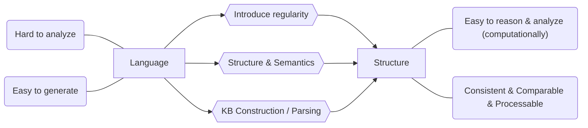

# Glossary

#### ILP

Inductive Logic Programming. // TODO

#### EBL

Explanation-based Learning.

#### Knowledge Base

Set of sentences in formal language.

# What is AI

There are many definitions of AI, addressing different aspects.

- Think humanly
- Think rationally
- Act humanly
- Act rationally

Rational means do the "right thing" with the given information, it is measured against an ***ideal result***. Humanly means can it do it like human, it measures the fidelity (保真度) when compared to ***human performance***. Thinking focus on ***thought process*** and ***reasoning***, while acting focus on ***behaviors***.

## Act Humanly: The Turing Test Approach

This covers most fields of AI, in order for a computer to pass Turing Test, it must be the case that the machine possess the following:

- **Natural Language Processing**: Understand what the person is talking.
- **Knowledge Representation**: Store information given by the person.
- **Automatic Reasoning**: Draw new conclusion from the information stored.
- **Machine Learning**: Adapt new circumstances and detect and extrapolate patterns.

Turing Test deliberately avoid physical contact, in the case of ***total Turing Test*** where video is included, the machine will need:

- **Computer Vision**: To perceive objects.
- **Robotics**: To stimulate humane movement.

## Act Rationally: The Rational Agent Approach

An agent is simply something that act. A rational agent is something that perform action that gives best outcome. One way is to draw logical conclusion with the given information. Note that correct inferences is not all of rationality, some rational acting cannot say that it is draw from logical reasoning, for example, snap finger away when it touch something hot.

All the skills needed for the Turing Test also allow machine to act rationally. This approach has two advantages over the others. Firstly, it is more general since "law of thought" is just one of the way to achieve rationality. Secondly, it is more amenable (适合的) to scientific development than other which based on human behaviors / thoughts.

## Think Humanly: The Cognitive Approach

If we say a machine think like a human, than it must be able to determining how human thinks. We have to get into the human brain and understand it. There are three ways to achieve it.

- Introspection: Capture your own thought.
- Psychological Experiments: Observe human in action.
- Brain Imaging: Observe human brain in action.

The distinction here is that the followings are separated:

- A good model of human performance
- Performs well on a task.

## Think Rationally: The Law of Thought Approach

This is about the "right thinking". In order to understand this we have to know what govern the thinking process, which I believe is --- logic. For example, if Rob is a man and all men are evil then Rob is evil. There are two main obstacles in this approaches.

- It is not easy to convert informal knowledge to formal representation as required by logical deduction to infer, particularly when the knowledge is less than 100% certain --- anything we deduce from incorrect knowledge will be incorrect.
- It is computationally expensive, simply a few thousand facts can exhaust computational resources unless there is some kind of guidance.

# Representation

Knowledge representation is important because it determine the information's fidelity and how easy we can make use of them --- we want a universal representation.

Sometimes we also remove some reality and enhance the other, for example, map, it does not necessary show the landscape but it is a kind of representation of the locations.

Note that *representation deeply impact learning*, e.g. different coordinate systems can perform different task using different algorithms and comes with different efficiency and understanding.

Representing apple:

- Symbolic

  An apple is a sweet, edible fruit produced by an apple tree (Malus pumila). Apple trees are cultivated worldwide and are the most widely grown species in the genus Malus. The tree originated in Central Asia, where its wild ancestor, Malus sieversii, is still found today. Apples have been grown for thousands of years in Asia and Europe and were brought to North America by European colonists. Apples have religious and mythological significance in many cultures, including Norse, Greek and European Christian traditions.

- Embodied

  

How do we introduce regularity? We need to find regularities and create structural / logical form of the information, then we can perform logical inferences on it. But this is not the full story, we also need to combine the **formal meaning representation** and the **inference model** and form **semantics**, this is because we do not want something that is syntactically correct but meaningless.

## From text to structure

1. Named Entity recognition, disambiguation
2. Co-reference resolution
3. Relation extraction

After this we can have a semantic representation of then language and answer questions.

# Grammar

### [Noun](https://en.wikipedia.org/wiki/Noun) 名词

Name of specific thing.

- The **cat** sat on the **mat**.
- Please hand in your **assignments** by the **end** of the **week**.
- **Cleanliness** is next to **godliness**.
- **Plato** was an influential **philosopher** in ancient **Greece**.

### [Pronoun](https://en.wikipedia.org/wiki/Pronoun) 代词

Used to represent noun.

- **I** love **you**.
- **That** reminds **me** of **something**.
- **He** looked at **them**.
- Take **it** or leave **it**.
- **Who** would say such a thing?

### [Verb](https://en.wikipedia.org/wiki/Verb) 动词

Conveys an action.

- I **washed** the car yesterday.
- The dog **ate** my homework.
- John **studies** English and French.

### [Adverb](https://en.wikipedia.org/wiki/Adverb) 副词

Modify verb or verb phrase.

- She sang **loudly**.
- I worked **yesterday**.
- She drove us **almost** to the station.
- **Even** numbers are divisible by two.
- **Internationally** there is a shortage of protein for animal feeds.

### [Adjective](https://en.wikipedia.org/wiki/Adjective) 形容词

Modify noun or noun phrase

- That's an **interesting** idea.
- That idea is **interesting**.
- Tell me something **interesting**.

### [Conjunction](https://en.wikipedia.org/wiki/Conjunction_(grammar)) 连词

Connect words, phrases or clauses.

- They do not gamble **or** smoke, for they are ascetics.
- You **either** do your work **or** prepare for a trip to the office.
- That's fine **as long as** you agree to our conditions.
- We'll do that **after** you do this.
- I really appreciate you waiting **while** I finish up.

### [Article](https://en.wikipedia.org/wiki/Article_(grammar)) 冠词

Specify grammar definiteness of noun. 对名词作限定。

- **The children** know **the fastest way** home.
- Give me **the book**.
- **The** cabbage white butterfly lays its eggs on members of **the** Brassica genus.

### [Preposition](https://en.wikipedia.org/wiki/Preposition_and_postposition) 介词

Express spatial or temporal relation.

- the weather **in** March.
- The key is **under** the stone.
- sleep **throughout** the winter.
- sick **until** recently.

### [Interjection](https://en.wikipedia.org/wiki/Interjection) 感叹词

Express spontaneous feeling.

- **Shh!**
- **Wow!**
- **ouch!**

# Miscellaneous

#### Statistical vs Symbolic AI System

|                 | Statistical | Symbolic |
| --------------- | ----------- | -------- |
| Explain-ability | &#10004;    | &#10006; |
| Generalization  | &#10004;    | &#10006; |
| Noise           | &#10006;    | &#10004; |
| Ambiguity       | &#10006;    | &#10004; |
| Mislabel        | &#10006;    | &#10004; |

### Grammar Relation

#### Arguments

subject, object, indirect object and prepositional object...

#### Adjunct

temporal, locative, causal, manner...

### Knowledge Representation: Five Roles

1. Surrogate – That is, a representation 
2. Expression of ontological commitment – of the world 
3. Theory of intelligent reasoning – our knowledge of it 
4. Medium of efficient computation – accessible to programs 
5. Medium of human expression – usable

### Simple Knowledge Based Agent

- Represent states, actions, etc.
- Incorporate new percepts
- Update internal representations of the world
- Deduce hidden properties of the world
- Deduce appropriate actions

### Inductive Logic Programming (ILP)

ILP algorithms are constructive induction algorithms – Able to create new predicates to facilitate the expression of explanatory hypotheses. For example, if someone has grandpa then there must be father, mother and grandma.

### Inference & Observation

Explanation based learning (EBL) is a method for extracting rules from individual observation. For example if you say: "Stick hold the food over the fire while keeping the hands safe". Then you can generalization it to any long, sharp, rigid object can be used to toast food over the fire. These general rules follows logically from the background knowledge.

### Neuro Symbolic Model

