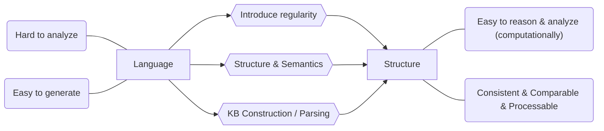

# Glossary

#### ILP

Inductive Logic Programming. // TODO

#### EBL

Explanation-based Learning.

#### Knowledge Base

Set of sentences in formal language.

#### Lexicon

The vocabulary.

# What is AI

There are many definitions of AI, addressing different aspects.

- Think humanly
- Think rationally
- Act humanly
- Act rationally

Rational means do the "right thing" with the given information, it is measured against an ***ideal result***. Humanly means can it do it like human, it measures the fidelity (保真度) when compared to ***human performance***. Thinking focus on ***thought process*** and ***reasoning***, while acting focus on ***behaviors***.

## Act Humanly: The Turing Test Approach

This covers most fields of AI, in order for a computer to pass Turing Test, it must be the case that the machine possess the following:

- **Natural Language Processing**: Understand what the person is talking.
- **Knowledge Representation**: Store information given by the person.
- **Automatic Reasoning**: Draw new conclusion from the information stored.
- **Machine Learning**: Adapt new circumstances and detect and extrapolate patterns.

Turing Test deliberately avoid physical contact, in the case of ***total Turing Test*** where video is included, the machine will need:

- **Computer Vision**: To perceive objects.
- **Robotics**: To stimulate humane movement.

## Act Rationally: The Rational Agent Approach

An agent is simply something that act. A rational agent is something that perform action that gives best outcome. One way is to draw logical conclusion with the given information. Note that correct inferences is not all of rationality, some rational acting cannot say that it is draw from logical reasoning, for example, snap finger away when it touch something hot.

All the skills needed for the Turing Test also allow machine to act rationally. This approach has two advantages over the others. Firstly, it is more general since "law of thought" is just one of the way to achieve rationality. Secondly, it is more amenable (适合的) to scientific development than other which based on human behaviors / thoughts.

## Think Humanly: The Cognitive Approach

If we say a machine think like a human, than it must be able to determining how human thinks. We have to get into the human brain and understand it. There are three ways to achieve it.

- Introspection: Capture your own thought.
- Psychological Experiments: Observe human in action.
- Brain Imaging: Observe human brain in action.

The distinction here is that the followings are separated:

- A good model of human performance
- Performs well on a task.

## Think Rationally: The Law of Thought Approach

This is about the "right thinking". In order to understand this we have to know what govern the thinking process, which I believe is --- logic. For example, if Rob is a man and all men are evil then Rob is evil. There are two main obstacles in this approaches.

- It is not easy to convert informal knowledge to formal representation as required by logical deduction to infer, particularly when the knowledge is less than 100% certain --- anything we deduce from incorrect knowledge will be incorrect.
- It is computationally expensive, simply a few thousand facts can exhaust computational resources unless there is some kind of guidance.

# Representation

Knowledge representation is important because it determine the information's fidelity and how easy we can make use of them --- we want a universal representation.

Sometimes we also remove some reality and enhance the other, for example, map, it does not necessary show the landscape but it is a kind of representation of the locations.

Note that *representation deeply impact learning*, e.g. different coordinate systems can perform different task using different algorithms and comes with different efficiency and understanding.

Representing apple:

- Symbolic

  An apple is a sweet, edible fruit produced by an apple tree (Malus pumila). Apple trees are cultivated worldwide and are the most widely grown species in the genus Malus. The tree originated in Central Asia, where its wild ancestor, Malus sieversii, is still found today. Apples have been grown for thousands of years in Asia and Europe and were brought to North America by European colonists. Apples have religious and mythological significance in many cultures, including Norse, Greek and European Christian traditions.

- Embodied

  

How do we introduce regularity? We need to find regularities and create structural / logical form of the information, then we can perform logical inferences on it. But this is not the full story, we also need to combine the **formal meaning representation** and the **inference model** and form **semantics**, this is because we do not want something that is syntactically correct but meaningless.

## From text to structure

1. Named Entity recognition, disambiguation
2. Co-reference resolution
3. Relation extraction

After this we can have a semantic representation of then language and answer questions.

# Grammar

### [Noun](https://en.wikipedia.org/wiki/Noun) NN(S) (名词)

Name of entities. Such as `cat` and `building`, tagged NN. When we have the plural form, `cats` and `buildings`, it is tagged NNS.

- The **cat** sat on the **mat**.
- Please hand in your **assignments** by the **end** of the **week**.
- **Cleanliness** is next to **godliness**.
- **Plato** was an influential **philosopher** in ancient **Greece**.

#### Proper Noun NNP(S)

When we refer to an unique entity such as person `John` and `Mary`, we have a proper noun, tagged NNP. When we have the plural form of them, such as `Johns` and `Marys`, it is tagged NNPS.

### [Pronoun](https://en.wikipedia.org/wiki/Pronoun) (代词)

Used to represent noun.

- **I** love **you**.
- **That** reminds **me** of **something**.
- **He** looked at **them**.
- Take **it** or leave **it**.
- **Who** would say such a thing?

#### Personal Pronoun PRP

This category includes personal pronoun proper such as `I`, `he` and `they` and reflexive pronoun ending `-self` or `-selves` such as `themselves` and `herself`. As well as `mine`, `hers`, `ours`, `theirs`.

#### Possessive Pronoun PRP$

This category includes adjective possessive forms such as `my`, `her`, `your`, `one's` `their` etc.

#### Possessive ending POS

the `'s` and `'` are tagged individually, such as `John\NNP 's\POS idea\NN`.

### [Verb](https://en.wikipedia.org/wiki/Verb) (动词)

Conveys an action.

- I **washed** the car yesterday.
- The dog **ate** my homework.
- John **studies** English and French.

#### Base form VB

For normal verbs.

#### Past tense VBD

For `-ed` verbs.

- He **rowed** the boat.
- She **rode** the horse.

#### Gerund / Present participle VBG

For `-ing` verbs.

#### Past participle VBN

For `-ed` verbs but follows words such as `have` and `has`.

- He has **rowed** the boat.
- She has **ridden** the horse.

#### non-3rd person singular present VBP

It is for verb that follows a singular 3rd person subject but precedes by a modal verb. 

- She can **speak** three languages.
- He must **like** football a lot. 

#### 3rd person singular present VBZ

It is a verb that adds an `-s` or `-es` because they follows a singular 3rd person subject.

- Man **hunts** and **searches** on his whirling globe and whenever he `unearths` a miniature truth within his environ, he **thinks** himself close to the peak of science.

#### Modal Verb MD

These are words that does not end with `-s` in their singular form, such as `could`, `shall` and `will`.

### [Adverb](https://en.wikipedia.org/wiki/Adverb) RB (副词)

Words that modify verb or verb phrase, this includes most words end with `-ly` as well as words like `quite`, `too` and `very`; post marker like `enough` in `good enough` and `indeed` in `very well indeed`; negative markers like `not` and `never`.

- She sang **loudly**.
- I worked **yesterday**.
- She drove us **almost** to the station.
- **Even** numbers are divisible by two.
- **Internationally** there is a shortage of protein for animal feeds.

#### RBR & RBS

Basically comparative & superlative adverb that used to modify verb or verb phrases.

### [Adjective](https://en.wikipedia.org/wiki/Adjective) JJ (形容词)

Words that modify noun or noun phrase.

- That's an **interesting** idea.
- That idea is **interesting**.
- Tell me something **interesting**.

### Wh-words (疑问词？)

#### Wh-determiner WDT

For `Which`, and `that` when used as a relative pronoun.

- **Which** plane is he catching?
- **Which** one would you like?
- **Which** of these colors shall we use?
- A cake **that** shines.

#### Wh-pronoun WP

The pronouns `who`, `whose`, `which`, and `what` that can be the subject or object of a verb.

- **Who** can help me?
- **Whose** is the new sports car outside?
- **Which** was your best subject at school?
- To **whom** did you speak?
- With **whom** did she go?

#### Possessive wh-pronoun WP$

For word `whose`.

#### Wh-adverb WRB

The adverb `wh-` words, `when`, `where`, `how` and `why`, always make the sentence follow the interrogative word order.

- **When** will they arrive?
- **When** shall I see you again?
- **Why** is the baby crying?
- **Why** are you saving your money?
- **How** many packs do you want?
- **How** many do you want?

### Particle RP (助词)

words that do not change their form through inflection and does not easily fit into the part-of-speech system. For example, `up` in `look up` and `out` in `knock out`.

### TO TO

Infinitive `to`. 

- We started our journey early so as **to** avoid the traffic.
- They spoke quietly in order not **to** wake the children.

#### Comparative JJR

Words with comparative ending `-er` and comparative meaning are tagged as JJR, the exceptions are `more` and `less`, they have a strictly comparative meaning thus should be tagged as JJR; but word such as `superior` and `further` are tagged as JJ because they either does not have a strict comparative meaning or does not end with `-er`.

#### Superlative JJS

Words with superlative ending `-est` are tagged as JJS. For `most` and `least`, they are tagged as JJS when used as adjective but other words such as `first`, `last` and `unsurpassed` should be simply tagged JJ.

### [Conjunction](https://en.wikipedia.org/wiki/Conjunction_(grammar)) CC (连词)

Connect words, phrases or clauses.

- They do not gamble **or** smoke, for they are ascetics.
- You **either** do your work **or** prepare for a trip to the office.
- That's fine **as long as** you agree to our conditions.
- We'll do that **after** you do this.
- I really appreciate you waiting **while** I finish up.

### Determiner DT (冠词?)

It is a word, phrase or [affix](https://en.wikipedia.org/wiki/Affix) that attached to a noun or noun phrase which used to express reference to that noun or noun phrase.

- **The** girl is **a** student.
- I've lost **my** keys.
- Give **me** money.
- **Which** book is that?
- **Both** windows were open.

This category includes

- articles such as `a`, `an` and `every.`
- demonstratives such as `this` and `that.`
- quantifiers such as `all`, `some`.
- distributive determiner such as `each` and `either`.
- interrogative determiner such as `which` and `whose`.

####  Predeterminer PDT

When determiner precedes another determiner or  possessive pronoun it is called predeterminer. This is because any noun phrase can only has one determiner.

- **all** his marbles
- **both** the girls
- **half** his time
- **quite** a mess
- **rather** a nuisance

### [Preposition](https://en.wikipedia.org/wiki/Preposition_and_postposition) IN(介词)

Express spatial or temporal relation.

- the weather **in** March.
- The key is **under** the stone.
- sleep **throughout** the winter.
- sick **until** recently.

### [Interjection](https://en.wikipedia.org/wiki/Interjection) UH (感叹词)

Words that express spontaneous feeling.

- **Shh!**
- **Wow!**
- **ouch!**

### Existential `there` EX

It is an unstressed `there` which trigger invasion of the inflated verb and logical subject of the sentence. For example, `there was a party in progress`.

### Cardinal Number CD

For words such as `1`, `241` and `third`.

### Foreign Word FW

It is the foreign words, note that `e.g., etc., i.e.` are abbreviations of foreign terms so they are tagged FW.

### Symbol SYM

This tag is used for mathematical, scientific and technical words or expressions that aren't English, for example `/[=*`. Note that the English name of the symbol such as `Carbon Dioxide` should be tagged as NNP.

### List Item Marker LS

Letters and numerals used to identify item in a list.

### Differences

> There are [much more](http://groups.inf.ed.ac.uk/switchboard/POS-Treebank.pdf) than listed here.

#### JRR & RBR

- This is a **faster/JRR** car than the previous one.
- He has a **higher/JRR** degree than me.
- Can you speak **faster/RBR**.
- He can jump **higher/RBR** than me.

#### Number

- **One/CD** of the best reason.
- **One/NN** of a kind.
- **One-third/JJ** cup.
- **One-third/RB** the amount.

#### DT & NN & PDT

- **All/DT** girls.
- I can't stand **this/DT**.
- **All/PDT** the girls.

#### DT & WP$

DT precedes an noun while WP$ precedes a verb.

|             | **Determiner**           | **Possessive wh-Pronoun** |
| ----------- | ------------------------ | ------------------------- |
| ***what***  | What color is his house? | What did she buy for him? |
| ***which*** | Which side is better?    | Which do you prefer?      |
| ***who***   | -------                  | Who did you meet today?   |
| ***whose*** | Whose car is this?       | Whose is this car?        |
| ***whom***  | -------                  | To whom did you send it?  |

# [Phrase Structure Parser](https://en.wikipedia.org/wiki/Phrase_structure_rules)

Basic clause structure is understood in terms of a binary division of the clause into subject (noun phrase NP) and predicate (verb phrase VP). The phrase structure rules are the following:
$$
\text{S} \rightarrow \text{NP VP} \\
\text{NP} \rightarrow \text{(Det) N} \\
\text{VP} \rightarrow \text{(AP) N (PP)}
$$

- **Subject** (主语)

  Subject can be view as the noun which controls the verb or verb phrase. If the sentence has no verb or verb has a different subject, for example *John* in *John --- I can't stand him!* is not grammatically subject but the topic of the sentence.

- **Predicate** (谓语)

- **Head** (中心词)

  Head of a phrase is the word that determine the syntactic category of the phrase. For example, *water* is the head in *boiling hot water*.

- [**Noun Phrase**](https://en.wikipedia.org/wiki/Noun_phrase) NP (名词词组)

  Noun phrase is a phrase that has a noun as its head or perform the same grammatical function as noun.

- [**Verb Phrase**](https://en.wikipedia.org/wiki/Verb_phrase) VP (主谓短语 / 动词词组)

  - Mary ***saw* the man through the window**.
  - David ***gave* Mary a book**.

- [**Adjective Phrase**](https://en.wikipedia.org/wiki/Adjective_phrase) AP (形容词短语)

  It is a phrase which the head is a adjective. For example, *very happy* and *quite upset about it*. 

  - Sentences can contain **tremendously *long*** phrases.
  - He is ***faster* than you**.
  - The people are ***angry* with the high prices**.

- [**Propositional Phrase**](https://en.wikipedia.org/wiki/Adpositional_phrase) PP (介词短语)

  - She walked ***to* his desk**.
  - They walk **up the stairs**.
  - ***As* a student**, I find that offensive.

- [**Adverb Phrase**](https://en.wikipedia.org/wiki/Adverbial_phrase) ADVP (状语?)

  - They repaired my car ***very* quickly**.
  - He worked ***extremely* hard** in the game.
  - She did ***really* well** in her race.
  - Why are you leaving ***so* soon**.

# Miscellaneous

#### [Coordination & Subordination](https://saylordotorg.github.io/text_business-english-for-success/s10-02-coordination-and-subordination.html)

Coordination happens when we join two related clauses with equal importance. For example `and`, `indeed`, `but` and `finally`.

- Most people do not walk to work; **instead**, they drive or take the train.

 Subordination is joining two clauses with different importance, for example, `if`, `as`, `because` and `when`.

- Everyone in the conference room stopped talking at once, **as though** they had been stunned into silence.

#### Inflection

Inflection is a process of word creation. It happens when a word is modified to express different grammatical meaning such as past tense in English. The inflection of verb is called [conjugation](https://en.wikipedia.org/wiki/Grammatical_conjugation) and inflection of others are called [declension](https://en.wikipedia.org/wiki/Declension). For example, the word `call` may become `called`, `calls` and `calling` depends on the context.

#### Statistical vs Symbolic AI System

|                 | Statistical | Symbolic |
| --------------- | ----------- | -------- |
| Explain-ability | &#10004;    | &#10006; |
| Generalization  | &#10004;    | &#10006; |
| Noise           | &#10006;    | &#10004; |
| Ambiguity       | &#10006;    | &#10004; |
| Mislabel        | &#10006;    | &#10004; |

### Grammar Relation

#### Arguments

subject, object, indirect object and prepositional object... // TODO

#### Adjunct

temporal, locative, causal, manner... // TODO

### Knowledge Representation: Five Roles

1. Surrogate – That is, a representation 
2. Expression of ontological commitment – of the world 
3. Theory of intelligent reasoning – our knowledge of it 
4. Medium of efficient computation – accessible to programs 
5. Medium of human expression – usable

### Simple Knowledge Based Agent

- Represent states, actions, etc.
- Incorporate new percepts
- Update internal representations of the world
- Deduce hidden properties of the world
- Deduce appropriate actions

### Inductive Logic Programming (ILP)

ILP algorithms are constructive induction algorithms – Able to create new predicates to facilitate the expression of explanatory hypotheses. For example, if someone has grandpa then there must be father, mother and grandma.

### Inference & Observation

Explanation based learning (EBL) is a method for extracting rules from individual observation. For example if you say: "Stick hold the food over the fire while keeping the hands safe". Then you can generalization it to any long, sharp, rigid object can be used to toast food over the fire. These general rules follows logically from the background knowledge.

### Neuro Symbolic Model

