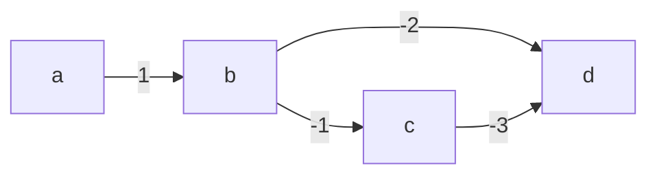

# Algorithm Assessment


# 1a

```python
def loop_free(path):
    # path => [(n1, n2), (n2, n3), ...]
    seen = set()
    new_path = list()
    new_path.append(path[0])
    seen.append(path[0][1])
    for src, dst in path[1:]:
        if dst not in seen:
        	new_path.append((new_path.last()[1], dst))
        seen.add(dst)
    return new_path
```

# 1b

### Data structure: List of tuples.

###  Justification: complexity is $O(n)$, we only use one iteration on the input path.

# 2a



# 2b

## We want to go from `a` to `d`.

## 1. Pop `a` and put `b` into the queue, $F = \{a\}, D = \{(a\rightarrow0), (b\rightarrow1), (c\rightarrow \inf), (d\rightarrow \inf)\}$

## 2. Pop `b`, and put `c` and `d` into the queue, $F = \{a, b\}, D = \{(a\rightarrow0), (b\rightarrow1), (c\rightarrow 0), (d\rightarrow -1)\}$

## 3. Pop `d` and return.

## Note that we missed the best possible path $a \rightarrow b\rightarrow c \rightarrow d $.

# 2c

## $init = \{0, \inf, \inf, \inf\}$

## $relax=\{(a,b), (b,d), (b,c), (c,d)\}$

## $state\ 1 = \{0, 1, \inf, \inf\}$

## $relax=\{(a,c)\}$

## $state\ 2 = \{0, 1, 0, \inf\}$

## $relax=\{(a,d)\}$

## $state\ 3 = \{0, 1, 0, -3\}$

## Return $-3$

# 3

Do not know how to do.

# 4a