COMP36111 Algorithms & Computation

## Lecture 1 Strongly Connected Component

#### Definition

A graph is G = (V, E). V = **finite** and non-empty set, E = set of order pair of **distinct** v. V are **vertices** and E are **edges**.

If e = (u,v) in E then u and v are **neighbour** and incident on e.

- no self-loop
- no multiple edges
- no directionless edges

By default we assume graph is stored in adjacency list, where each vertices associated with a linked-list (because size is small and variable) of other vertices where it has an outgoing edge.

- in-degree: # incoming edges
- out-degree: # outgoing edges
- path: sequence of distinct vertices such that if i < j, then (vi, vj) is an edge
- reachable if there exists a path
- strongly connected if every v is reachable from every other.
- topological sorting: an order of v such that for all (vi, vj) we have i < j.
- strongly connected component: every node is reachable from other in that component.
  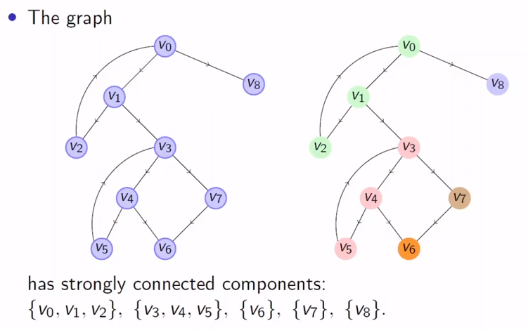
- st-con: test if t is reachable from s in g
- strong connectivity: test if g is strongly connected
- cyclicity: test if g contains cycle
- topological sorting: compute topological sorting of g
  - by product: check contains cycle
- strongly connected component: find strongly connected components of g
- lemma: directed graph + no cycles = v with 0 in-degree and v with 0 out-degree


- dfs O(e+v)

  ```python
  def dfs(g, v):
  	mark v
  	for each (v, u) in g:
  		if u is not marked:
  			dfs(g, u)
  ```

- topological sorting O(e+v)

  ```python
  def t_sorting(g):
  	list;
  	for v in g:
  		if in-degree of v == 0:
  			list.add(v)
  			g.remove(v)
  	if list is empty:
  		print "contains cycle"
  	else:
          list.addAll(t_sorting(g))
      return list
  
  def t_sorting(g):
  	list, map, stack;
  	for v in g:
  		map[v] = in-degree of v
  		if map[v] == 0:
  			stack.push(v)
  	while stack is not empty:
  		# when v is popped, all its predecessor must be popped already
  		# so it is added after its predecessor is added
  		v = stack.pop()  
  		list.add(v)
  		for (v, u) in g:
  			if --map[u] == 0:
  				stack.push(u)
  	if list.size() != g.size():
  		# if some v is not indexed, then it has cycle
  		return "contains cycle"
  	else:
  		# if all v is indexed, then we have a topological sorting
  		return list
  ```

- strongly connected component (tarjan's algorithm)

  ```python
  def scc_tarjan(g):
  	list of scc;
  	for v in g:
  		if v.index undefined:  
  			sc(g, v, 0, new stack, list of scc)
  	return list of scc
  
  def sc(g, v, index, stack, list):
		v.index = index
  	v.lowlink = index
  	v.on_stack = true
  	stack.push(v)
  	
  	for (v, u) in g:
  		if u.index undefined:
  			sc(g, v, index+1, stack, list)
  			v.lowlink = min(v.lowlink, u.lowlink)
  		else if u.on_stack:
  			v.lowlink = min(v.lowlink, u.index)
  			
  	if v.index == v.lowlink:
  		scc = new list;
  		repeat:
  			w = stack.pop()
  			w.on_stack = false
  			scc.add(w)
  		while w != v
  		list.add(scc)
  	return list
  ```
  

## Lecture 2 Union Find

#### Pre Lecture 2 Dijkstra Summary

- Task: find shortest path from a node to all other node in a graph

- Priority Queue: Node closer to the source is searched first

- Path Representation: each node in p-queue represent the current shortest path (distance to source and parent)

- Relaxation: when a shorter path is found, its distance and parent is updated.

  

- If weight is the same, then it is same as bfs.

- To get from source to only one destination node, stop when the destination node is popped.

- Completeness: If there is a shortest path, it will find it.
- Optimal: It always find the most optimal (shortest) path.
- Uninformed: It does not use any information about the location of the target.

#### Content

Union find is an algorithm operate on undirected graphs. A partition of V is pairwise disjoint sets that when taken together, it forms V. We refer to elements of a partition as cells. 

- makeSet(v): create singleton set containing v.
- union(Ai,Aj): remove Ai and Aj from P and add new cell Ai U Aj.
- find(v): return pointer to cell of P containing v.

```python
def union_find(V,E):
	P = empty partition
	for v in V:
		P.add(makeSet(v))
	for (u,v) in E:
		if P.find(u) != P.find(v):
			P.union(P.find(u), P.find(v))

def makeSet(v):
	s = [v] # optimization2: use tree instead, later in union just merge assign root
	s -> size = 1
	v -> cell = s
	P.add(s)

def find(v):
	return v -> cell
	
def union(s,t):
	if s->size < t->size:  # optimization1: use the smaller size list
		s,t = t,s
	P.remove(t)
	s = append(s,t)
	for v in t:
		v->cell = s
	s->size += t->size
```

lemma: no element can assigned more than low_bound(logn) +1 times
proof: whenever v->cell changes, the size of cells at least doubles, but 1<=size<=n, this can only happen lower_bound(logn) times.

theorem: union-find is O(e+vlogv)
prrof: makeSet, union and find is linear: e+v, they are constant time except updating v->cell, this update is at most logn so yielding total work O(e+vlogv+v).

optimization2: use tree to store cells, and parent is the root of the cell, when merge, just point two partition to the same parent.


```python
def makeSet(v):
	v -> parent = v
	v -> size = 1
	return v

def union(u,v,P):
    ...
	v -> parent = u
	...

# we have to change find so that it return the parent
# this is logn but we can flatten it
def find(v):
	if v->parent != root:
		v->parent = find(v->parent)
	return v->parent
```

With tree implementation, the union-find algorithm runs in (almost linear) O((e+v)alpha(v)) where alpha is a very slow growing function.

## Fast & Slow

### Fast

- polynomial (in x): expression p(x) of the form: $a_nx^n+a_{n-1}x^{n-1}+\dots+a_1x+a_0$. 

- polynomial bounded: a function is polynomial bounded if for some p: $\forall n:f(n)\leq p(n)$.

- exponentially bounded:

  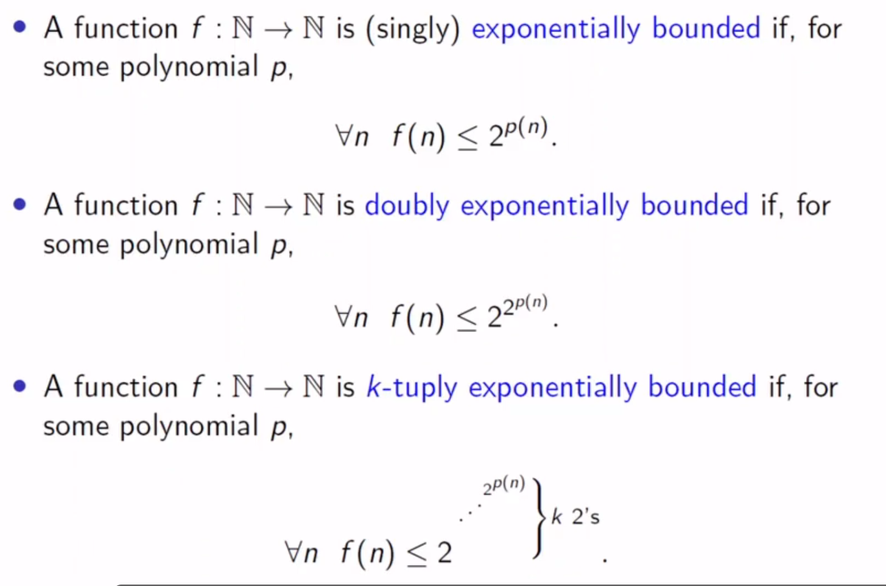

  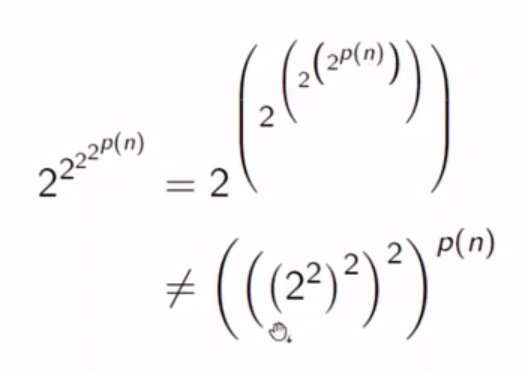

  - $2^n$: singly exponentially bounded

  - $2^{n^2}$: singly exponentially bounded

  - $2^{2^n}$: doubly exponentially bounded

  - $n!$: between singly exponential and doubly exponential:
    by taking log on both complexity:
    $$
    \log(2^{2^n}) = 2^n\\
    \log(n!) \leq \log(n^n)=n\log n\\
    n\log n \leq 2^n
    $$

  - 

  LOOP language:

  ```python
  x=y
  x=0
  x++
  return x
  loop (x) {...} # x is fixed even if changed in loop
  ```

  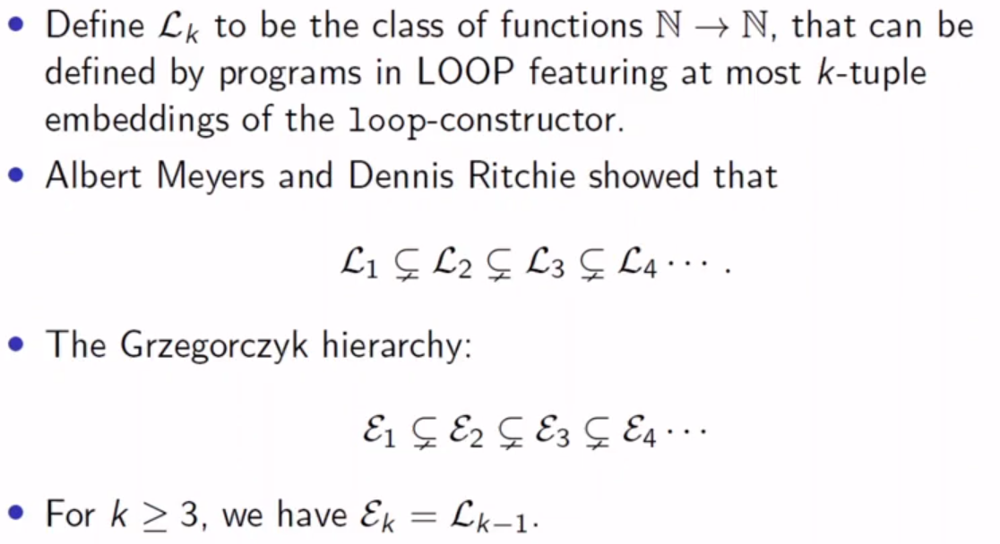

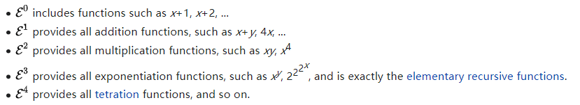

- any function in L2 (exponential) is **elementary**, note that L3 is tetration functions, so elementary means it has fixed amount of towers.

- any function in the set: $\bigcup_{i=1}^{\infty}\mathcal{L}_i$, is **primitive recursive**. e.g. tetration function is in L3, so it is not elementary, but it is primitive recursive

- There exists functions that are not primitive recursive (i.e. cannot compute by LOOP language) but it is a total computable function: Ackermann function:
  $$
\begin{align*}
  A(m,n)=\begin{cases}
n+1 & m=0\\
  A(m-1,1) & m\gt0 \text{ and } n=0\\
  A(m-1, A(m,n-1)) & \text{otherwise}
  \end{cases}
  \end{align*}
  $$
  This function grow rapidly, much faster than any functions in LOOP language.
  
- notation: $A^{(k)}(x)=\overbrace{A(A(\dots A(}^{\text{k times}}x)\dots))$
  
- An Ackermann-like function:
  $$
\begin{align*}
  A_0(x) &=x+1\\
A_{i+1}(x)&=A_i^{(x)}(x)\\
  A(x)&=A_x(2)
  \end{align*}
  $$

### Slow

$$
\alpha(n)=\min\{i\ge 0:A(i)\ge n\}\\
\text{Note: }\alpha(A(n)) = n
$$

alpha(n) is the minimum i such that A(i) is more than or equals to n. Minimum increasing i such that A(i) >= given number. So if A(i) is fast growing, then alpha must be slow growing, because for the number i to increase, A(i) must be smaller than given n.

When given the number of atoms in the universe, it yields 4.

### Proof union-find is almost linear

Let's first define a Ackermann-like function:
$$
\begin{align*}
A^{(k)}(x)&=\overbrace{A(A(\dots A(}^{\text{k times}}x)\dots))\\
\\
A(x)&=A_x(2)\label{r4}\tag{1}\\
A_{i+1}(x)&=A_{i}^{(x)}(x)\label{r5}\tag{2}\\
A_0{x}&=x+1\label{r6}\tag{3}
\end{align*}
$$

Note that this function grows rapidly, then we define another function:
$$
\alpha(n)=\min\{i\ge0:A(i)\ge n\}
$$
Note that this function grows slowly, now lets define some term:
$$
\begin{align*}
G&=\text{graph}\\
n&=\text{number of vertices}\\
m&=\text{number of edges}\\
v&=\text{vertex}\\
r&=\text{rank}\\
z&=\text{root of }v\\
n(v)&=\text{number of nodes rooted at v}\\
r(v)&=\lfloor\log n(v)\rfloor + 2\\
\end{align*}
$$
Note that the $+2$ we have on the $r(v)$ is simply to fit with the initial $2$ in the Ackermann-like function.

Suppose we carry out $m$ `makeSet`, `union` and `find` operations on a collection of $n$ vertices. Each call to `makeSet` or `union` requires a constant number of operations. We need only worry about the work done by the calls to `find`.

The tree-structure changes as we modify the pointers (path compression). Let the parent of $v$ denote $p(v)$, and the number of path compression needed to find this parent be $t$ and denote everything as $p^t(v)$.

Now we define a relationship between the number of nodes a vertex $v$ and its parent $p(v)$ has:
$$
L^t(v)=\text{the largest }i\text{ s.t. }r(p^t(v))\ge A_i(r(v))
$$
Note that $r(v)$ is depend on the number of nodes that $v$ has, we know that parent has more nodes than the child. This function gives a label to each $v$ which answer the question: how much we can increase the nodes of $v$ using the Ackermann-like function, such that it does not exceed the number of nodes the parent of $v$ has?

If $v$ has an ancestor, that is, $p(v)$ is not the root of the tree of $v$ currently in, then we know that it has at least one ancestor further up the tree, we denote the ancestor of $v$ as $w$, that has a label $L^t(w)$. Now, if the $w$ has the same label as $v$, then we call this ancestor a proper ancestor.

Note the condition for having a different label, since $A_{i+1}(x)=A_{i}^{(x)}(x)$, it means that we have to repeatedly apply $x$ to $A_i$ for $x$ times.

Now consider a vertex $v$ in the union-find graph. We charge £1 for each pointer move:

- if $v$ has a proper ancestor $w\neq z$ such that $L^t(v)=L^t(w)$, charge £1 to $v$.

  - lets consider how many times, a vertex $v$ can have a proper ancestor. If $v$ is found to have a proper ancestor, although their label is the same, but the number of times the function $A_i$ is applied to $r(v)$ actually increases, to see this, lets first assume $r(v)$ was having $k$ times repeatedly applied by $A_i$, that is, $A_i(r(v))=A_i^{(k)}(r(v))$, then:
    $$
    \begin{align*}
    r(p^t(w))&\ge A_i(r(w))\\
    &\ge A_i(r(p^t(v)))&\text{definition of }w\\
    &\ge A_i(A_i^{(k)}(r(v)))&\text{definition of label }i\\
    &\ge A_i^{k+1}(r(v))
    \end{align*}
    $$
    in short, it says that each parent of parent of $v$ will result in $+1$ for $k$. Since we know that if there is $r(v)$ of $k$, then label will $+1$, hence we also know that $v$ can be charged at most $r(v)$ times before $i$ increments. We also know that the label $i$ can increments at most $\alpha(n)$ times, therefore for each $v$, it can charge at most $\alpha(n)\times r(v)$ times.

    We also know that there can at most $n/2^{s-2}$ vertices with rank $s$, therefore, the total charges accruing to vertices over the course of all `find` calls is:
    $$
    \begin{align*}
    \sum_{s=0}^{\lfloor\log n\rfloor+2}s\alpha(n)\frac{n}{2^{s-2}}&\le n\alpha(n)\left(\sum_{s=0}^{\infty}\frac{s}{2^{s-2}}\right)\\
    &\le 8n\alpha(n)
    \end{align*}
    $$
  
- else charge £1 for the current invocation of `find`.

  - this happens either $v$'s direct ancestor is the root, happens at most $m$ times
  - or its ancestor has a different label, happens at most $\alpha(n)$ times.
  - therefore total charges is $\alpha(n)\times m$.


## Lecture 4

### Flow

flow network = (V, E,s,t,c), VE=directed graph, s=start vertices (no incoming edges), t=end vertices (no outgoing edges), c=function that assign edge to natural number (capacity). edge's capacity has no negative capacity.

A flow in N is f:E->R+ with two properties:

-  conservation rule: net flow out of any e is zero: $\sum_{v:(u,v\in E)}f(u,v)-\sum_{v:(v,u)\in E}f(v,u) = 0$. (each vertex does not store any water)
- capacity rule: no edge exceed capacity. (pipe cannot contains more water than its capacity)

### Cut

Cut is a separation of vertices into two parts $(V_s, V_t)$. For every bridge between $V_s$ and $V_t$  (edges that connected these two partitions):

- It is forward edge if it goes from $V_s$ to $V_t$.
- It is backward edge if it goes from $V_t$ to $V_s$.

**flow across a cut** is the net flow of it, i.e. forward flow - backward flow.

- flow across cut = flow of network
- flow of cut <= capacity of cut
- any flow of network <= capacity of any cut

If we can find the minimum cut (cut that has the least capacity), then we can have a upper bound for the maximum flow of the network. In fact, the maximum flow of a network is equal to the capacity of the minimum cut.

### Residual Capacity

It is just capacity - flow: $\Delta_f(u,v)=c(e)-f(e)$.

### Ford-Fulkerson Algorithm

auxiliary directed graph: $\{(u,v)\in E | f(u,v) <c(u,v)\} \cup\{(v,u)|(u,v)\in E \and f(v,u)>0\}$, which does the following things:

- remove exhausted edges (max flow)
- add backward edge for every non-zero flow edge

if you can find a path from $s$ to $t$ in auxiliary directed graph, then you can increment the forward edge and decrement the original edge of the backward edge path to add 1 more to the over all flow. In the book, such path is called augmenting path.

if you cannot find a path in auxiliary directed graph, then it already has the maximal flow.

```python
def ford_fulkerson(graph):
	assign 0 flow to each edge in graph
    # if min-cost is required, find the shortest path here instead of any path
    while exists augmenting/auxiliary path in graph as path:
        min_rc = min residual capacity of all edges in path
        for each edge in path:
            if edge is forward:
                edge.flow += min_rc
            else:
                edge.flow -= min_rc
```

### Cost

Cost of an edge is the cost for one unit of flow.

Finding min-cost max-flow is same as finding the shortest path in all max-flows.

If we have a negative weight cycle then we can always find a path that has less weight but with the same flow, and in fact, we have a negative cost cycle if and only if we do not have a minimum cost flow. Note that we can modify the edges so that all of them has positive weights (by adding a constant amount), then we can use dijkstra's algorithm instead of bellman ford's algorithm.

We just need to find the shortest path instead of any augmenting/auxiliary path in the while loop above.

### Time Complexity

We know that reachability can be solve in $O(m+n)$ where $n$ is the number of nodes and $m$ is the number of edges. The value of any flow across the network is less than $nC$ where $C$ is the maximum capacity of all nodes. Therefore the operating time is at $O(n(n+m)C)$. 

### Matching

A bipartite graph is a triple $G = (U, V, E)$ where $U$ and $V$ are disjoint sets and $ E ⊆ U × V$. A **matching** is a subset of $E$ denoted as $E'$ such that each node in one set is connected to at most 1 node from the other set. A **matching is perfect** if every node in $V$ and $W$ is incident to some $e \in E'$.

- **MAXIMAL-MATCHING** is to find matching with maximal cardinality.

- **MATCHING** is to check whether $G$ has perfect matching.

  ```python
  def naive_match(V, W, E):
  	if V is empty:
          return W is empty
      
      v = pick(V)
      for (v, w) in E:
          V_, W_ = V.remove(v), W.remove(w)
      	if naive_match(V,W,E):
              return True
      return False
  ```

- **stable-matching** (from 2019-20 paper): In [mathematics](https://en.wikipedia.org/wiki/Mathematics), [economics](https://en.wikipedia.org/wiki/Economics), and [computer science](https://en.wikipedia.org/wiki/Computer_science), the **stable marriage problem** (also **stable matching problem** or **SMP**) is the problem of finding a stable matching between two equally sized sets of elements given an ordering of preferences for each element.

  A [matching](https://en.wikipedia.org/wiki/Matching_(graph_theory)) is a [bijection](https://en.wikipedia.org/wiki/Bijection) from the elements of one set to the elements of the other set. A matching is *not* stable if:

  1. There is an element *A* of the first matched set which prefers some given element *B* of the second matched set over the element to which *A* is already matched, and
  2. *B* also prefers *A* over the element to which *B* is already matched.

  In other words, a matching is stable when there does not exist any match (*A*, *B*) which both prefer each other to their current partner under the matching.

## Lecture 5

#### Turing Machine

Turing Machine: $M=\langle K,\Sigma,Q,q_0, T\rangle$, where:

- $K$: >= 2 tapes
- $\Sigma$: non-empty finite set of alphabets
- $Q$: non-empty finite set of states (this includes both the current instruction (and does not include all symbols on the tapes))
- $q_0 \in Q$: initial state
- $T$: set of transitions

#### Symbols

- Symbol $\in\Sigma\ \cup\{\Huge\textvisiblespace\normalsize, \rhd\}$
- set of finite strings over $\Sigma$ denote by $\Sigma^*$

#### Transition

A transition = $\langle p, \overset{\bold{-}}{s}, q,\overset{\bold{-}}{t}, \overset{\bold{-}}{d} \rangle$ where:

- $p$: current state
- $\overset{\bold{-}}{s}$: K tuples of symbols (symbols on current K tapes' head, to be scanned)
- $q$: next state
- $\overset{\bold{-}}{t}$: K tuples of symbols (symbols to be written on current K tapes' head, after this the head contains $\overset{\bold{-}}{s}$)
- $\overset{\bold{-}}{d}$: the direction to move after symbols is written $\in \{\text{left},\text{right},\text{stay}\}$.

An example, if we have: , and a transition: $(s,a_h\mapsto b,\text{right},t)$ says:

- if you are in state $s$, and reading the symbol $a_h$,
- then write the symbol $b$, move to the right and go to state $t$.

#### Configuration

A configuration of M (turing machine) is a K tuple of strings $\sigma_i$ where each in the form:

- $\rhd, S_{k,1},\dots,S_{k,i-1},q,S_{ki},\dots,S_{k,n(k)}$
- we put $q$ in front of the symbol where head is currently at.
- This states that the kth tape of M reads $\rhd$,sk,1, . . . ,sk,n(k) , the head is over square i, and the current state is q (same for all K strings).

The set of these configurations, say V, forms a directed graph G = (V, E) where (c, d) ∈ E just in case M has a transition taking. c to d. We call G the **configuration graph** for M with input x.

- Configuration is just a snapshot of the turing machine.

#### Run

A run of M on input x is a sequence of configurations. For each configuration

- if it is successive, then it conforms to some transition
- if it is not successive(some transition is possible) then it may be a final/initial state.

It is terminating if finite and deterministic if there is only one transition for every state.

- $M\downarrow x$: machine M is terminating on input x
- $M\uparrow x$: machine M is non-terminating on input x

if $M\downarrow x$ then we can have a set of output strings, this is the partial function: $f_M:\Sigma^*\rightarrow\Sigma^*$:
$$
f_M(x)=\begin{cases}
y&\text{if }M\downarrow x\\
\text{undefined}&\text{otherwise}
\end{cases}
$$


Now we can say M computes fM, and a partial function f:sigma->sigma is computable if it is computed by some deterministic turing machine.

We can encode a sequence of numbers using prime-power encoding, thus we can encode one turing machine into a number, so this means we can have another turing machine that takes this encoded turing machine EM as a number and the input x and compute the function EM(x), the machine that takes in EM and x and output EM(x) is called the universal turing machine.
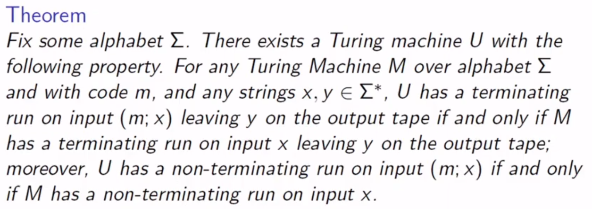

It just means a turing machine that can runs another turing machine.

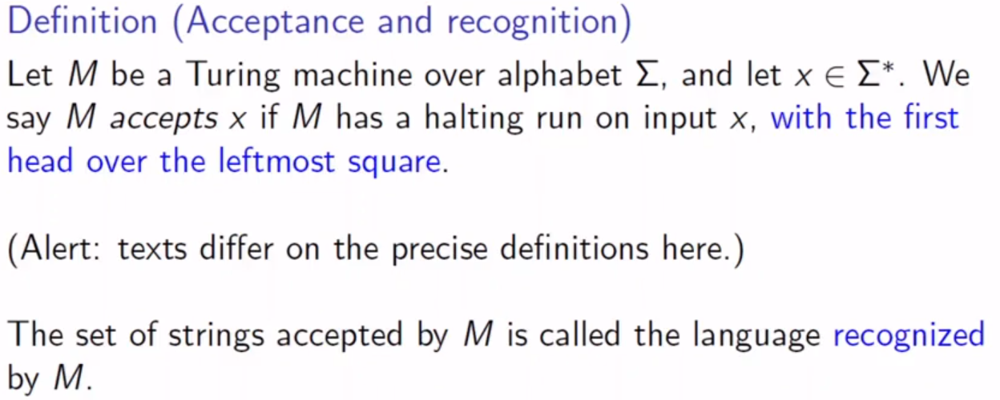

if you have a language recognized by some turing machine, then there is a deterministic turing machine (DTM) that recognized the same language (because non-deterministic turing machine can converted into a deterministic one.

- language L from alphabet S is **recursively enumerable (r.e.)** if there is a DTM which recognizes L.
- language L is **co-recursively enumerable (co-r.e.)** if there is a DTM which recognizes S \ L.
- language L is **recursive** if and only if there are DTM that recognize L and another DTM that recognize S \ L.
  - language L is **recursive** if and only if there is a DTM that recognize it and always halts.

- language $\Leftrightarrow$ decision problem.
- recursive $\Leftrightarrow$ decidable.
  - the problem that determine whether a number x is prime is the language:
    $\{x\in\{0,1\}^*|\text{x is prime number\}}$
  - the problem that determine whether formula of propositional logic is satisfiable
    $p_0\and(p_1\rightarrow p_{10})$ is the language $\{x\in\{p,1,0,\and,(,),\rightarrow\}^*|\text{x is a wff and satisfiable}\}$.
    wff: well-formed formula

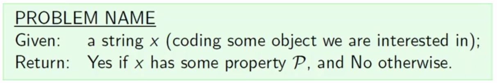

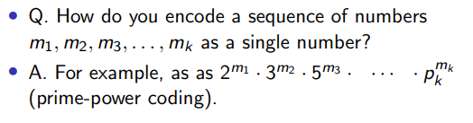

There exists undecidable problem:


Turing says that you can code the halting machine H as validity of first order logic, so there is no way to check the validity of first order logic, because if there were, then we have a halting machine which we have shown is not possible

## Lecture 6 Time, Space & Determinism

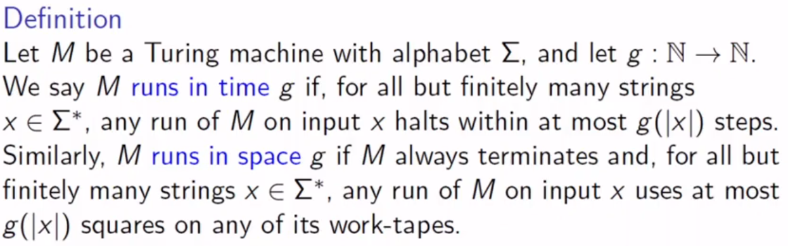

- M runs in time $g: N\rightarrow N$ if any run on a finite set of strings $\Sigma$ halts at most g(|x|) where $x\in \Sigma$.
  - non-deterministic: perform transition simultaneously.
  - We say that L is in Time(g) if there exists a deterministic Turing machine M recognizing L such that M runs in time g.
- M runs in space $g: N \rightarrow N$ if M always terminates and any run on a finite set of strings $\Sigma$ uses at most g(|x|) squares on any of its work-tapes. 


- L is in Time(g): exists DTM that recognizing L and run in time g
- L is in Space(g): exists DTM that recognizing L and run in space g

e.g.:

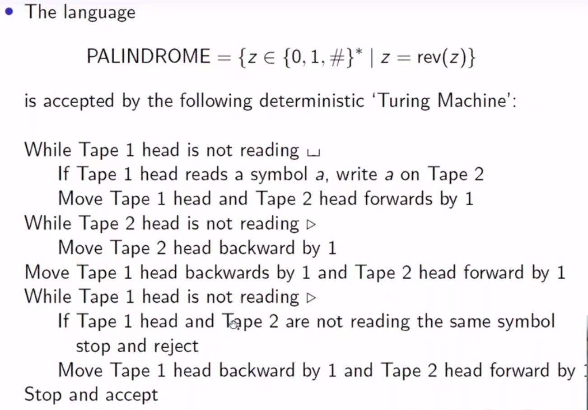

- It runs in Time(3n+1) and actually in Space(upper_bound(log n)) as well.
  - you can just use two pointers, one at the start and another at the end, move both pointer towards each another while checking their head is reading the same symbol.

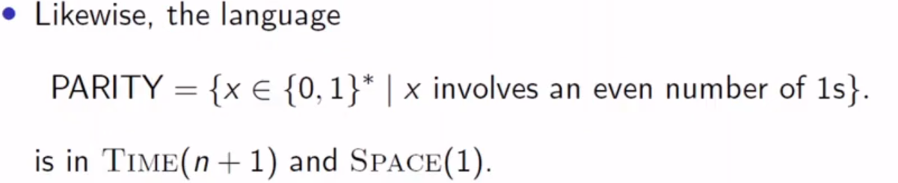

#### Linear 'speed-up' Theorems


Given a turing machine M which recognize the language, you can build a larger turing machine operating on larger set of states/alphabets, in this larger machine, several steps of the old turing machine is compiled into a single step.

because of the theorem, we can simplified the complexity:


we use big G to denote a large set of complexity, where P is polynomials, and E is exponential


Some complexity of recognizing language using turing machine:


We usually do not say time(log n) because that means the turing machine does not need to read the whole input which is not very interesting. We also defined some sets of languages(problems) by their complexity here.


- st-con: reachability given two vertices, just dfs.
- undirected st-con: same as above, dfs.
- cyclicity: check has cycle
- 2d-matching: check perfect match
- LPF
- Prime checking
- ...

We cannot access certain index's element in the array using constant time, where most analysis assumes, but in practice it affect the degree of polynomial but does not change the polynomial time complexity.

Some other polynomial time problem is linear programming feasibility (LPF):

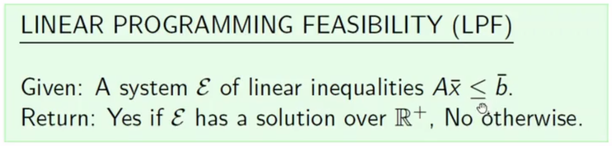


Prime may seen trivial in polynomial time, i.e. just check all digit within sqrt(n), but input we measuring is bit string, so the size of input is not n but log n (the size of digits) and sqrt(n) grow faster than any fixed power including log (n). The reason why it can be tested in polynomial time even with binary coding of input is due to the proof in 2004 but we are not going into it in this course.


Similar go for NDTM:

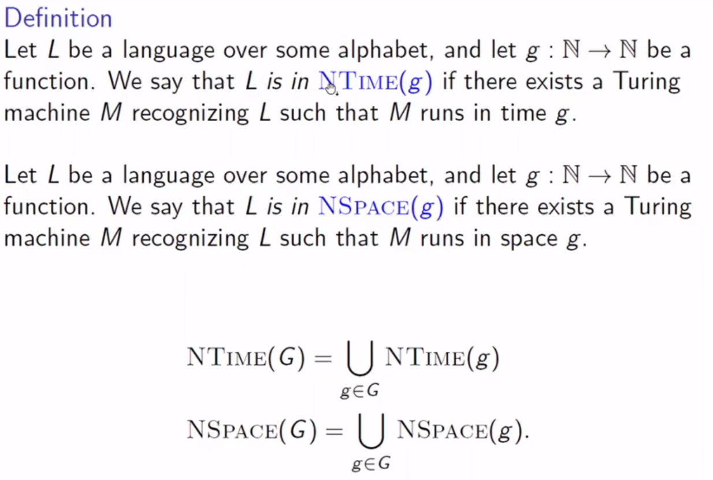


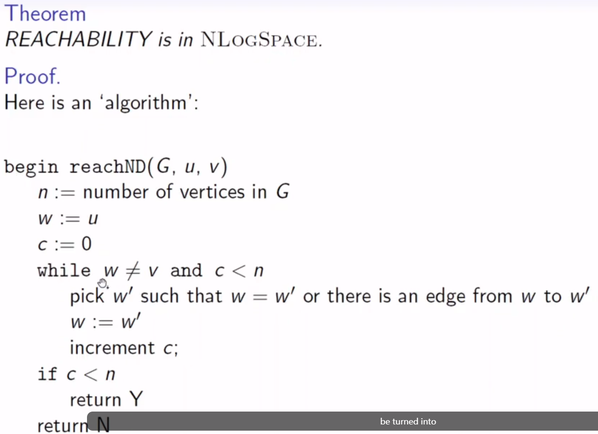

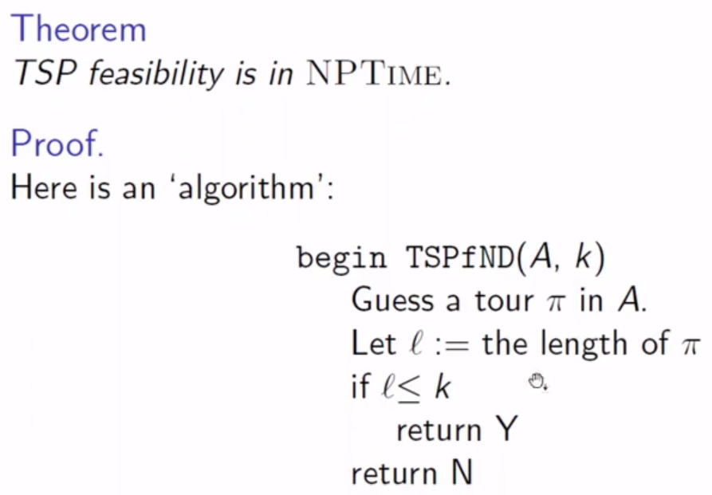

If answer is yes, then there will be a run which return Y, else you can never return Y, so this algorithm can decide feasibility. It is non-deterministic since you can just guessing one tour.


left is k-colorable but not right.


It is ND, because you can just guess a coloring, then check if it is correct, then by some miracle luck you will have it right and return Y. 

#### Inclusion

**Summary**

- $\text{Time}(G)\ \in \text{NTime}(G)$.
- $\text{Time}(G)\ \in \text{Space}(G).$
- $\text{Space}(G)\ \in \text{NSpace}(G)$.
- $\text{NTime}(G)\ \in \text{NSpace}(G)$.


- $\text{NSpace}(G)\ \in \text{Time}(2^{O(G)})$.

- corollary
  - $\text{NLogSpace}\ \in \text{PTime}$.
  - $\text{NPSpace}\ \in \text{ExpTime}$.
  - $\text{NExpSpace}\ \in \text{2-ExpTime}$... etc.

- $\text{NTime}(G)\ \in \text{Space}(G)$.

- $LogSpace ⊆ NLogSpace ⊆ PTime ⊆ NPTime ⊆ PSpace ⊆ NPSpace ⊆ ExpTime ⊆ NExpTime ⊆ ExpSpace ⊆ NExpSpace ⊆ 2-ExpTime ...$.

  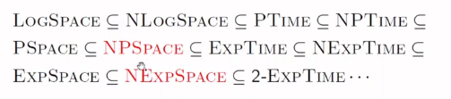

  from lecture 11, we have:

  

  note this does not include $\text{nlogspace}=\text{logspace}$.
  

  

  

- For all time-constructible, increasing functions $f (n) ≥ 2n$, $ Time(f (n)) \subsetneq ( Time((f (2n + 1)3 )$.

- $PTime \subsetneq ExpTime$.

- Note if a $P$ is complete in a lower class, it does not mean it is complete is a higher class.

if $G$ is the same, then deterministic is within non-deterministic (you can do more things at a time), time is within space (you can only reach G space with G time).

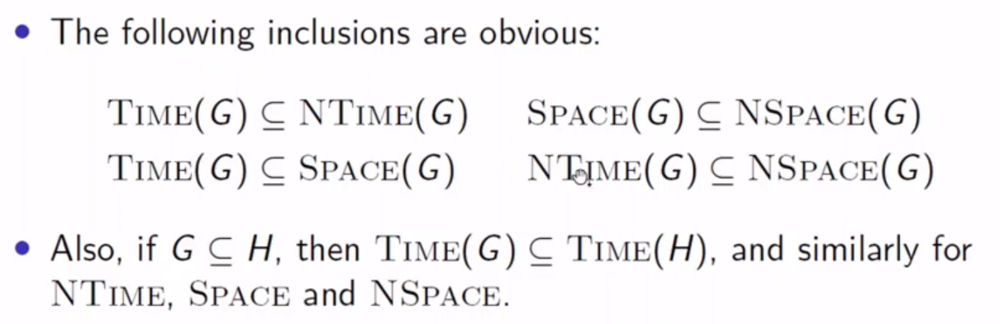

Time(G) is in Space(G) because you can at most reach G squares in the turing machine tape with Time(G).

Now let M be a K-tape turing machine $\langle K,\Sigma,Q,q_0,T\rangle$ and size of input is $s(n)$ then the maximum amount of configurations is:
$$
\begin{align*}
\text{max config size}&=\text{possible states}&\times& \text{possible work tape content} &\times &\text{possible head}\\
&=|Q|&\times&|\Sigma|^{K\times s(n)}&\times&(s(n)+1)^K\\
&\in2^{O(s(n))}
\end{align*}
$$


- possible states is the value of the head.
- possible tape content is combination of all alphabet of length s(n) on K tapes.
- possible head is possible position for head, +1 because you can be at the start and end of the tap.

This set of configurations forms a directed graph (maximum size of this graph is $2^{O(s(n))}$), where each edge represents one configuration can transition to another. We can also find a start configuration $c_0$ and a success configuration $c_*$, since the size of the graph is bounded by $2^{O(s(n))}$, the time for this search is also bounded by $2^{O(s(n))}$, therefore we have the proof:


 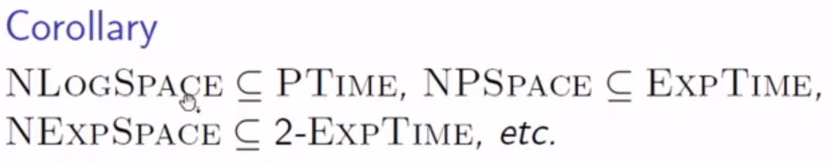

non-deterministic space in (nextlevel)Time (except linear)

- $2^{log}$ is in polynomial time, $2^{poly}$ is in exp time, similarly for others


This basically says use k_i to represent the exhaustive list of non-deterministic choice of a run on NDTM. 

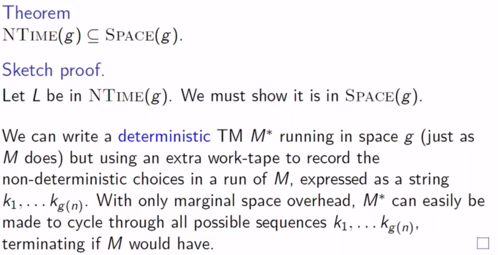

It basically says that since we have recorded all ND choices using k_i, we can use an extra tape to record each deterministic choice on the non-deterministic choices on each step, so the space use is at most space(g).

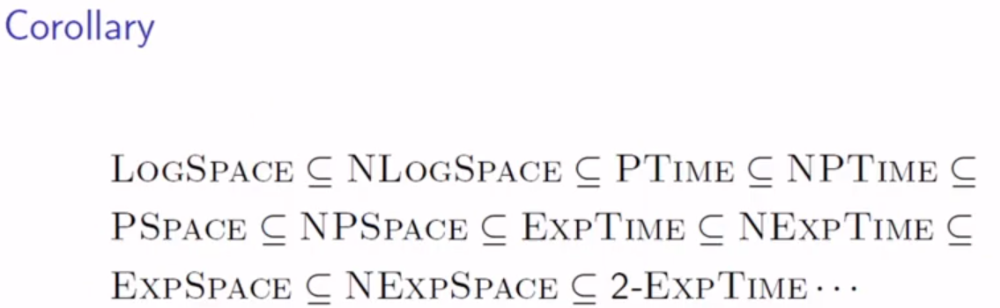

### Separation Result

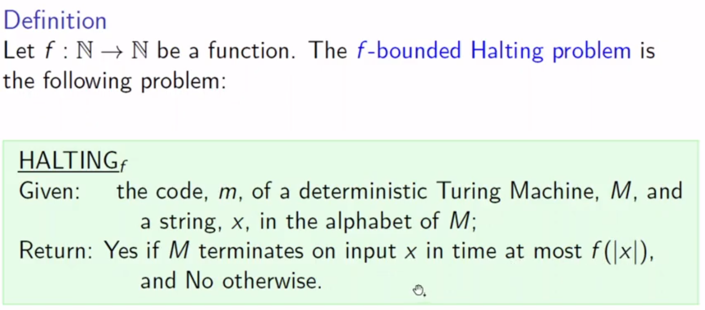

HALTING-f is basically to check if a turing machine can terminate within a certain time complexity given input x.

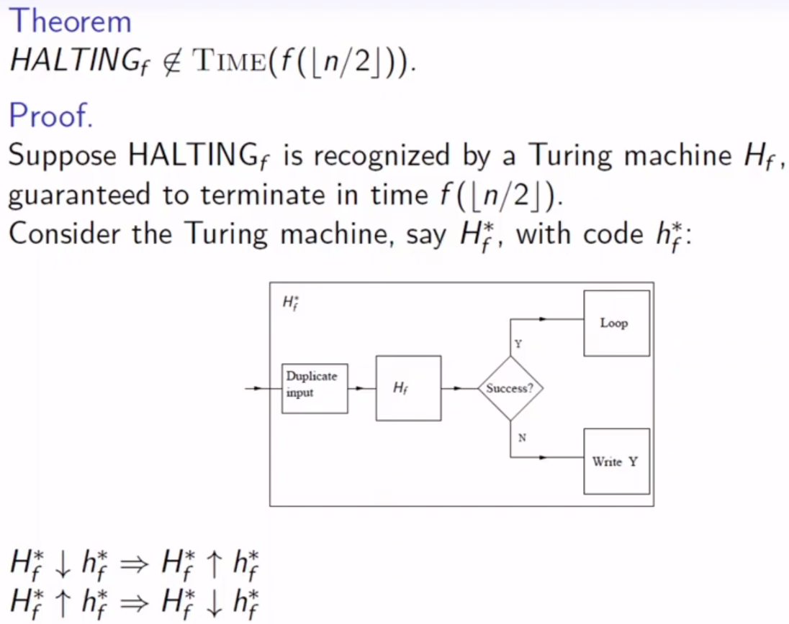

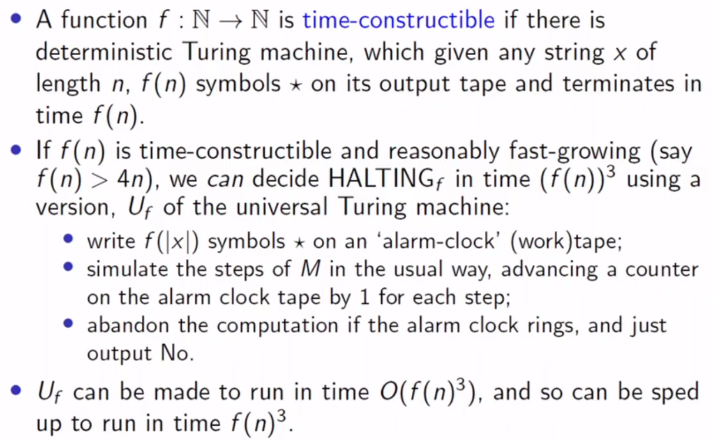

A function  **is time-constructible** if there exists a deterministic Turing machine such that for every , if the machine is started with an input of *n* ones, it will halt after precisely *f*(*n*) steps.  All polynomials with non-negative integer coefficients are time-constructible, as are exponential functions such as 2*n*.

It is shown that If f(n) is fast-growing (say >4n) then we can decide HALTING_f in time O(f(n))^3 using a UTM as described above. 


## Linear Programming

Linear programming is an optimization problem that generally means to maximize a objective functions given a set of constraints, e.g.:


### Lemma 26.3

The slack form of a LP is uniquely determined by the set of free variables.

## Lecture 7 Try to be logical

- SAT is in NPTime. 
- Horn-SAT is in PTime.
- Krom-SAT is in co-NLogSpace.
- QBF is in PSpace.

### SAT

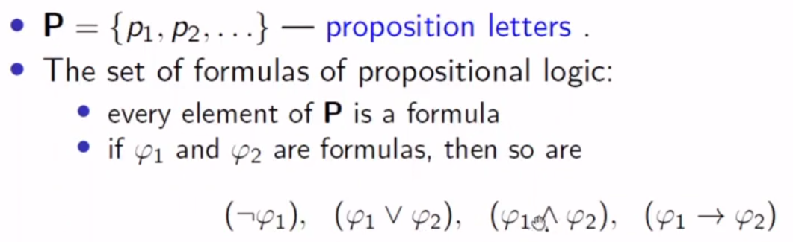

- literal: $p$ or $\neg p$, where p is a letter
- clause is a $l_1 \lor \dots \lor l_n$, empty conjunction is $\bot$.
  - unit clause: clause with just one literal
- if $l$ is literal then $\bar{l}$ is the opposite literal.
- satisfiable if there is an assignment such that $\theta(\gamma)=T$ for all $\gamma \in \Gamma$


obviously, since propositional SAT is in NPTime, then these two problems are in NPTime as well.


- resolve takes in a set of clauses and a literal and assumed the literal is true.
  - the first if statements remove $\gamma$ (clauses) that is already true
  - the second if statements remove unsatisfiable literals from each clause
  - so we will left with the modified clauses such that if it is satisfiable, then the given set of clauses with the assumption that $l$ is true is satisfiable.
  - in short it removes the redundant clauses/literals given $l$ is true.

### Horn


- if there is at least one negated literal in every clause, then we can simply set all variable to false to find a solution.
  - horn -> every clause at most 1 positive
  - no unit clause -> every clause has at least 2 literal
  - above two requirements guaranteed every clause has at least 1 negated literal.

### DPLL

**The Davis-Putnam ( -Logemann-Loveland) algorithm**

```python
set = set of clauses

def resolve(set, literal):
	for clause in set:
        if literal in clause:
            # this clause is satisfied
            set = set.remove(clause)
        elif ¬literal in clause:
            # this literal cannot be satisified
            clause = clause.remove(¬literal)
    return set

def DPLL(set):
    if set is empty:
        return True
    if empty clause in set:
        return False
    # resolve all unit clauses
   	while set contains unit clause as literal:
        set = set.remove(literal)
        set = resolve(set, literal)
        if set is empty:
            return True
        elif empty clause in set:
            return False
    # pick any literal and try assign both True and False
    literal = pick_literal(any_clause(set))
    return DPLL(set.add_unit_clause(literal)) or DPLL(set.add_unit_clause(¬literal))

def horn_DPLL(set):
    if empty clause in set:
        return False
    # remove all unit clauses
    while set contains unit clause as literal:
        set = resolve(set, literal)
        if empty clause in set:
            return False
    # at this point every clause has at least two literals
    # and there is atleast one negative
    # so we can assign all literals to False to have a satisfiable assignment
    return True
```

### 2-SAT (Krom)


We can represent the set of clauses (2-SAT) as directed graphs

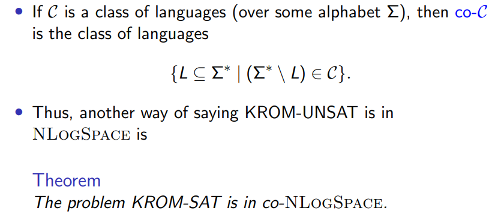

### QBF

QBF: given a quantified boolean sentence $\varphi$, return if it is true.

```python
def qbf(quantifiers, sentence):
	return qbf(quantifiers, sentence, empty list)

def qbf(quantifiers, sentence, assignments):
    if quantifiers is empty:
        return assign(sentence, assignment)
    
    current quantifier = next(quantifiers)
    quantifiers = quantifiers.remove(current quantifiers)
    current variable = get_variable(current quantifier)
    
    if current quantifier is for_all and qbf(quantifiers, sentence, assignments.add(current variable, False)) is False:
        return False
    elif current quantifier is exists and qbf(quantifiers, sentence, assignments.add(current variable, False)) is True:
        return True
    else:
        return qbf(quantifiers, sentence, assignments.add(current variable, True))
```

qbf is in PSpace.


## Lecture 8 How hard can this be

- SAT is NPTime-complete (Cook’s theorem).
- Horn-SAT is PTime-complete.
- st-CON is NLogSpace-complete.
- QBF is in PSpace-complete.

SAT is not essentially harder than 3-SAT, because 1 clauses with more than 3 variables can be reduce to 2 clauses that has less variables:

If we have a clause: $(l_1\or ...\or l_m)$ where $m\ge 4$, then we can introduce a new variable $p$ as: $p\or l_3 \or...\or l_m$ and $\neg p\or l_1\or l_2$. If we repeats this process then we can convert it to clauses that have at most 3 literals and it only requires polynomial time (in fact only logspace).

Therefore SAT is not essentially harder than 3-SAT.

###  Reducible (Many-one logspace)


This is like converting the language from $P1$ to $P2$ (remember language can represents a problem). If it can be computed by a DTM using at most log n space on any work tape, then we say $P1$ is (many-one logspace) reducible to $P2$. We can think of it as stating:

- $P2$ is at least as hard as $P1$.
- $P1$ is no harder than $P2$.
- If anyone show me an easy way to solve $P2$, I have a easy way of solving $P1$.

And we have just shown that SAT $\le_m^{\log} 3\text{-}SAT$.

SAT is reducible to 3-SAT


closed: if P1 is log-space reducible to P2 and P2 is in any of these classes then P1 is also in these classes.


The above theorem basically state that logspace reducibility is transitive.


Note that the output of f(x) from x may not be in log-space, although its working is, therefore we cannot say that this is a proof, but we have a workaround for it. Below is how we do it:


The above idea is only keep one bit of output from $f_1(x)$ at a time:

- calculate the first bit of output of $f_1(x)$, store it and proceed to $f_2(x)$.
- if $f_2(x)$ requires a bit on the right, then we continue $f_1(x)$'s calculation until we get that bit and goes back to $f_2(x)$.
- if $f_2(x)$ requires a bit on the left, then we restart $f_1(x)$'s calculation until we get that bit and goes back to $f_2(x)$.

This way we only need to store 1 bit at a time.

### Reducible (Many-one polytime)


We also have similar idea for many-one polytime reducible. 

Theoretically, log-space reducibility is a bit more useful, it is rare to find something that is polytime reducible but not logspace reducible, so when we talk about reducibility, we assume it is log-space unless stated specifically.

We have the following definition:


- We say $P$ is $C\text{-hard}$ if every problem in $C$ is reducible to $P$.
- We say $P$ is $C\text{-complete}$ if:
  - $P\in C$, and
  - $P$ is $C\text{-hard}$.

### Cook's Theorem


- **SAT is an NP problem**
  Assignment can be verified in polynomial time. We do not proof it here.

- **Every NP problem can be reduced to an instance of a SAT problem by polynomial time many-one reduction.**
  Given an NP problem (and turing machine M that solves it), for each of its input, we specify a boolean expression which is satisfiable iff the machine M accepts it (the given problem's machine). The expression uses the following variables:

  | Variables | Intended interpretation                                      | How many?    |
  | --------- | ------------------------------------------------------------ | ------------ |
  | *Ti,j,k*  | True if tape cell *i* contains symbol *j* at step *k* of the computation. | O(*p*(*n*)2) |
  | *Hi,k*    | True if the *M*'s read/write head is at tape cell *i* at step *k* of the computation. | O(*p*(*n*)2) |
  | *Qq,k*    | True if *M* is in state *q* at step *k* of the computation.  | O(*p*(*n*))  |

Here we basically have a propositional variables for each possible configuration of M, assign it true if the configuration is used in the machine M for input I, therefore we can encode any run on the machine with at most p(n) x p(n) size:


We then defines a bunch of propositional expressions such that for each encoding of any run on the machine M as demonstrated above, it satisfies the properties of the turing machine. In other words, it is to ensure that the encoding we have using propositional expressions above cannot have any ill-formed run of turing machine M.


By adding these propositional expression (like some rules to the encoding), we ensure that it does not leads to any ill-formed runs (e.g. impossible transitions or head appear in two places at the same time). The non-deterministic property mentioned basically to note that if you are in a particular state, then you may do several transitions from that point, but each transition must not be ill-formed.

If there is an accepting computation for *M* on input *I*, then *B* is satisfiable by assigning *T**i,j,k*, *H**i,k* and *Q**i,k* their intended interpretations. On the other hand, if *B* is satisfiable, then there is an accepting computation for *M* on input *I* that follows the steps indicated by the assignments to the variables.

All these clauses form a resulting set of clauses $\Gamma_x$, and this set of clauses is satisfiable iff M accepts x.

There are *O*(*p*(*n*)2) Boolean variables, each encode-able in space *O*(log *p*(*n*)). The number of clauses is *O*(*p*(*n*)3) so the size of *B* is *O*(log(*p*(*n*))*p*(*n*)3). Thus the transformation is certainly a polynomial-time many-one reduction, as required, and actually if we check it, it is in log-space as well, so:


Next we show that 3-SAT is NPTime-complete.

- Since SAT is NP-hard, then obviously 3-SAT is NP-hard
- And we already shown that SAT can be reduce to 3-SAT in log-space, and every NP problem can reduce to SAT in log-space, so every NP problem can be reduce to 3-SAT as well.


Next lets show that horn-SAT is PTime-complete:


deterministic means there is only one possible transition that is true, so it means there is at most one positive literals for transition above (q,h,p are negated, and there is only one positive p).


### Space

#### st-Con is NLogSpace-complete


basically you just construct a graph from initial configuration to the final accepting configuration of the given turing machine. Since the original turing machine is log-space, the construction of the graph is log-space as well, therefore it is nlogspace reducible. And we already shown before st-con is nlogspace-hard,  therefore it is nlogspace-complete.

#### QBF is PSpace-complete

We shown previously QBF is PSpace


if some L is PSpace, then its configuration graph can at most have $c^{f(n)\log f(n)}$ vertices, because it is the size of the tape is $f(n)$ and $\log f(n)$ is the size of the heads. We can represents each configuration as strings of bits, then strings of bits can be encoded into propositional variables, e.g. 010 = $\neg a\and b\and\neg c$, and we call this sequence of propositional letters $\bar{p}$ and its length is of-course in polynomial:


Now we can encode configurations in polynomial size, then we can encode transition t representing as: $\psi(\bar{p},\bar{q})$. Then if we can show that given any two configurations (p,q) and i steps (where $1\le i\le \log(c^{f'(n)})=f'(n)\cdot \log(c)$), $\psi_i(\bar{p},\bar{q})$ is reachable within $2^{i}$ step, then we can establish the proof.


Our first thought is too big because it doubles in size every time i+1. (? arent we proofing $2^i$ so it is fine?). The trick that we use only has a single $\psi_i$ so it does not double in length, but effectively they mean the same thing, we rephrase it such that it only increase by some constant amount as we do not double the $\psi_i$ (?? why this works).

So now we have size of configuration is in exp, but we only need log of it to reach between any two configurations, and log of exp is in polynomial, so it is in polynomial space.

## Lecture 9 Two NP-Complete Problems

- 3-colorability is NP-complete
- The problem EULERIAN-circuit is in LogSpace, hence certainly in PTime.
- By contrast, HAMILTONIAN-circuit is NPTime-complete.
- TSP feasibility is NPTime-complete.

### 3-colorability


We are going to show it is NPTime-hard, therefore showing it is NP-complete. We show this from 3SAT: from a set of 3 literals $\Gamma$, we compute (in log-space) a graph $G_{\Gamma}$ and show that they are iff satisfiable.

- dash line means they have the same color


For asserting a=b


For asserting a=b xor c


For asserting a=b or c


For asserting a=b or c or d, this can used to means either any of the variable in the clause


 

### Circuits

- An Eulerian circuit of G is a cycle in G in which each edge of G is traversed exactly once.
- A Hamiltonian circuit of G is a cycle in G in which each vertex is encountered exactly once.


- The problem EULERIAN-circuit is in LogSpace, hence certainly in PTime.

## Lecture 10 Integer Linear Programming

- LPF is in NPTime $\cap$ co-NPTime.
- LPF with integer A and b is in PTime.
- LP-infeasibility is in PTime.
- ILP is in NPTime and NP-hard, therefore NP-complete.
- homogenous equations Ax=0 where A is integer is in PTime?

### LPF

Recap on the coursework:

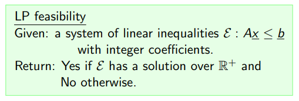

By adding slack variables, we can get:


Using Caratheodory's Theorem, we have:

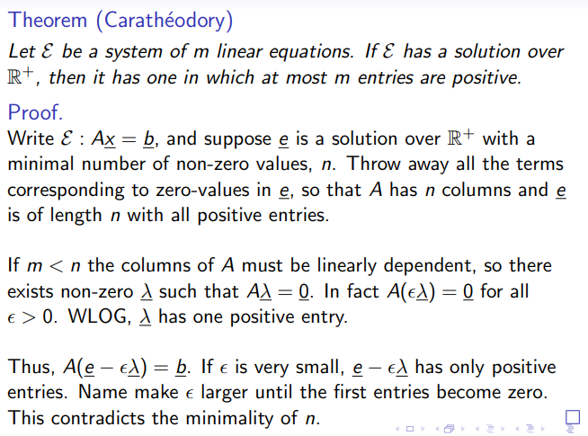


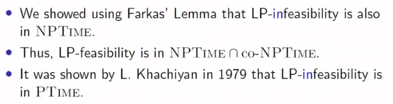

Note that although LPF is in NPTime $\cap$ co-NPTime, it does not mean that it is in polynomial time (although it is likely). But also note that LP-infeasibility is in PTime.

### ILP

Here we ask if the linear equations has integer solution instead of rational.

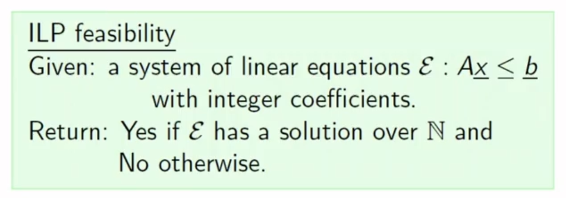


But of course, slack variables still works:


An equation in which all coefficients are integers and solutions are sought over the non-negative integers is called **Diophantine**.


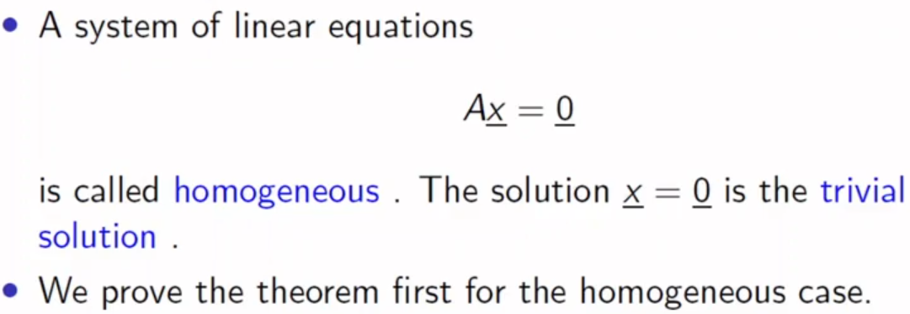

Right hand side is 0 means that it is **homogeneous**, and the solution x=0 is a **trivial solution**.


Lets assume we have minimal integer solution x*, consider a line from the trivial solution to it, like below:


note that each vertex of the cubes is an integer point, then from the trivial solution, we draw another line, connecting vertices, that as close to the line as possible, like some kind of zigzag line, and finally arrive at the x* vertex.


On this line, we have a sequence of vectors, from 0 to x*, which is in increasing order, like: 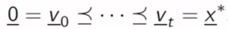. Note that every $v$ here corresponding to a vertex that is very close to become solution (differ by no more than $1$ on any dimension).

- If we multiply each of these vertex with $A$, then we can get another sequence of vectors, lets call it $w$, and each element is $Av_k$.
- We can also find a point on the original line for each vertex in the sequence, differ by no more than $1$ on any dimension, lets call it $w'$ and each element is $Av'_k$.

We claim that $Av$ is small, because $w_k=Av_k=Av_k-Av'_k=A(v_k-v'_k)$.  Note that $v'_k$ is a point on the solution line that we draw at the beginning. We can see that since $v_k-v'_k$ is at most $1$. 

Therefore, we have that every entry in any vector $w_k$ has absolute value at most $M+\dots+M\le nM$, where $M$ is the maximum absolute value of $A$ and $n$ and the number of variables.

Actually, they are not only small, but they are also different, this is because if they are the same, let say $i$th vertex and $j$th vertex, then we can have a solution at $Av_k-Av_j=\underline{0}$, which contradicting minimality of $x*$.

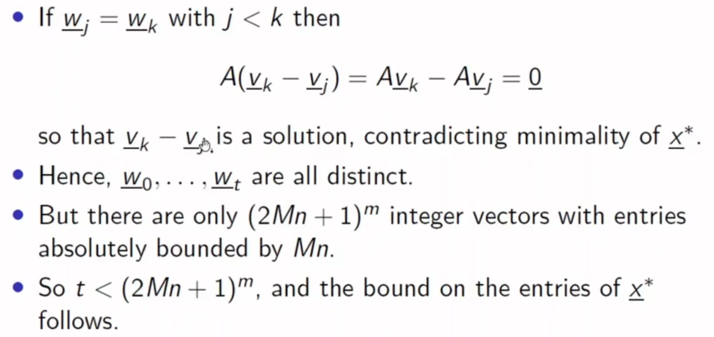


We can add a $y$ to $Ax=b$ to convert it to homogenous equation:

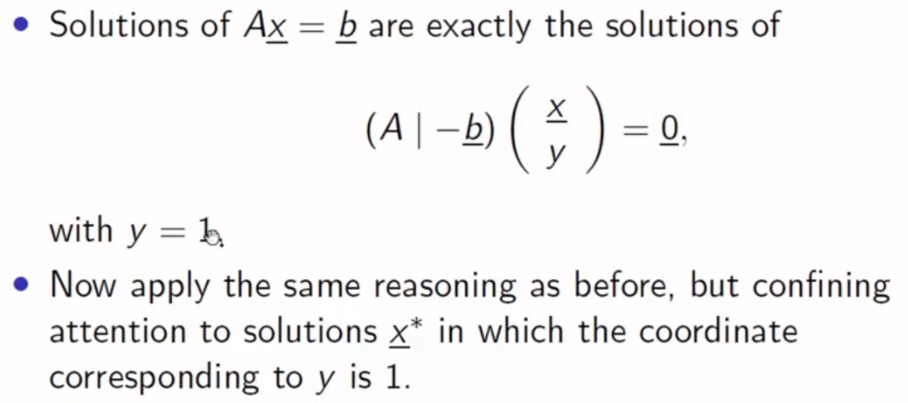

By applying the same reasoning, we have ILP is in NPTime:


Now we left to prove ILP feasibility is NPTime-hard:


Note since we need to have integer solution, $x$ in above image can only be the case that one of them is $1$ and the other is $0$.

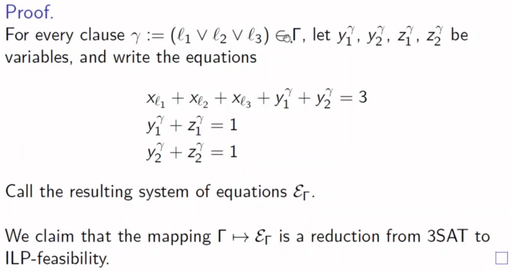

$y$ variables are to ensure that the equation are equal to $3$, to handle the case where only 1 or 2 or all 3 of $x$ is true. $z$ variables are there to ensure $y$ variables are $0$ and $1$.

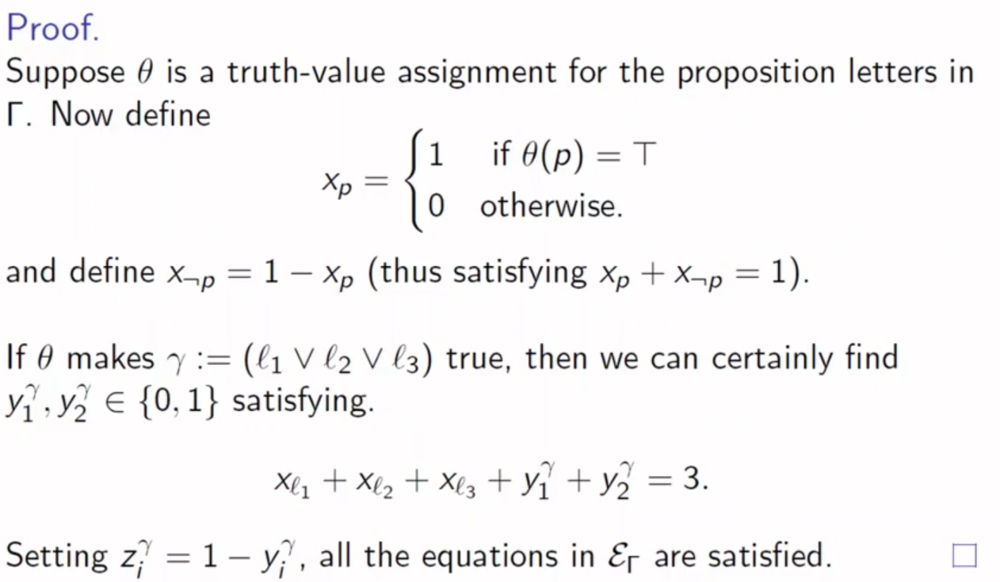

 

### Summary


## Lecture 11 Two Theorems on Space Complexity


### Is Reachable Num

```python
def is_reachable_num(s,t,G,h):
	if h is 0:
        return s == t or (s, t) in G.edges()
    for w in G.edges():
        if is_reachable_num(s, w, G, h-1) and is_reachable_num(w, t, G, h-1):
            return True
    return False
```


When implementing on a turing machine

- keep a list of triples (s,t,h) on a worktape to keep track where we are
  
  - if any call failed, we can just simply overwrite the call
  - else move on to next triple

The list of triples is at most $h$ in length and each item in the triples can be express in $log(v)$ space, since each recursive call uses constant space, we can see that this algorithm requires at most $O(h\cdot\log|V|)$.

Therefore st-con is $\text{space}(\log^2n)$.

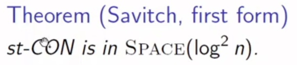

### Space-constructible

A function is **space-constructible** if there is a turing machine which given any input of length $n$, can write $f(n)$ symbols while using only working memory in order $f(n)$. Almost all ordinary/sensible functions like $\log n$ or polynomials are space-constructible.


It has to be reasonably fast growing so that we have enough space for computation.


Note this does not include $\text{nlogspace}=\text{logspace}$, this is just because $\log n^2$ grows faster than $\log n$. But nlogspace is equivalent to its complement class, that is, $\text{nlogspace}=\text{co-nlogspace}$.

### Unreachability

- UNREACHABILITY: yes if not reachable else no. This is proved to be a nlogspace.

```python
# check reachable in k step
# return true means it is reachable, (by some miracle)
# but return false does not mean it is not reachable 
def reachable_lossy(s,t,k):
    u = s
    while k > 0:
        v = guess any node
        if u != v and (u, v) not in E:
            return False
        u = v
	return u != s
```

 Now assume we have an algorithm call `is_reachable_fail(s,t,k)` that returns either $\bot$, `True` or `False`.

- It returns `True` iff `t` is reachable from `s` in at most `k` steps.
- It returns `False` iff `t` is not reachable from `s` in at most `k` steps.
- It returns $\bot$, then we cannot tell anything.

With this algorithm, we can do:

```python
def num_reachable_fail(s, k):
    if k is 0:
        return 1
    num_reachable = 0
    for each node in N as t:
        reachable = is_reachable_fail(s, t, k)
        if reachable is fail:
            return fail
        if reachable is True:
            num_reachable += 1
    return num_reachable
```

This algorithm return either fail ($\bot$),  or return the correct number of reachable nodes from $s$ in $k$ or fewer steps.

Now lets look at the implementation of `is_reachable_fail`:

```python
def is_reachable_fail(s,t,k):
    num_reachable_1_less = num_reachable_fail(s, k-1)
    if num_reachble_1_less is fail:
        return fail
    num_reachable_1_less_lossy = 0
    for each node in N as v:
        if reachable_lossy(s, v, k-1) is True:
            if v == k or (v, k) in E:
                return True
            num_reachable_1_less_lossy += 1
    if num_reachable_1_less_lossy < num_reachable_1_less:  # check that all reachable_lossy calls did not return unreliable False
        return fail
    else:
        # we must be very lucky
        return False
```

Now, this is the algorithm for checking unreachability:

```python
def is_unreachable(s, t, (V,E)):
	if is_reachable_fail(s, t, |V| - 1) is False:
        return True
    return False  # either fail or True
```

Therefore, we have the following theorem:


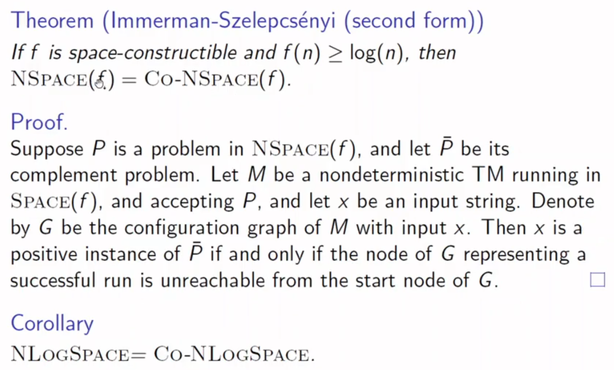

### KROM-SAT


### Big Picture


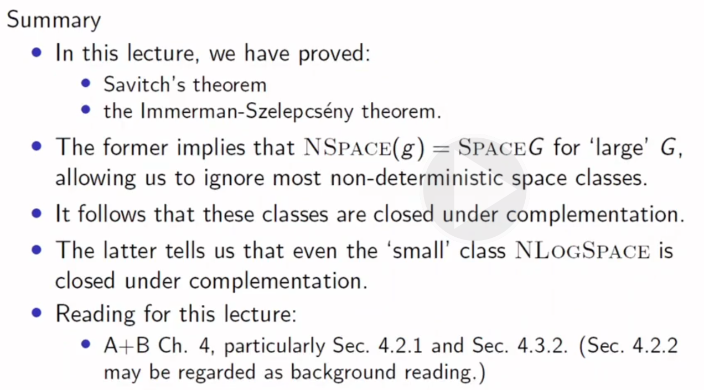

## Miscellaneous

Total function: function defined for all possible input values

Computable function: function that can write a algorithm to compute it.

### Quiz

#### 1

- SAT is PTime-hard: **True**
- PSpace is a proper subset of ExpTime: **Not Known**
- PTime = co-PTime: **True**
- PTime is a subset of NPTime ∩ co-NPTime: **True**, opposite direction is not known
- PTime is a proper subset of ExpTime: **True**
- PSpace is a subset of NLogSpace: **False**
  - NPSpace = PSpace (in later lecture)
- The problem QBF (truth of quantified Boolean sentences) is in PTime: **Not Known**
  - if this is true, PTime = PSpace.

#### 2

- L1 is in NPTime. Assuming that there is a many-one logspace reduction from L2 to L1, what follows about L2? 
  **L2 is in NPTime.**

- L1 is NPTime-hard. Assuming that there is a many-one logspace reduction from L1 to L2, what follows about L2?
  **L2 is NPTime -hard**

- L1 is in NPTime. Assuming that there is a many-one logspace reduction from L1 to L2, what follows about L2?
  **Nothing that doesn't follow without the assumption.**

- L1 is NPTime-hard. Assuming that there is a many-one logspace reduction from L2 to L1, what follows about L2?
  **Nothing that does not follow without the assumption.**

- L1 is in NPTime. Assuming that there is a polynomial time reduction from L2 to L1, does it follow that L2 is in NPTime?

  **True**

- Claim: Of the following two statements, the latter is the stronger.

  1. There is a logspace reduction from L2 to L1.
  2. There is a polynomial time reduction from L2 to L1.

  **Wrong**

- Claim: L1 is in PSpace. Assuming that there is a polynomial space reduction from L2 to L1, it follows that L2 is in PSpace.
  **True**

- Which of the following quentified Boolean sentences evaluates to true?

  - ∀p1∃p2(p1 XOR p2) **True**
  - ∃p1∀p2(p1 XOR p2)
  - ∃p1∀p2(p1 ∨ p2) **True**
  - ∀p1∃p2∃p3¬(p1 → (p2 → p3))
  - ∃p2∀p1∀p3(p1 → (p2 → p3)) **True**

#### 3

- The problem LP-feasibility is defined as follows:

  Given a system of linear inequalities Ax ≤ b, where A is an integer matrix and b an integer vector, 

  Return Y if this system has a solution over the non-negative rationals, N otherwise.

  What is the lowest complexity class this problem is known to be in?

  **PTime**

- The problem ILP-feasibility is defined as follows: 

  Given a system of linear inequalities Ax ≤ b, where A is an integer matrix and b an integer vector, 

  Return Y if this system has a solution over the non-negative integers, N otherwise.

  For which of the following complexity class is this problem known to be complete? Tick all that apply.
  **NPTime**

- The problem Homogeneous-ILQ-feasibility (which I have just made up) is defined as follows: 

  Given a system of linear equations Ax = 0, where A is an integer matrix, 

  Return Y if this system has a non-trivial solution over the non-negative integers, N otherwise.

  What is the lowest complexity class this problem is known to be in?
  **PTime**

- The problem PosNeg-ILP-feasibility (which I have just made up) is defined as follows: 

  Given a system of linear inequalities Ax ≤ b, where A is an integer matrix, 

  Return Y if this system has a solution over the integers, N otherwise.

  For which of the following complexity class is this problem is known to be complete?

  **NPTime**

- What is the smallest set among the following that the problem of 2-colourability is known to be in?
  **Time(O(n))**

- What is the status of the following claim?

  NSpace(O(n)) = Co-NSpace(O(n)).

  **True**

- What is the status of the following claim?
  NSpace(O(n)) ⊆ Space(O(n2)).
  **True**


#### Amortied Analysis

amortied analysis is a method for analyzing time/space complexity, it tries to looking at the worst-case run time per operation, rather than per algorithm, as it can be too pessimistic.

- Avergae running time per operation over a worst-case sequence of operations.
- traditional worst case analysis can give too pessimitic bound if the only way of having expensive operation is to have a lot of cheap ones before it.

- aggregate method: amortized cost = total cost/#operations
  - inserting in array, we have to expand array if necessary, this means worst case insert is O(n), but amortized analysis says that it is O(1), since when cost of expanding the array is spreaded among elements, it is constant.
- Accounting method: Some operations are overcharged, because the cost maybe used for paying subsequent operations.
  - Amortied analysis says that inserting in a array is 3 credits:
    - table not full: use 1 credit for insert and save 2 credits
    - table is full:  doubling: half of the elements have 2 credits each. Use these to pay for reinsertion of all in the new array.
- Potential method: (lazy read too long)

#### Simplex

1. convert minimize to maximize problem
2. convert all equations to <= constant
3. convert to table and add slack variables for each constraint
4. repeat until all positive in objective function row
   1. find minimum row and column. min column = least in object function row, min row = min constants/min column, call this number m
   2. convert m to one and all number in m's row to zero (equivalently).
5. then we get the solution by:
   1. for each col:
      1. if it is singular (only contain one 1 and others are 0), then its value is its row's constant
      2. else 0.


 