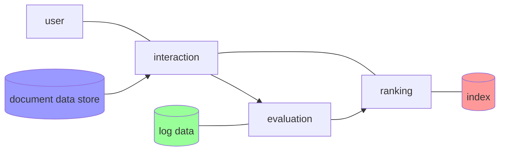
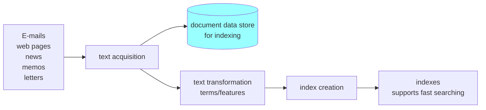
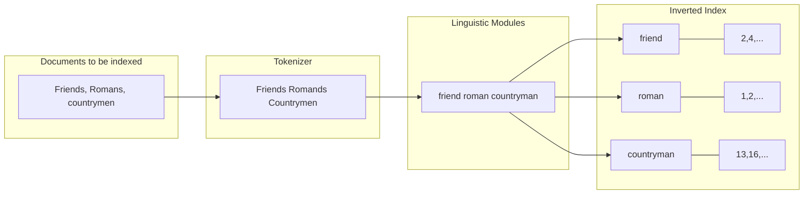
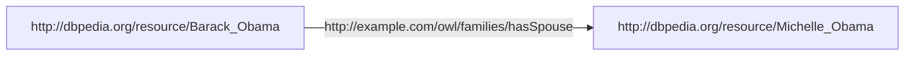
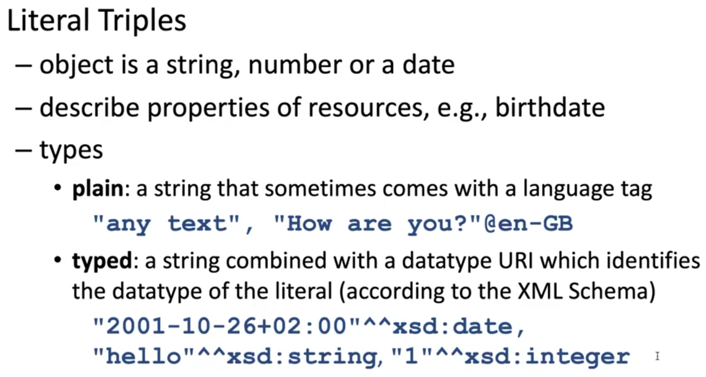
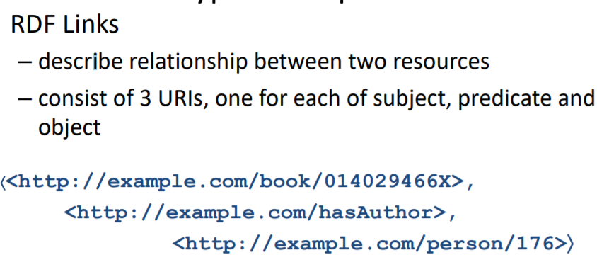
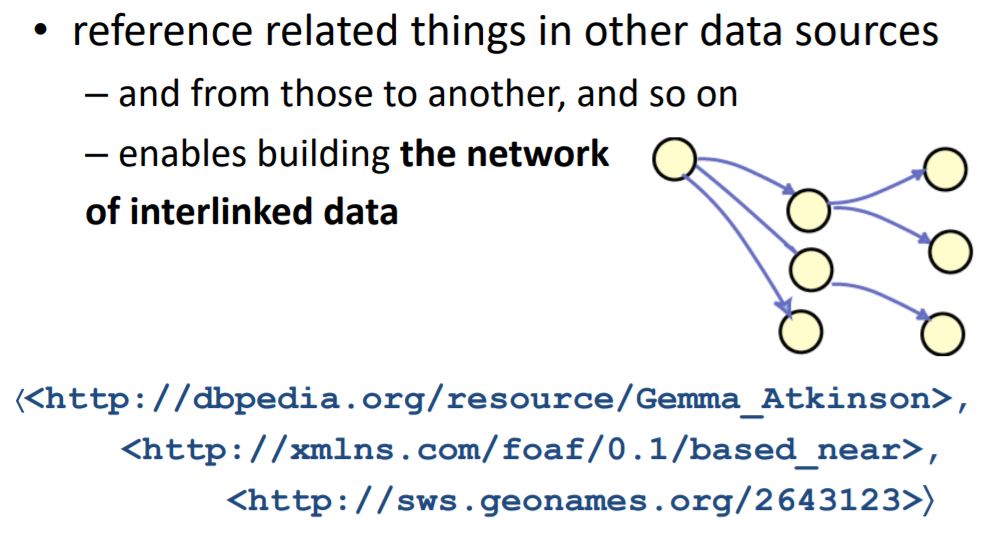
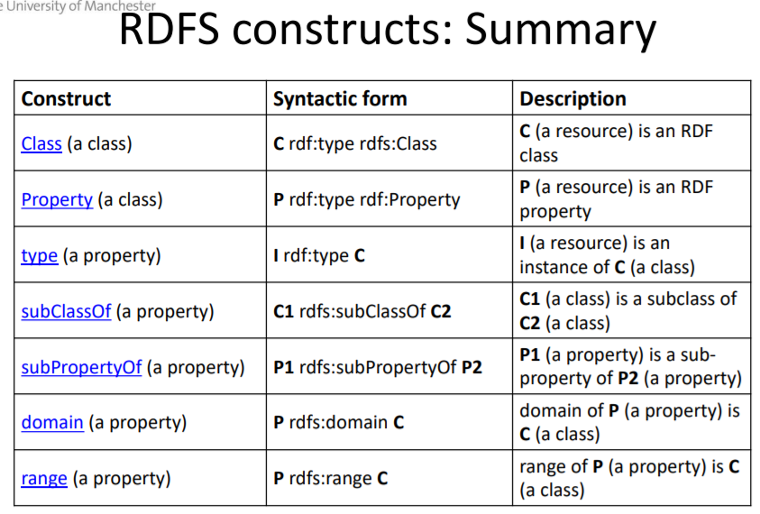
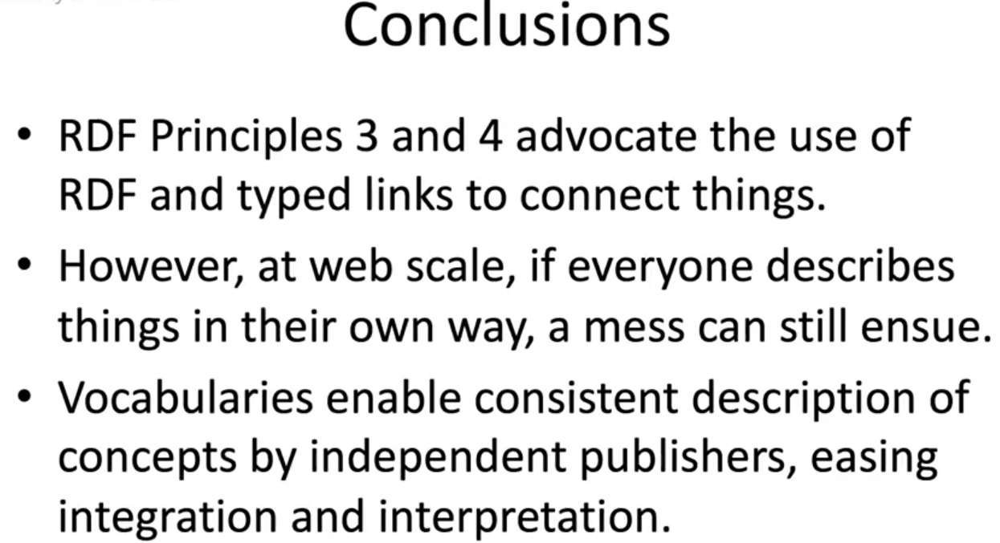

COMP38211 Documents & Data on the web

## Documents on the web

There is huge volume of various types of data on the web. For example Twitter has 10k new tweets/sec; Google handles 3.5billon searches/day.

There are structured data like those in the database; but most of the data nowadays are unstructured, and it is growing larger and larger. Note that structured data we referring here is those structured to machine, not human, for example, text and images are typically unstructured to machine.

What we have currently is **web of documents**, they are connected by **untyped links**. It is designed to be consumed by human but it is difficult for human to find what we are searching for, because there is implicit semantics of content and links.

What machine want is actually **web of data**, because machines are rarely interested in the documents itself, we want the data connected by **typed links**, so that machine can understand them, like a global database, then we can add explicit semantics. This way when we index and search at the web scale, it will be efficient. Note that the computation power we have cannot afford to index and search all documents on the web on the fly, so data are analysis offline using distributed and parallel computing.

We will be looking at cloud services:

- Map Reduce: a scalable programming model, origin
- ally developed by Google for task such as index building (Google said that they stopped using MapReduce in 2014)
- Hadoop: a widely used open source implementation of Map Reduce.

## Information Retrieval (IR)

IR is not…

- Not only search engine, it also includes searches in social media platforms, legal database etc. 
- Not only about text as well, it can be speech QA (siri) or music retrieval (shazam).
- Not only English, there are people who use other languages.

>  IR is finding material of an unstructured nature that satisfies an information need from within large collections.

- **unstructured**: there is no obvious structure that computer can easily deal with. This does not mean no structure at all, there is document structure (title, paragraphs, etc.) and visualization structure (html, xml, latex, etc).

- **large collection**: cannot do it manually (often dynamic)

- **information needed**: topic which user desires to address on the web.

  - Navigational: query to take user to the page, short query (<3).
  - Transactional: query that interacts, multimedia, communication.
  - Informational: collection/retrieve information, longer query(>2)

  A document is relevant if the user perceives that it contains information of value with respect to the information need. But it is hard to determine relevance, we have to find a way to balance different criteria.

  - does the user like the answer?
  - has user clicked on it? how long did they spent on it? have they click another? did they change the query? is it a new query?
  - what about spam/adverts etc on the web?

### IR System

A typical indirect relationship

- search formulation: query -> query representation
- indexing process: documents -> document representation (offline)
- find similarity between the query and documents representation

#### Search Formulation (online)

Use of keyword & questions

- Google example:

  | \# words | percentage of searches |
  | -------- | ---------------------- |
  | 1        | 21.71%                 |
  | 2        | 23.98%                 |
  | 3        | 19.60%                 |
  | 4        | 13.89%                 |
  | 5        | 8.70%                  |
  | 6+       | 12.12%                 |

  - Searches volume grow by roughly 10%/year
  - 16%~20% searches are new every year.
  - Questions constitute 8%.

0. [Assist the user in formulating the request] (? hint, autocomplete, spelling correction)
1. Transform the query (index the query)
2. Map query against the index
3. Retrieve and rank the results
4. Help user browse the results and re-formulate the query
5. log user action etc.



#### Index Process (offline)

We reduce documents to index terms, then we map user query to the index, determine the similarity between index and user query, thus index construction is critical part of the IR system.

1. We acquire documents through crawling, feeds, etc.
2. Generate index for each document.
3. Store the index in a easy-to-search form.



We can convert the documents into a vector space representation.

**Term-document matrix**


**Term-document frequency matrix**


We can have incidence matrix where instead of frequency we have 1 and 0 only to indicate whether the word exists.

But note that these matrixes can be massive. Assuming 1 million documents, each containing 1k words and we have 500,000 unique words. Our matrix will have the size of 500,000 * 1,000,000 = 500,000,000,000 (half a trillion). Obviously this is a sparse matrix and we can try to reduce its size by just storing the 1s not the 0s. So we have this idea of **inverted index**, where each term store the list of documents containing those words (called postings).


Now the problem becomes inverted index construction, we do this by:



(? But what if tense/capitals matters )

Then we will have the **indexer** to process those inverted indexes. Indexer steps:

- Token sequence: sequence of (modified token (not unique yet), document id).
- Sort: first by term, then by document id.
- Dictionary & Postings: Multiple term entries in a single document are merged, split into dictionary and postings, frequency for each term is also added.


### Representation (docs & queries)

We normally use either Controlled search terms (tags) or Words.

#### Controlled search terms

- Example: PubMed

  - MeSH (Medical Subject Headings) is a controlled vocabulary used for indexing articles for PubMed.
  - Each article is manually assigned a set of MeSH tags, then you search by those MeSH tags.

  

#### Words

Most important words? Extra weights to title? bold? quote? Background? Think of possible queries?
We have to do this systematically on large scale.

- Simplest model: Bag of Words (BoW), it is efficient and used in many areas but it has many problems:
  - Ambiguity: different meaning for the same word.
  - Variability: same meaning for different words.

We have to find a way to determine good index terms.

**Frequency**

- Zipf's Law says that the frequency of any word in a given collection is inversely proportional to its rank in the frequency table. (This mean rank * frequency ~= constant). 
- luhn's hypothesis says that we can introduce two bounds for the frequency of words to remove the common and rare words and leaves the significant words.
  

**Combinations**

Word combination often have specific meaning; world cup, break a leg, turn up, cutting edge; idioms, organization names, etc.

- N-grams: a contiguous sequence of n words from a sequence of text: unigram, bigram, trigram, etc, it is often quite low.
  - to be a, a number of, one of the, I don't, the end of,, etc…

**Stop words**

High frequency words/n-grams has low distinguish power for index, top 30 words account for ~30%  mentions and they are content free. So we might want to filter them out. You can try:

```
from nltk.corpus import stopwords`
sw = stopwords.words("english")
```

But now trends are away from doing this, because some people include those words in their searches and we have more storage and can store those indexes.

## Preparing to index

### Document Conversion & Language Domain identification

- **Document conversion** (not language/domain dependent)
  We have to map documents to an internal representation format, like pdf, doc, xml, etc. Some of the document even comes in scanned format (e.g. when you take an image of a pdf).

- **Language Identification**

  We have to determine choice of processors on a per language basis. But how do we identify the language? This is not trivial even for short text.

- **Text type & Domain Identification**
  We also want to determine the genre: social media, news, literature, emails, etc. Domain like biology, chemistry, law, entertainment can be useful as well.

  - Punctuation varies with text type/domain
  - May need specific resources: controlled vocab, lexicons, grammars, trained ML models.

### Tokenization

This task is to identify the main tokens: basic unit to deal with. It is roughly corresponding to number of words, numbers and special symbols. There are many things to deal with, e.g. white space is not the only delimiter! If you see 200g/7oz then you probably want to split by "/" as well, sometime dash may not be separator (when it is used in line-break), even "." or "," may not be separator (i.e., $1.20), sometime it may just be a typo because dash "-" is close to "p" on the keyboard. There are also other languages like Chinese where there is no spaces between words and Japanese which uses several alphabets in one sentences (katakana hiragana, kanji, romaji). Some languages are not written left to right and direction can even change within the sentence (e.g. Arabic, Hebrew, sentence is right-to-left but number is left-to-right).

1. Segmentation

   - Remove leading & trailing questions marks, parentheses and punctuation.
   - Replace white spaces & punctuation with word boundaries 

   In language like English, this produces reasonable performance but have issues with:

   - over-segmentation: ad hoc
   - under-segmentation: London-based

2. Handle abbreviations & enclitics

   - period "." can be both separate token and abbreviation (integral part), this usually can be check by if it precedes by a word or letter.
   - abbreviated form typically of auxiliary verbs (be, will). I'll -> I will, I'm -> I am, can't -> can not.
     - ambiguity: she's -> she has/is.
     - apostrophes are ambiguous
       - genitive markers: Remarque's book
       - quotative markers: 'All Quiet on the Western Front'

3. Handle hyphenation

   - self-assessment: 1 token, UK-based/end-of-line: 3 tokens
   - lexicon hyphen: compound words, meta-, co-, pre-, multi-, etc.

4. Special expression

   - email, urls, telephone number, date & time, measures, citations, hashtags.

Issues

- abbreviations: etc, ltd., or other unseen abbreviations
- numbers: decimal, language conventions: 123,456.78; 123 456,78; telephone number formats
- dates: 10 Oct 2020, 10/10/2020
- punctuation: usually separator but: e.g., dr., M/cr.
- quotation marks: usually separator but: single quote and apostrophe often same char.
- domain-specific issues & rules: E. coli, Saccharum spp. L., DNA sequences: 5'-TATGCTCGCCAGAGGATAATTA-3', chemical names: 4-[(2-(4,8-dimethylquiolin-2-yl)hyp…)], coordinates: 41202'23"N.

There is no firm rules for tokenization, it has to be consistent with  the rest of the IR system. It is a problem of knowing when to split, not combine, we want to avoid over-segmentation, and it has to be efficient.

### Linguistic Modules

Aim is to normalize the token (unhappiness -> un + happy + ness, morphemes (stem & affixes): clueless -> clue + less). Words often have inflection: the modification of a word to express different grammatical categories/roles: tense, 1/2/3th person, singular/plural, gender, case, mood, voice, perfect/imperfect/habitual. 

- case folding: Parsnips -> parsnips

  - we can simply convert everything to lowercase but it can lost semantics meaning: Apple (company) and apple (fruit). But does the user need this? Will they give us appropriate input? It depends on application.
  - what about special characters like emojis, accents, ligatures?

- two principle approaches:
  - Lemmatization: parsnips -> parsnip

    - using dictionary: can be slow
    - morphological analysis: usually rule-based, finite state automata. regex
      - regular inflectional morphology is easy like nouns and verbs, but there are irregular words which may still need a dictionary.

  - stemming: automated -> automat

    - chop end of the word, language depends, crude, result may not be word.

      - under-stemming: divide -> divid, division -> divis (fail to corelate terms)
      - over-stemming: neutron & neutral -> neutr (corelate unrelated terms)

    - [Porter Stemmer algorithm](http://facweb.cs.depaul.edu/mobasher/classes/CSC575/papers/porter-algorithm.html) in 1980 divide words into consonants (C), vowels (V) and measure in the form: $[C](VC)^m[V]$, then he form rules with this pattern.
      

      Generally, the steps are:

      1. get rid of plural, -ed, -ing for m>0: agreed -> agree, feed -> feed.
      2. change y -> i when there is another vowel.
      3. map double suffixes to single ones
      4. deal with suffixes: -full, -ness, etc.
      5. take off -ant, -ence, etc.
      6. tidy up, remove -e and double letters.

- spelling corrections: vomitted -> vomited
  This is pretty common.

  - 0.05% in newspaper
  - 26% in web query
  - on average, 1 word in every tweet.

  - non-word error: graffe -> giraffe
  - read-word error: piece -> peace: need context to correct it

  - 80% of all misspelled words are caused by single-error. (edit distance 1), almost all are with edit distance 2.

    - insertion
    - deletion
    - substitution
    - transposition

    - typographical (keyboard-based): 83% novice and 51% overall, many is surrounding keys.
    - cognitive: phonetic (seperate -> separate) and homophones (there -> their)
    - optical: D -> O, ri -> n

  - [simple algorithm](https://norvig.com/spell-correct.html) can work for 80-90% cases, based on simple probability approach.

  **Non-word error**

  For non-word error, we usually generate a list of candidates and decide which is the most suitable one. Some options that efficiently find candidates includes:

  - run through dictionary and check edit distance
  - generate all words within an edit distance k
  - use character k-gram index and find dictionary words that share most k-gram with word (see IIR sec 3.3.4)
  - compute them fast with Levenshtein finite state transducer
  - Have a precomputed map of words to possible corrections, e.g. http://norvig.com/ngrams/spell-errors.txt

  Instead of finding the very best spell corrections, we usually find a list of pretty good corrections (e.g. edit distance 2), then we find the best among them. This is a recurring paradigm in IR including find the best docs for a query, best answers, best ads, etc.

  The probability model (x=misspelled, w=word from vocab V):
  $$
  \begin{align*}
  \hat{w} &= \underset{w\in V}{\text{argmax}}P(w|x)\\
  &=\underset{w\in V}{\text{argmax}}\frac{P(x|w)P(w)}{P(x)} \leftarrow Bayes\\
  &=\underset{w\in V}{\text{argmax}}P(x|w)P(w)
  \end{align*}
  $$
  $P(w)$ is easy, just the word's frequency. $P(x|w)$ can be found by computing a corpus of errors:

  

  we can also come up with a confusion matrix that tells you number of times letter x is mistype to letter y:

  

  Other methods:

  

  What google does is that they figure out possible misspellings and their likely correct spellings by using words it finds while search the web and processing user queries, it is user-behavior based.

  **Real-word error**

  flying form A to B -> flying from A to B.

  1. for each word: find word with similar spelling and pronunciation as candidates, (include the original word in the candidates).
  2. choose the best candidate
     - noisy channel view of spell errors.


## Week 4 Querying & Ranking

### Boolean Model: Boolean query processing

Merges: AND, OR and NOT. For AND-merge, it is important that posting are sorted. For arbitrary boolean formulae, we can always merge in linear time $O(kN)$ where k is the number of query terms and N is number of docs, linear in document and query terms. $O(N)$ is the tightest bound and we cannot do better than this. But we can do some optimization:

- start search from smaller set of postings
  - imagine query a AND b AND c, if c only exists in 2 documents, then we can just search for whether that 2 document contains the word a and b.
  - For this we need the document frequency for each term (size of postings).
- prioritize NOT term.
  - for frequent negated terms, use N-length of negated term postings list in desc order
  - for infrequent negated terms, use length of the negated term postings list for ordering


 in extended model, each term in document are embed with position, then query can refer to those information:

- /n: /3 means within 3 words
- /s: in the same sentence
- /p: in the same paragraph
- +s term1 must precede term2 in the same sentence

### Ranked Retrieval

Boolean model is too rigid and sometime we want some flexibilities, and its result is often unranked.


The idea is to represent documents as vector. This means we have a very high dimensional vector for each document because it has many different terms, and it is going to be very sparse.


term frequency is number of time a term appear in a document. More occurrence = more relevant.


document frequency is the number of documents that a term appeared. The idea is that if a term is rare, then documents that contains this term will have higher weighting.


we want higher weights for rare terms, so we use N/df where N is the number of all documents. So the lower df is, the higher N/df, then we use log to dampen the effect because we do not want to grow too fast -> if a term appear 10 times more than another, it does not mean that term is 10 times more relevant, probably just 2 times.


Combining tf and idf we have tfidf weighting, one of the most popular search weighting even up until today. It increases when the number of occurrence within a document increase and when rarity increase.


So we use tfidf for each term in the document, then represent document as vector. the distance between angle are measured using cosine.

 


### Measuring Quality Retrieval

- Precision: relevant in all retrieved
- Recall/sensitivity/TP-rate: relevant in all relevant
- F-measure: 2pr/(p+r)
- contingency table
  
- FP-rate: how many irrelevant documents are retrieved.
- specificity/TN-rate:  non-relevant in all non-relevant
  - usually not informative because number of non-relevant documents is huge and TN-rate will always be very high.
- ROC curve: TP-rate against FP rate
  

Note that these measure does not take ranking into account. i.e. does not care whether the first document is relevant or not, but this usually has larger impact than subsequent documents. There are also other things like the following that we did not consider.


 

## Week 5 Enhanced Ranking & Retrieval

### Probabilistic Model

Vector Space Model (VSMs) work pretty well, but:


What we want to achieve is understanding the user needs (context), and this involves uncertainty. Probability theory is good for dealing with uncertainty.


What we will focus on is (statistical) language modelling.


We are looking for a way to telling us the following:


We can create a DFA that gives the probability of a string:


If we have DFA for each document, then we can calculate the probability of the document is relevant given a string (query). There are some variants of the model:


Unigram basically is the probability of each word, measured separately, and bi-gram/n-gram measure the probability of words given some other words, therefore it is more important here.


 


One easy way to learn the probabilities is to use word count, there are also some other approaches like machine learning and statistical model.

 


 

### PageRank

The original algorithm that google uses.


In order to do this, we need to find the IN links and OUT links of each page.


Example:


Each node has 0.2 initially (5nodes so 1/5=0.2), each node send its value (partial PR) to its OUT link, if you have 2 OUT link, then you send 0.2/2=0.1 to each of them. So each node will distribute its weights, this process repeats until convergence (however undefined).


In practice page rank is just 1 of 200+ measures that google uses.

### Improving Querying & Retrieval

You can use user behavior to improve the ranking, for example, if most user click on 3rd result, then you might want to rank it first instead. But note that higher position result tends to get higher clicks, no matter whether the user actually prefers them.


#### Relevance Feedback


Let user mark whether some documents are relevant, then improve based on that information.


You want to get good result, not the best result, since you only know whether a document is relevant, not how relevant it is.


It is not always practical due to the problem above.

#### Query Expansion

We can try to expanse user query, for example, when user search for doctor, we also search for hospital, medicine, etc.


You can also expand query based on previous searches or maybe find out what is the combination/topic the user is actually looking for, Note that this maybe expensive, you probably won't want to add too much query.


When you add extra words, you have to reduce their weights, because it is not exactly the term user is looking for, and if you add a wrong word, you may reduce the quality of retrieval. For example, when user search for interest rate, you may want to add "fascinate evaluate" which will be wrong.


## Data on the web

- data is weakly structured and not fully connected (data islands)
- documents are written in HTML
  - meant to structure document not data
  - data is intermingled with surrounding text
  - designed for humans but hard for machine.


data in HTML is weakly structured and often machine cannot interpret those text, except those with meaningful tags.


Some people comes up with a richer HTML formats to provide more explicit information in the documents.


data like those in the API 


data is too much -> machines -> data centers -> providing vendor service like aws

```java
data
.map((id, value) -> dict.get(id).put(value))
.reduce((id, values) -> (id, values.sum() / values.count()))
```

### Map Reduce

We have a lots of data on the web. There are many web-scale data-intensive application. For example, around 3000 tweets are sent every seconds and CERN has more than 10 thousands TB of data stored.

It takes too long to address big data problem in serial manner, we want to store many different data, access and processing them parallelly. This is beyond the capability of individual machine, so we want data centre / clusters.

- Big data model are diverse, some batch, some interactive, some streaming.
  - Give rise to generalized processing platform, hard for single platform to be good at everything.
- Processing demand for company has volatile demand, therefore encouraging companies to rent resources in cloud, rather than manging their own.
- Search the web has many problems:
  - Crawl the web: highly distributed, offline.
  - Construct index: batch processing
  - Search index: interactive

Big data is often associated with four Vs:

- Volume: lots of data
- Velocity: arrives quickly.
- Veracity: not necessarily correct.
- Variety: lots of different types.

In this course, we will focus on a model that utilized in search, which is MapReduce. Map Reduce is a scalable programming model originally developed by Google for tasks such as index building, application is developed using two simple functional operation: map and reduce, it run application:

- in parallel
- on potential huge dataset
- on potential numerous machine

Hadoop is a widely used open source implementation of MapReduce. 

- job: unit of work to be performed (data and program), can consists of several map reduce tasks
- split: a part of the input
- task: map/reduce functions that created and run for each split
- task tracker: track progress of each map/reduce task on node, keep the job tracker informed
- job tracker: coordinates the different tasks comprising a job

A map task is created for each split, and the map task will try to run on where the split data is stored.

1. map task runs and generate key-value pairs
2. pairs are partitioned into groups for sending to the reduce tasks, typically by hashing
3. partitions are sorted by key
4. write output to local filesystem
5. job tracker is informed by task tracker when a task has completed.


Combiner is a optimization operation and the infrastructure may not call it. E.g. instead of [the,1;the,1;the,1], summarize it as [the,3]. But these operations can be simply done in mapper, so it is often not used. We do in-mapper aggregation because reducing the task in reducer is slower, as the data is written to disk and sent over the network to reduce. Note the operation has to be commutative and associative.

Some optimization/functionality that we can use:

- summarizing: using in-mapper aggregation can reduce the data written to disk and sent over the network
- filtering: do not pass data that will be ignored by the reducer, this waste traffic
- joining: relational joining does not naturally fit directly into map reduce, but patterns exist for implementing it, for example using key to send joinable tuples to the same reduce.

### Linked Data

#### Background

Data in the documents are weakly structured and not fully connected (data islands). Documents are written in HTML which is used to structure document not data, it is designed for human but not machine. It is hard for machine to figure out data from paragraphs.

There are some attempts to solve this problem:

- [Microformat](http://microformats.org/): publishing structured data on specific types of entities, but only limited number of entities can be represented.

- Web APIs: based on query that return specialized, structured data, allow application to combine data from multiple sources but need to follow each others' specification and write custom code.

- Semantic Web: rather than simply href, we can have other keywords like depends, generate, etc. Its goal is to:

  - enable machine to understand data.
  - maximising interconnections between data.
  - reusability, reduced redundancy.

  Semantic web technologies are useful for tasks such as knowledge base construction and graph data management.

We will look into semantic web here. Its principles are based on successful data infrastructure behind the Web of Documents:

- Unique address system: Uniform Resource Identifiers (URLs)
- Access mechanism: HTTP
- Common format: HTML
- Hyperlinks

But instead of HTML, we have RDF and the hyperlinks are typed, here are some examples:

- Individuals: http://dbpedia.org/resource/Barack_Obama
- Types: http://schema.org/Person
- Properties: http://dbpedia.org/ontology/almaMater
- Values of properties: http://dbpedia.org/resource/Harvard_Law_School
- Relation types: http://example.com/owl/families/hasSpouse

Then we link those like:



To achieve semantic web using above linking idea, W3C published a [semantic web standard](https://www.w3.org/RDF) (RDF) for exchanging data on the web. The RDF data model uses triples to describe relationship between things: (subject, predicate, object). Triples come in different form:





These links can be either internal (same URL namespace) or external (connects data islands).  We can form a directed and labelled graph:


We then can write/publish RDF graphs using serialisation formats, such as RDF/XML, N-Triples and Turtles, etc.


The RDF model has several benefits:

- Enable anyone to refer anything using HTTP URLs.
- Additional information can be retrieved by dereferencing.
- Data sources can also be connected using RDF links.
- By merging triples we can combine data from different sources
- Information expressed using different schema can be represented using graph

#### URI

Every document (linked data) you published, it has a URL, some good practices for designing URI includes:

- In your namespace
- Avoid implementation details such as machine/port name
- The name should be meaningful and not a obscure internal identifier

Note description is not the resource itself, URI containing description is different from the URI of the resource.

- Resource: http://cs.man.ac.uk/COMP38211
  - For human: http://cs.man.ac.uk/COMP38211.html
  - For machine: http://cs.man.ac.uk/COMP38211.rdf

There are also other patterns such as http://cs.man.ac.uk/COMP38211/html and http://cs.man.ac.uk/html/COMP38211.

Now a web client can use this URI to retrieve a description, if web client is human, return HTML, if web client is machine, return RDF:

- HTML web browser: Accept: text/html
- Semantic web browser: Accept: application/rdf+xml


#### Description

There is no hard and fast rules for writing RDF description, but here are some good practices:

- Triples that describe the resource:
  - With literals: `<mnemonic>SPIKE_SARS2</mnemonic>`
  - By linking to other resources: `<citation rdf:resource="http://purl.uniprot.org/citations/32015508" rdf:ID="_P0DTC2-citation-32015508"/>`
- Triples that describe the description itself: `<created rdf:datatype="http://www.w3.org/2001/XMLSchema#date">2020-04-22</created>`

#### Connecting Data Sources

- Relationship links: point to related stuff in other sources
  
- Identity links: point to URI aliases used by other sources that identify the same resource
  
- Vocabulary links: serve as bridge between schemata used by different sources

#### Vocabulary

We need to be consistent when defining term to use, for example:

- Reuse term as much as possible
- Make data self-describing
  - make term dereferenceable
  - publish mapping between terms from different schemata using predicates such as: `owl:equivalentClass`, `owl:equivalentProperty`, `rdfs:subClassOf`, `rdfs:subPropertyOf`, `skos:broadMatch`, `skos:narrowMatch`.

The terms are in the form: `<prefix>`:`<nodeName>`, the prefix represents organisation responsible for the definition, some examples:

- rdf: http://www.w3.org/1999/02/22-rdf-syntax-ns#
- rdfs: http://www.w3.org/2000/01/rdf-schema#
- dc: http://purl.org/dc/elements/1.1/
- owl: http://www.w3.org/2002/07/owl#
- xsd: http://www.w3.org/2001/XMLSchema#
- foaf: http://xmlns.com/foaf/0.1/
- gn: http://www.geonames.org/ontology#
- gr: http://purl.org/goodrelations/

| Vocabulary             | Scope                                                        |
| ---------------------- | ------------------------------------------------------------ |
| Scope Dublin Core (dc) | General Metadata Creator, Date, Subject, Title, Format, …    |
| Geonames (gn)          | Geographical Terms Map, PostalCode, Areas where ships can anchor, … |
| FOAF (foaf)            | People and Information Person, Name, Age, Organisation, Project, … |
| Good Relations (gr)    | e-Commerce Business entities, Products, Offerings, Locations, Services, … |

RDF is an abstract data model and does not provide specific terms, specific terms comes from vocabularies:

- RDF Schema (rdfs): provide ways to describe conceptual models in terms of classes and properties.

  - Specifies mechanisms that may be used to name and describe groups of related resources (i.e. classes), their properties and relationships. (i.e. domains and ranges of properties).

  - For historical reason, core vocabulary is defined in two separate namespaces: rdf (http://www.w3.org/1999/02/22-rdf-syntaxns#) and rdfs (http://www.w3.org/2000/01/rdf-schema#.

    - classes: `rdfs:class`, `rdf:Property`
    - predicates:`rdf:type`, `rdfs:subClassOf/subPropertyOf/domain/range/label/comment`.
    - other classes: `rdf:seeAlso`, `rdfs:isDefinedBy`
    - ... full list:  http://www.w3.org/TR/rdf-schema/

    

    

    

- OWL: assigns additional meaning to certain RDF triples.

- SKOs: how to express hierarchies.




### Ways of Serving RDF Data

- Static RDF/XML files
  - Only relatively small RDF files are involved 
  - Some tool generates RDF data as static files
  - e.g. `<link rel="alternative" type="application/rdf+xml" href="friends.rdf"\>`
- Embedded in HTML
  - Useful for avoid updating two different static documents
  - Makes use of RDFa: RDFa can be used to generate other serialization format (e.g. RDF/XML) using tools such as RDFa Distiller and Parser.
- Relational Database
  - Useful if aiming to expose data underpinning an existing application
  - Retain existing DB but publish an LD view: e.g. using D2R Server that create mapping between DB schema and target RDF terms.
- RDF Triples Stores
  - Native RDF repositories: persistent storage systems implemented specifically for RDF data
    - Provide support for transactions and own query language
    - Support inferencing at varying levels 
    - e.g. RDF4J, Virtuoso, AllegroGraph

#### Rating for Open Data


[5:star: open data](https://5stardata.info/en/)

#### Summary

Simple, generic data model for both human and machine consumption. 

- Publishing and interlinking public interest data on the Web. 
- Allowing applications to access this data using common Web technologies.

### Consuming Linked Data

1. Linked data browsers: – Exploring within and between linked data sources. 
2. Linked data search engines: – Currently no active examples? 
3. Linked data mashups: – Applications that combine Linked Data – Dbtune, Slashfacet, DBpedia Mobile 
4. Querying linked data: – SPARQL: the SQL of RDF

#### SPARQL

Sparql Protocol And Rdf Query Language (SPARQL).

- Specification started in 2004
- W3C recommendation in 2008
- Supported by most triple stores

Example query:

```SPARQL
PREFIX uni: <http://example.org/uni/>
SELECT ?name
FROM <http://example.org/personal>
WHERE { ?s uni:name ?name.
        ?s rdf:type uni:lecturer }
```

- Variables begins with a question mark.
- `uni:name` and `rdf:type` are example of predicate

It retrieve the name of all university lecturers from the RDF graph given at `example.org/uni`.

```SPARQL
SELECT ?name ?age
WHERE {
    ?person a foaf:Person.
    ?person foaf:name ?name.
    ?person foaf:age ?age
}
```

`a` is a shorthand for `foaf:type`.

Example dataset:

```SPARQL
@prefix ex: <http://example.org/#> .
@prefix vcard: <http://www.w3.org/2001/vcardrdf/3.0#> .
ex:john
    vcard:FN "John Smith";
    ex:hasAge 32;
    ex:marriedTo ex:mary.
ex:mary
    vcard:FN "Mary Smith";
    ex:hasAge 29.
```

Example: Return all people and their spouse if they have one:

```SPARQL
PREFIX ex: <http://example.org/#>
SELECT ?person, ?spouse
WHERE {?person a foaf:person .
OPTIONAL { ?person ex:marriedTo ?spouse } }
```

Example: test whether or not a graph has a solution, it will return a boolean:

```SPARQL
PREFIX foaf: http://xmlns.com/foaf/0.1/
ASK { ?x foaf:name "Alice" }
```

