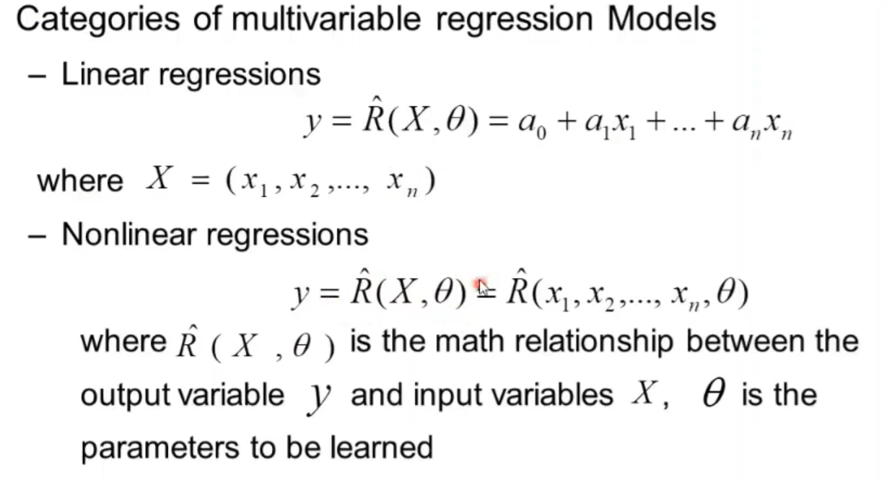

# AI  & Games S2

### Course Organization

- part1 asymmetric game. stackelberg (leader - follower), application to pricing and marketing
- part2 algorithmic mechanism design and applications
- group project

 

# Lectures

## Lecture 1

Stackelberg game: leader - follower

- **Retail Pricing Games**
  Two gas station, ASDA and Shell, when ASDA make a price move, Shell will make a response.

  - leader: ASDA, follower: Shell
  - Strategy space: infinite, price are real number.
  - There are private information within players, ASDA may not know Shell's pay-off

- **Duopoly/Oligopoly game in economic**

  - market dominate by single company: monopoly
  - market dominate by two companies: duopoly
  - market dominate by a few companies: Oligopoly

  We have three major oil companies, OPEC, OECD and Russia, OPEC is at a more dominate position. OPEC first announces an increase/decrease crude oil output, Russia and OECD will act accordingly to decide whether to increase/decrease oil output.

  - infinite strategy space, 0 to max capability
  - each player does not know other's economic/political motivation

- **Wholesale pricing game in supply chain**
  Supplier announce their price, then retailers decide their order. Supplier can set price according to quantity of order, e.g. £10 for order less than 100 units and £8 for order more than 100 units.
  There competitions between suppliers, retailers, and supplier and retailers. The information is very little.

### Formulation

In stackerelberg games, player select action sequentially, which is different from nash games where players select action simultaneously. 

We will use $P_{L/F}$ to denote player, $U_{L/F}$ to denote strategy space, $J_{L/F}(U_L,U_F)$ to denote pay-off function, the objective is to maximize the pay-off function. Note that the pay-off function depends on both leader and follower's strategy space. The sales is denoted as $S_{L/F}=D_L(U_L,U_F)=a+bU_L+cU_F$. Where $a$ represents the sales independent of both strategy space, $bU_L$ and $cU_F$ represents the sales impact by own/other's strategy, of-course, the strategy from the opponent usually yield $b/c$ negative. Then our pay-off function can be represented as $J_{L/F}(U_L,U_F)=(U_{L/F}-C_{L/F})\times D_{L/F}(U_L,U_F)$. where $C_{L/F}$ represents the cost; that is, $\text{profit per unit}\times \text{sales}=\text{total profit}$. The follower is trying maximize its own profit by finding a best response to the leader's strategy, i.e. $J_F(U_L,R(U_L))=\max_{u_F\in U_F}J_F(U_L,u_F)$.

If there exists a leader strategy such that it gives the maximum profit for the best response the follower give, then it is called a stackelberg strategy or stackelberg equilibrium.

### Analysis

The player who act first is the leader, it does not require him to be in a dominate position. A stackelberg game can be continuous or discrete, dependent on its strategy space is finite or infinite.   

In stackelberg games, we assume the follower is rational, which may not be true in real life. For example the monopoly supplier may take 90% of the profit and leave 10% for the retailers, you may assume the retailer has no choice, but he may reject the offer and buy nothing, forcing the supplier to change strategy.

If there exists both nash strategy and stackelberg strategy for a game, being a leader in the stackelberg game is better (at least equivalent) than being a player in the nash game. This is because in stackelberg game, you 

But it is not always good to be leader, for example, 田忌赛马.

### Homework

- A stackelberg strategy is a strategy for leader where it gives the maximum profit for leader with the best response the follower give.
- A definition of the stackelberg ga me is given by two types of players, leader/follower denote as $P_L/P_F$, and their corresponding strategy space denote as $U_L/U_F$, and the corresponding pay-off function $J_{L/F}(U_L,U_F)$. The leader wants to maximize its pay-off function $J_L(U_L,R(U_L))$ and follower wants to maximize its pay-off function $J_F(U_L,U_F)$, during the game, the leader will act first and follower follows. A stackelberg strategy is when there exists a $u_L\in U_L$ such that it gives the maximum profit for the best response the follower can give.

1. A stackelberg equilibrium in this scenario is a strategy for leader $u^*_L\in U_L$ such that it maximize the outcome for the leader with the best response from both followers, denoted as $u^*_{F1} \in U_{F1}, u^*_{F2} \in U_{F2}$ that maximize their own pay-off function.
   ****
2. a. a player is the leader if he act first.
   b. leader, **without knowing the private information of the follower, the leader will be unable to figure out the follower’s reaction function and achieve the max payoff. **.
   c. False, this is only true if there exists both stackelberg equilibrium and nash equilibrium.
3. The stackelberg equilibrium is when leader choose 0 and follower choose 1, that is, (0, 1).
   ****

## Lecture 2

### Function maximization problem

let say we have a function: $-2x^2+4x+5$ and $x\in [0,5]$, and want to find the maximum value of the function, note that this function is equal to $-2(x^2-2x+1)+7$, which is equal to $-2(x^2-1)^2+7\le 7=f(1)$. So our maximum value occur at $x=1$.

1. find all local maximum points by find the first derivatives and verify its second derivative is negative.
2. find all boundary points
3. calculate f(x) for all x in step 1 and 2 and find the x that yields the highest output.

### Homework

1. **The statement is false. Consider function f(x) = 1/x on interval [𝑎, 𝑏] = [1,2], which reaches its max value at the boundary point 𝑎 = 1, but f ‘(1) = −1 ≠ 0. The calculation of the derivative is given below: Based on the derivative formula (𝑥^n)′ = 𝑛𝑥^{n-1}, the derivative f'(x) = -1/x^2**
2. Yes. f'(x\*) = 0 means that its gradient is zero at that point, and f''(x\*) means that it is maximum point instead of minimum.
3. 1.6, if optimal point outside bound, then optimal point must be at the boundary.

## Lecture 3

### Demand Model

- Demand Models: mathematical model that describe sales change by price change
- Linear Demand Model: $S_L=D_L(u_L,u_F)=a_1+b_1u_L+c_1u_F$.
- Consistency of demand model: If own price decrease, then own sales increase; if competitor price decrease, then own sales decreases.
  - b1 < 0, c1 > 0; b2 > 0, c2 < 0.
  - b2 < -b1; c1 < -c2
    This simply says that the own price change affects ourselves more than other players.

### Follower Function

The follower's strategy first derivative is $2c_2u_F+b_2u_L+a_2-c_Fc_2$, second derivative is $2c_2$. We know when first derivative equals to 0, we have max/min point, and we know that $c_2<0$, this confirms it is maximum point, so the follower's global optimal function is indeed $u_F=-\frac{b_2u_L+a_2-c_Fc_2}{2c_2}$. Let's check the boundary:

### Leader Function

After substituting the follower's optimal reaction function, we have $(u_L-c_L)(a_1+\beta_1u_L+\beta_0)$ where $\beta_1=b_1-\frac{c_1b_2}{2c_2}$ and$\beta_0=-\frac{c_1(a_2-c_fc_2)}{2c_2}$.

Then similar to solving follower's function, we have the leader's optimal function first derivative as $u_L=\frac{a_1+\beta_0-c_L\beta_1}{2\beta_1}$, and second derivative is $2\beta_1=2\left(b_1-\frac{c_1b_2}{2c_2}\right)=\frac{1}{c_2}(2c_2b_1-c_1b_2)$, from above we know $(2c_2b_1-c_1b_2)>0$ and $c_2<0$, so second derivative is indeed negative and this function gives global maximum point.

#### Theorem

 note we need continuous payoff function. 

## Lecture 4

- stackelberg game with imperfect information

 ### Imperfect information

 Often in real world there is no perfect information, for example you do not know if your opponent's intent is to gain more market share or gain more profit. So what is the impact of imperfect information to the players?

- no impact to the follower, he acts after leader announce his strategy.
- huge impact to the leader, without knowing follower's strategy space and payoff function, the leader can not figure out the follower's reaction function and then impossible to find a good strategy.

 Solutions:

- be a follower...
- find best strategy under worst scenario, guarantee min payoff but often too conservative.
  
- find the best estimate of follower's reaction, and find the best estimated reaction, good when you have information about follower's reaction (e.g. historical data). We have to learn the follower's reaction function.
  This will be our focus in following lecture.

### Statistic Regression

Remember in stackelberg game with perfect information, we have the follower's pay-off function, and we calculate his best payoff and then calculate our best payoff. Since we now do not know his payoff function, so we cannot apply the method directly.

instead of find the reaction function directly, we estimate the it through historical data instead. To do this we find a function, $\hat{R}(x)$ to approximate $R(x)$, and use the historical data we have to measure the accuracy of our estimation: , where $t=\text{time}$, we often use square error: , this error can be huge when $T$ is large, so we often divide it by $T$ to get mean square error.

It is problem dependent to design $\hat{R}(x)$, in the retail pricing problem, we know follower reaction function is a linear function as follows: $R(x)=a+bx$, so it is better for us to match this: $\hat R=\hat a+\hat bx$, then we find $\hat a$ and $\hat b$ such that it best matches $R(x)$.

aawwwwwwwwwwww

Now the problem become a function maximizing problem, and we can use derivative to find the maximum point.

With some more calculation, we would have verified that the second order derivative is negative, so we will use this formula to solve our problem.

## Lecture 5

The follower's goal and environment may change, so we need to learn follower's reaction functions in stackelberg game (multivariable). 

linearizable non-linear regression is where relationship between input and output is non-linear, but output and parameters is linear. Note that the parameter $a_i$ is linearly related to $y$, but not $x$, since $\hat R$ is a non-linear function.

 note $X^t(T)X(T)$ need to be invertible/non-singular.

### Measurement

mape gives a more intuitive measurement.

 

### Example

## Lecture  6

Often in reality, the environment is changing, thus the offline learning we introduced may not be useful.

In many cases, we want to update our model to adapt environment change.

### Update Model

- **Moving Window**: when a new data is received, remove the oldest data.
  Big window will make model more reliable, accurate and resistant to noise.
  disadvantage: forgets old historical data.
  
  The modified version attempts to remember some information in the past, adjust by $\lambda$.
  

  We can also use a forget factor that decrease as data gets older. This method has a smooth balance, easy to implement and let old data play a role.

  
  Using the recursive least square algorithm, we can update the old parameter with new data without needing to recalculate everything.

### Incentive Strategy

here the leader announces the incentive strategy $u_L=S(u_F)$ first, after the follower make a move that maximize his payoff , then leader will make the decision.

so if you are leader in game with both stackelberg and incentive strategy, you should always choose incentive strategy, as you can some what enforce the follower to do something.

By using incentive strategy, leader creates a team optimal strategy.

## Lecture 7

### Mechanical Design

#### Cake Example

Imagine a mother cutting a cake for children, Bob and Alice, and each of the them wants the bigger slices, what can the mother satisfy both children? You may say let the mother cut the cake equally into two and give children each, but now the problem is Bob think that the cake the mother cut different in size, so what can you do?

We can decide a simple mechanism to solve this: let Bob cut the cake, but tell him that the Alice will get to choose first.

#### Mobile License Allocation

 

 

#### History

Mechanism design was introduced by Hurwicz in 1960s, from gam theory perspective, he thinks that socialism will fail due to lack of individual incentives. There is revelation principle in mechanism, it has two types, direct or indirect. It has many applications, includes:

- auctions, market/trading design.
- regulation and auditing
- social choice theory
- computer science
  - algorithm mechanism design
  - network system

A simplified definition is a sub-field in game theory that consider how to design and implement a good system that involve multiple self-interested players with private information, and achieve desire outcome.

#### Definition

- outcome set: $\Omega$
- $N$ players, each player $i$:
  - has private information $\theta_i$.
  - has payoff function $u_i(o, \theta_i)$ over $o\in \Omega$.

each player has different payoff function or even different strategy space. There is a designer that does not know some private information, he wants to achieve some desired outcome. This is some times called reversed game theory or science of rule-making, as it tries to design the game based on some desired outcome.

## Lecture 8

### Single-Item Auction

- an item for sale.
- $n$ bidders with unknown values $v_i$.
- bidder wants to maximize  $v_i-p$.

Possible objectives

- maximize social surplus: value of the winner.
- maximize seller profit: payment of the winner.

possible mechanism include first/second price:

- first price: pay for what you bid.
- second price: pay for second highest bid.
  This will result in best strategy is to bid the true value regardless of what other bidder do.
  

DSIC = dominant-strategy incentive-compatible.

This leads to the following:

  

$x_i$ is either 1 or 0 indicate if the bidder win the item.

### Equilibrium

- $s_{-i}$ all other players' strategy.
- $\hat{\theta}_{-i}$ all other players' strategy.
- $s_{-i}(\hat{\theta}_{-i})$ is the all other players' strategy with their private information.

A **dominant strategy** is a strategy such that no matter what other players' private information, your pay off is always better than any other strategy.

 

A **nash strategy** is a strategy such that if other players also play the nash strategy, then this strategy will give you the best payoff. This requires to be true for all players' private information, but often in reality we have some idea about other players' private information, but it is not used here, moreover, assumptions over these private information can be useful, to include theseinformation, we have bayes-nash strategy.

A **bayes-nash strategy** has some common prior $F(\theta)$, and the average/expectation payoff is better than all other strategies.

 

 

## Lecture 9

### Multiple Item Auction

- $k$ items, each include several units $j$ of a product/service.
- $n$ bidders, and its private value $v_i$ for each unit (unit valuation).

bidder $i$ objective is to maximize: $u_i=v_i\cdot x_i-p_i$. Here we will assume **single-parameter environment**, where each item has only one unit and each bidder can only get one item at most.

- **allocation rule**, given the bid $b$, return item that this bid win.
- **payment rule**: given the bid $b$, return the price needed to pay for the bid.

The rules are designed to achieve:

- dominant strategy incentive compatible (DSIC): truthful bidding should be dominant strategy, and does not leads to negative utility.
- social surplus maximization: $\max\sum^n_{i=1}v_ix_i$. $x_i$=number of units to the item, 1 or 0 in single parameter environment, and $v_i$ is the value assigned to the item.
- polynomial time algorithm.

### Case Study: Sponsored Search

 

### Design Approach

- design the allocation rule then the payment rule.

we usually assume:

- more bidders than items
- unit valuation of each bidder is known
- then we have claim: the social surplus function is maximized by the following allocation rule:
  - allocate the ith largest item to the bidder with the ith highest valuation for i=1,2,...,k and allocate 0 to the rest.
  - note item a is larger than item b if a has more unit than b.

basically just match higher value with higher item.

monotone allocation rule: increase your bid will get you more or equal stuff. (fix other players' bid)

Example:

