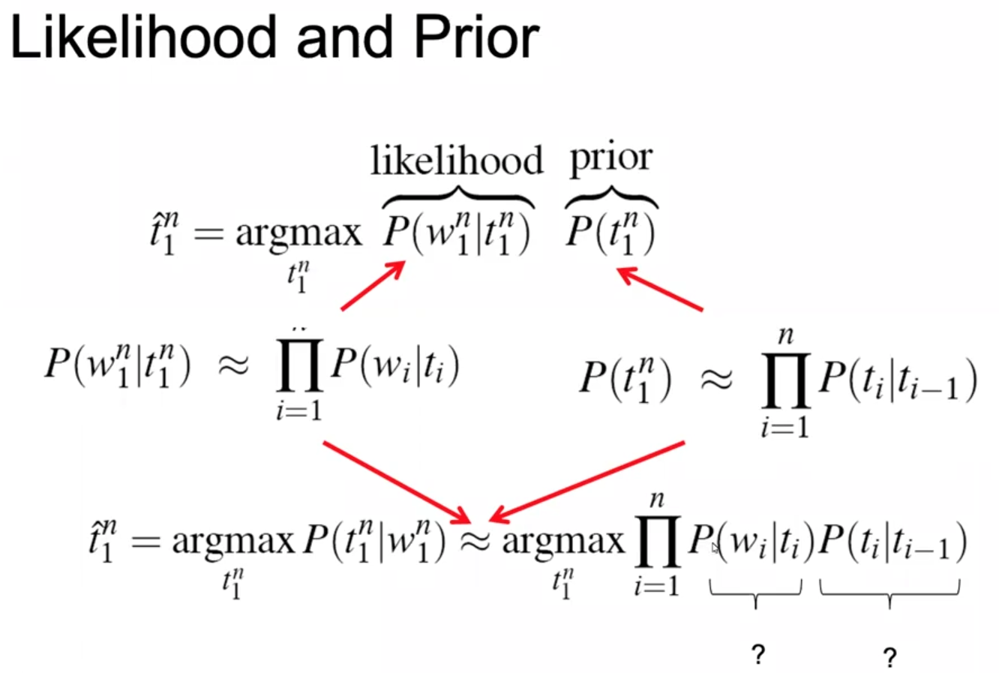
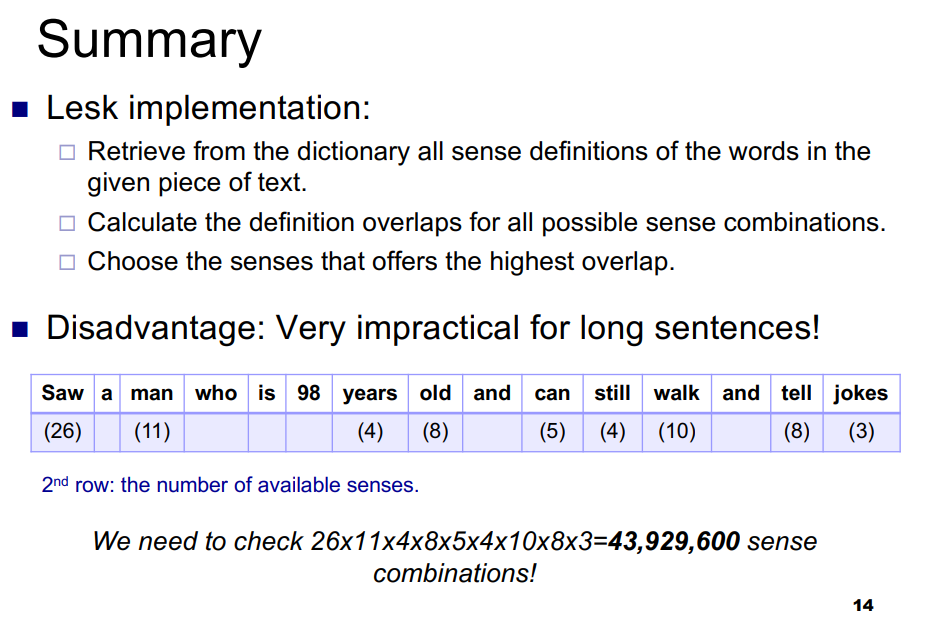
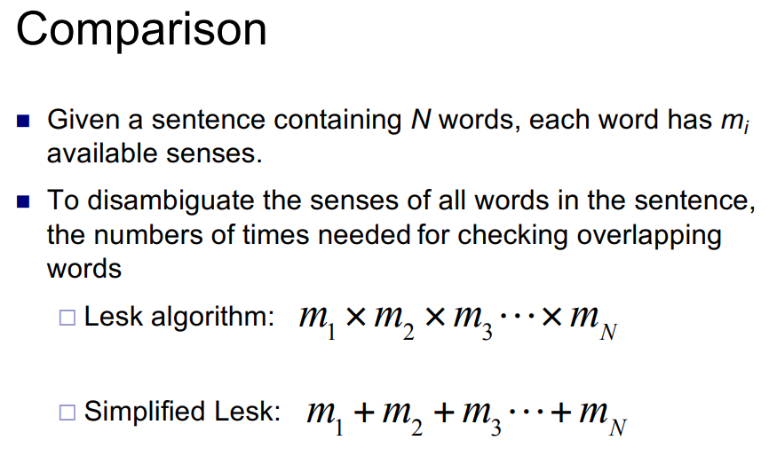
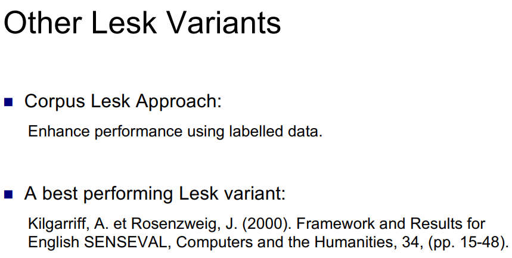
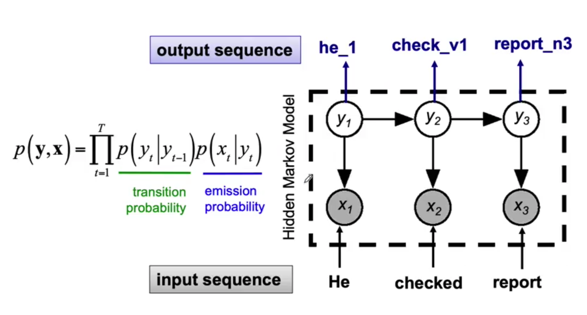
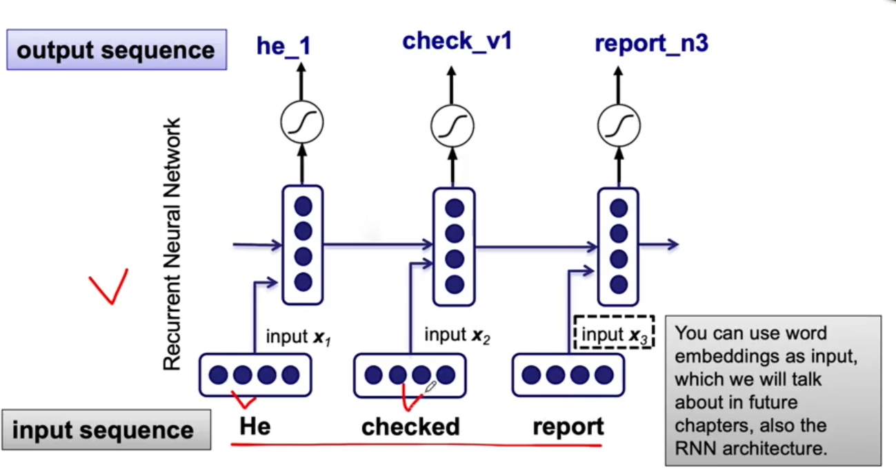
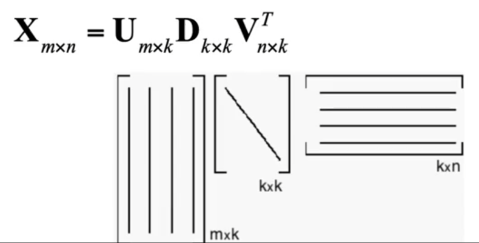
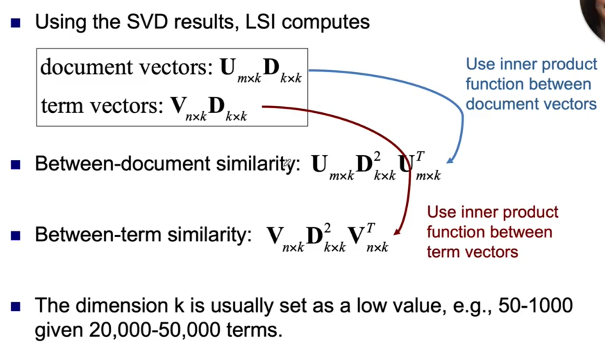

# Natural Language System

## Definitions

### Lexical semantics

- **同义 Synonymy**: same meaning (in all/nearly all situations), e.g. water/H2O, big/large.
- **反义 Antonyms**: opposite meaning, e.g. dark/light, short/long.
- **同名 Homonymy**: same word but different meaning
  - bank, financial institution or sloping land.
  - bat, club for hitting a ball or nocturnal flying mammal.
- **同音 Homophones**: sound the same but different meaning, e.g. write/right, piece/peace, their/there.
- **Polysemy**: related meaning.
  - the bank was constructed in 1875 out of local red brick. Sense 1: The building belonging to a financial institution”
  - I withdrew the money from the bank. Sense 2: A financial institution
  - building/organization, tree/fruit.
- **下位 Hyponymy and 上位 hypernymy**

### Open class words

[original doc](https://online.manchester.ac.uk/bbcswebdav/pid-12310643-dt-content-rid-67013747_1/courses/I3132-COMP-34412-1201-2SE-001971/glossary%281%29.pdf), [more material](https://developers.google.com/tech-writing/one/just-enough-grammar).

- **noun**: denotes person or thing, e.g. dog, house, mind, English.
- **verb**: denotes state, action, or event, e.g. live, lives, living, lived, know, think, catch.
- **adjective**: describes a property with noun, e.g. old, green.
- **adverb**: describes a property with verb, e.g. quickly, suddenly.

### Closed class words

- **pronoun**: denotes a something or person that we talk about recently, e.g. it, she, her, he, him.
- **preposition**: provides more information about a noun or a verb by linking it to some other entity, e.g. on, with, at. 
- **auxiliary**: helps provide information about when an event happened, e.g. am, will, might.
- **determiner**: nouns and adjectives provide you with a description, e.g. a, the, many, all.

### Features

- **person**: 1st, 2nd, 3rd.
- **number**: singular or plural, e.g. -s, -es.
- **tense**: used in combination with auxiliary, e.g. -ed, -ing.
- **aspect**: tells you how the event was related to the time point named by the tense.
- **voice**: active, passive.

# Lectures

## Lecture 2

Typical steps in NLP app:

raw text -> tokenization -> lexical processing -> syntactic processing -> semantic processing -> structured/annotated text

- tokenization step is to identify basic unit to deal with, called main tokens.
- lexical processing is to understand each word
  - normalization and pos tagging
  - word sense disambiguation

**POS** is a linguistic category of words, which is generally defined by their syntactic (句法) or morphological (形态) behaviour. It does not tell you what does each token/word means, but it tells you how it is used (e.g. noun, verbs), note that same word can be used differently, and this is the main task of POS tagging.

Some internal cues includes morphology (形态学), e.g. if a word ends with -ous then it is likely that it is adjective and -ed is common for verbs. Some external cues includes limited amount of context.

There are three types of taggers:

- **rule-based**: large amount of hand-written rules.
  - map words to possible tags, then write rules to separate the tags. e.g. if follow by something then do something. Not used much as we need to write a large amount of rules.
- **stochastic**: resolve ambiguities by using a training dataset to estimate the probability of each word given a POS.
  - given a sentence, that is, a sequence of observations, what is the best sequence of tags that corresponds to this sequence of observations?
  - use bayes rule: $P(t|w)=\frac{P(w|t)P(t)}{P(w)}$ where $w=\text{word}, t=\text{tag}$. the data on the rhs is relatively easy to collect.
    
    it comes down to find what is the probability of having a tag/word given a tag.
- **transformation**: automatically deduce rules from previous tagged dataset.
  - start with simple rules, iterate by applying transformation to get best results (correcting error), stop when no more improvement can be made.
  - rules for transformation is automatically deduced from training data.
  - good for new data/language, just add new training data to train the model.

There are many tag set to use, depends on how many information is needed.

**Function words** are words that have little lexical meaning and serve to express grammatical relationships or speaker's mood.

#### Chunking

We may also interested in tagging a group of words (noun/verb phrases) instead of individual words. We call the grouping of words chunking. One of the choice is context-free grammar. A phrase normally consists of a noun/verb, with pre/post modifiers, nominals, determiners etc, we can use cfg to model them.

But cfg is not enough, because there are some constraint in English, for example, determiner and head nouns have to agree with each other, e.g. we can have this fight but not this fights or these fight. of-course we can enumerate all these with cfg, but it does not scale well, so we need a alternative.

The idea we want to introduce here is treebank. It is a corpora in which sentences has been paired with a parse tree. Instead of writing rules, just annotate the sentences with parse trees, then use the annotated data to learn the rules. i.e. we create a probabilistic-cfg.

## Lecture 3

### Word Sense Disambiguation

- **word sense**: one of the meaning of a word in linguistic
- **word sense disambiguation**: is a NLP task that selects which sense of the word is used in a given piece of text from a set of possibilities.
  - Applications includes *machine translation*, *information retrieval* where documents with different sense and topics of the search terms are returns, *Bioinformatics* that assign identifier to a gene, and *medical application* that find the correct meaning of some acronyms in clinical text.
  - Currently Supervised ML perform the best.

There are currently two approaches to WSD: 

- **knowledge-based**
  uses external resources such as dictionary, thesauruses (additional synonymy info) and semantic network such as wordnet.
- **ML** approaches that uses labelled data.

#### Lesk

A classical knowledge-based WSD approach is **Lesk**, it has two version where one of them is simplified. Its core idea is to examine the definition overlap in all possible sense combinations among all words in the given text, for example, if you want to disambiguate the sense of the word *pine* in *pine cone*, then you will look up the definition for these two words:

- PINE
  1. kinds of evergreen tree with needle-shaped leaves 
  2. waste away through sorrow or illness 
- CONE 
  1. solid body which narrows to a point 
  2. something of this shape whether solid or hollow 
  3. fruit of certain evergreen trees

You will find that there is some overlapping words in the definitions, namely *evergreen tree*. The algorithm will try all possible combinations of these definitions to find two senses that has highest overlap of definition. Its disadvantage is that this is impractical for long sentences.

The **simplified lesk** algorithm is faster, it does not checks for overlap between the definitions, but the overlap between the definition and the given text. The number of checks needed is now additive to the size of senses instead of multiplicative.

#### Corpus Lesk

enhance the sense definition with labelled data, label each overlapped word by its inverse document frequency. $idf_w=\log(\frac{\text{n docs}}{\text{n docs contains the word}})$.

#### Classification & Feature Extraction

assign a word in context to a predefined set of classes (tag set), the training corpus is a collection of words tagged in context with their sense. You can train a classifier for each word, then you will have number of words of classifiers. example: input: "...fish as Pacific salmon and striped *bass* and...", output: bass4. But a useful thing to do before building the classifier, is to characterize each word pattern along with the context to a set of features. This is called feature extraction.

A common approach to feature extraction here is bag-of-words. Given a large amount of sentences, you can first choose a window with the targeted word in the middle, for example, "An electric <u>guitar and *bass* player stand</u> off to...", the target word is bass and window size is +/- 2, so your features for this word in this sentence will be [guitar, and, player, stand]. Then you define a set of words (dictionary) as your feature dimension, e.g. {fishing, sound, player, fly, rod, pound, stand, runs, guitar, band}. Then you encode the features to this set of words as one-hot, e.g. {0, 0, 1, 0, 0, 0, 1, 0, 1, 0}. This will be the feature vector of the target word in the given sentence. Now, you can train the classifier with this feature vector as input, instead of the sentence.

One classifier you can use is the naive bayes classifier. Find the $p(class)$ and $p(word|class)$ and finally $p(class|word)=p(word|class)^*p(class)$ (assuming independence). $p(word|class)=\frac{\text{n occurrences in class +1}}{\text{n words in class +n unique words in class}} $, $p(class)=\frac{\text{n words in class}}{\text{n words}}$.

#### Bootstrapping Techniques

When you do not have enough samples, you can apply some rules to create some new samples.

- **one sense per collocation**: a word appear reoccur in collocation with the same word will almost surely have the same sense.
  - if you know the sense of a word e.g. "guitar" in "he plays guitar" and you see "she plays guitar", since "plays guitar" occur in these two context, they are almost surely has the same sense.
- **one sense per discourse**: the sense of a word is highly consistent within a document, especially topic-specific words.
  - if you have a document that has the word "cup", then the sense of "cup" of all occurrences in this document is likely to be the same.

This is called semi-supervised learning.

#### Sequence Labelling

Instead of predicting word by word, you may want to predict the whole sequence as one. Common approach includes HMM, SVM, RNN.

- HMM
  
- RNN
  

#### Evaluation & Baselines

- compare human labelled data with computer generated label.
- embed WSD in a NLP task to see if it is better.
- compare with naive approach, e.g. always assign the most frequent sense, simplified lesk algorithm (47% accuracy on senseval-2 data).
- human is around 75%-80%.

## Lecture 4 Distributional Semantics

Distributional semantics refers to the hypothesis that a word is characterised by its context. The whole area of distributional semantics is build upon this hypothesis.

The idea is to generate a high dimensional feature vector and calculate the semantic similarity in term of vector. The high dimensional space is also referred as latent space or embedding space.

euclidean gives distance between two points, cosine gives angles between two vectors.

vector space model (VSM) is a count-based, algebraic model for representing a piece of text object (document) as vector of indexed terms (uses indexed terms to represent a document), in the document vector, each feature value represents the count of an indexed term appearing in a relevant piece of text, by collecting document vectors and storing them as matrix, we have a document-term matrix.

context engineering.

The vector can be sparse, and we prefer a lower dimension and dense vector, use single value decomposition, corresponding to latent semantic indexing (LSI), convert the input matrix to multiplication of 3 matrixes.

 

Continuous bag of words input context and output target word (e.g. word embedding), skip gram input the word and output the target (e.g. word2vec). GloVe model utilises the frequency that a word appears in another word's context in a given text corpus.

After you have a good semantic space, you can use clustering/visualization to check if it make sense from a human perspective, then you can use it to support other NLP tasks.