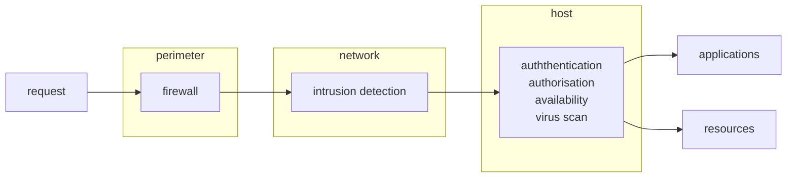
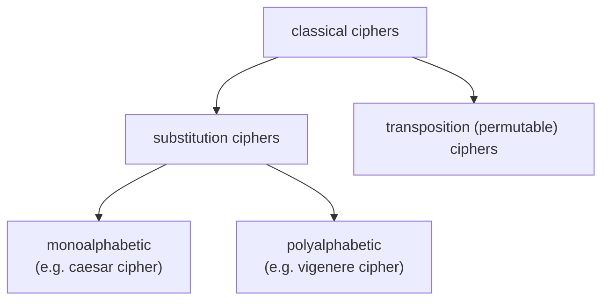
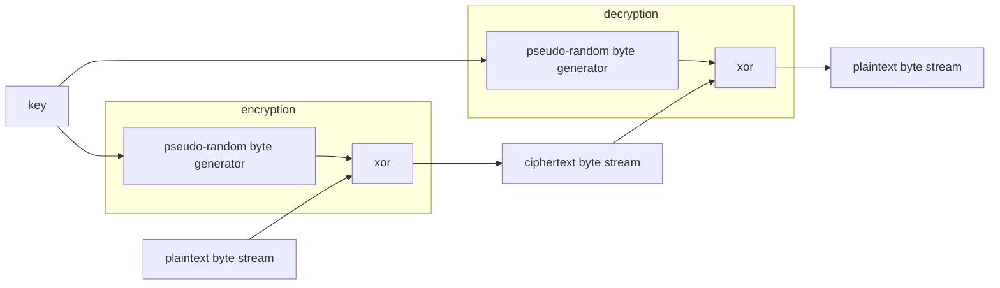
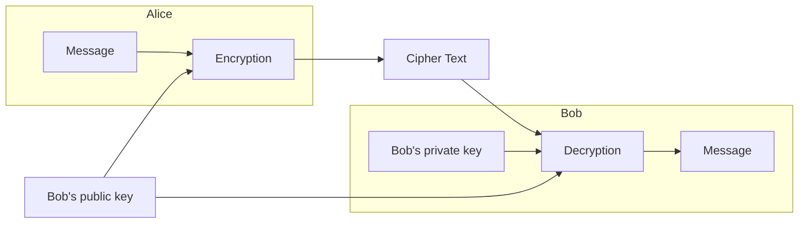
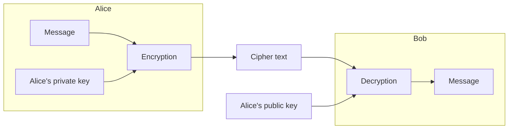

COMP 38411 Cryptography & System Security

Security can be classified into many different aspects, we only cover some of the topics in this course in the following order:

1. threads/vulnerabilities
2. cryptography algorithms/protocols
3. digital signature
4. data integrity
5. data management
6. trust

## Definitions

#### Identification

The act of indicating a person or things identity.

#### Authentication

The act of verifying the identity.

Ways someone maybe authenticated fall into three factors:

- knowledge: something that user knows
- ownership: something that user has
- inherence: something that user is or does

MFA involves more than one authentication factors.

### Digital Signature

Associate a mark with text, can verify the authenticity of digital messages or documents. Gives strong reason that the message was created by a known sender.

#### Forgery

- Selective: attacker can generate a valid signature for an given message.
- Existential: attacker can generate a pair of message and signature that is valid.

Selective implies Existential.

## Lecture 1-2

## History & Present

- Very old days, before large-scale application of the internet
  Interest in security were largely confined to military domain.
- 1988: Morris worm brought down a large fraction of the internet.
- late 80s: E-commerce, ATM, financial transactions
- early 90s: Mosaic and Netscape (early search engines)
- Mobile
- Cloud
- Crypto currencies, smart contract signing, getting rid of third parties, block chain
- IoT

## Threads & Challenges

- 444129 ransomware attacks took place worldwide in 2018.
- 300000 new malware are created daily.
- 75 records are stolen every second.
- A consumer account can be as cheap as 1 dollar.
- More than 6000 online criminal marketplace sell ransomware products/services.

Threads in generic context (Confidentiality, Integrity & Availability (CIA))

- Disclosure (confidentiality)
  - Snooping/sniffing
  - Unauthorized access
- Deception
  - Spoofing (identity theft)
  - (integrity)
    - Unauthorized data modification
    - Replay (intercept & retransmit)
    - Repudiation (false denial) of origin/receipt
- Disruption (availability)
  - modification, delay, Denial of Services (DoS)

Specific Threads (Top 5)

1. Social Engineering Attacks: relate to people.
2. Supply Chain Attacks: relate to system, payment, etc.
3. IoT & Infrastructure Attacks: relate to infrastructure, organizations (they usually have their own network).
4. Identity & Mobile Authentication: like Multi-Factor-Authentication (MFA), relate to high value assets.
5. Rise of Zero-Day Threats & Polymorphic Attack: related to malware, this refers to vulnerabilities that is found and fixed, but patch has not been applied to the system.

- Most attack is done through malware.
- There are hacking-as-a-service nowadays
  
- People do not have to be very knowledgeable to launch attacks because there are many available tools.
  
- Spectrum of risks increases as degree of digitization increases.

  - e.g. messaging<storing information<transactional system<technology integration<fully integrated information based business

- Infrastructure relationships in cyberspace

  1. Physical Infrastructures: nuclear plants, hospitals, cable fiber, farms, etc.
  2. Critical Infrastructures/Key Resources(CIKR): comms, water/gas/oil, transportation, emergency, banking, etc.
  3. Cyber Infrastructures: hardware, software, interconnected network (internet), etc.

  

- Naive users: lack of security awareness
- Inadequate management procedures
  - Insecure system set up and configuration
  - Lack of proper policy making, implementation and enforcement procedures.
- Global networks without national boundaries
- Heterogeneous devices, laptop, phones with universal connection
- Anonymous nature of many Internet-based services.

## Lecture 1-3

### Achieving Security

There is three basic security properties that is commonly seen in real life (CIA):

- Confidentiality
  - Keeping data & resources hidden
- Integrity/Authenticity/Authentication
  - Content integrity (detect modification & replay)
  - Origin integrity (data is indeed from claimed source)
- Availability
  - Ensuring data/service is available to authorized users.

There are also other advanced security properties:

- Freshness
  - Ensure data is not a replay/retransmission of old data
- Non-repudiation
  - Protect against false denial.
- Fairness
  - Either all parties are received or no party received something useful.

In order to achieve security we go through following steps:

1. define security goals
   1. threads analysis & identification: what to protect against
   2. policy/requirement specification: define what is/is-not allowed
2. design & implement
   1. decide how to protect as to satisfy the specification
      1. technical measures
      2. procedural measures
3. operation maintenance
   1. assess how well the implementation has achieved the security goal

In term of thread analysis:

- identify assets, threads and vulnerabilities.
- assess the levels of risks on the assets
  - value
  - importance: likelihood of exploitation
  - not all threats is worth defeating
    - cost vs benefit analysis, prevent vs recover vs ignore.

This can be carry out using an attack tree. It is a conceptual diagrams (usually tree-like) showing how an asset, or target, might be attacked. Child nodes are conditions that must be satisfied to make the direct parent node true. Conditions can be OR or AND.

Security measures is a method, protocol, tool or used to address the risks identified (or enforce security policy)

- prevention
  - block attacks by closing vulnerabilities
  - reduce level of risk by making attack harder
  - make other more attractive target (honey pot)
  - e.g. access control (firewalls), encryption, digital signatures, etc.
- detection
  - measures taken before/after the attack
  - e.g. logging, auditing & intrusion detection
- recovery
  - assess & repair damage
  - continue to function correctly even if attack succeeds
- accept
  - accept it and do nothing (if some threats are not worth it).

Operation & maintenance

- assurance
  - testing to check the correct implementation
  - formal evaluation
  - standards
    - US Security Evaluation Criteria (the orange book)
    - European ITSEC (Information Technology Security Evaluation Criteria)
- Human Issue
  - organizational issue
    - power & responsibility
    - financial benefits
  - people problems
    - outsiders & insiders
    - social engineering

Putting together:

### Security Models

When designing a security model, we have to think what are the security threats in this model and what are the properties/services that are necessary to counter the threats? There are many issue to think of:

Lets first consider a communication security model. This model emphasis on protecting the data over the channel, security properties we interested are authenticity and confidentiality.

If we only consider the receiver, we have the following multi-layer network security model:

We also have other model, such as the E-commerce security model, in this case, the customer and merchant does not trust each other, instead, they introduce a trusted third party (TTP) that offer some services.

### Conclusion

Network & distributed systems are part of our daily lives. Most systems are networked which open to many attacks and threats, security provisioning is a complex task, it consists of computers/software/wired/wireless network/processes, and the weakest link is people.

## Lecture 2-1

Cryptography is the art of keeping messages secure — Scheier

Keeping message secure is done either prevent the unauthorized access or encrypt the message, the later use cryptography, nowadays cryptography is more widely used, it can be found in:

- authentication of an identity
- credential systems: a proof of qualification or competence of a person.
- confidentiality: secrecy and privacy of data in transmission and storage
- integrity of data: data authentication/authenticity in transit and in storage
- digital signatures
- electronic money: cryptocurrency, bitcoins

Application:

- Threshold cryptography: shared decryption key within entities, a subset of entities have to collaborate and perform decryption/digital signature
- Multi-party computation: compute a function together, one party should only know their own input and the output of the function.
- Digital right management: activating software license
- electronic voting
- …

We will focus on achieving confidentiality using encryption

- ciphers (cryptography system)
  - symmetric-key (same key used for encryption and decryption) (conventional ciphers) (before 1976)
  - asymmetric-key (different key used for encryption and decryption) (public-key ciphers)
- ciphertext: message in encrypted form
- cipher/cryptosystem: the system that performs encryption and decryption
- cryptanalysis: attempt to discover plaintext or key

- unconditional secure: cannot be defeated regardless of how much power is available
- conditional secure: perceived level of computation required exceeds the computational resources of the hypothesized adversary. e.g. takes very long time to break.
- provably secure: some solution can be verified that it is secure
- adhoc security: claims of security remain questionable

## Lecture 2-2

classical encryption techniques

- monoalphabetic: a character always replaced by another same character
- polyalphabetic: a character maybe replaced by multiple other characters

classical algorithms uses:

- substitution (confusion): a -> b
  - modern ciphers look up table that transform input: S-Boxes (transforming block of nbits)
- permutation (diffusion): ab -> ba
  - modern ciphers look up table that transform input: P-Boxes (transforming block of nbits)
- XOR operator: efficient in computers
- simple/non-secure ciphers:
  - shift ciphers: caesar cipher
  - vigenere cipher
- secure cipher: one time pad

Note that modern ciphers operates on bits rather than characters

caesar cipher (shift cipher) basically uses addition and modulo, encryption is circular right shift and decryption is circular left shift. This algorithm is very unsecure.

- easily break by brute force (exhaustive key search) 

  - only 25 keys to try
  - algorithm is in public domain
  - language of plain text is easily recognized, not compressed.

  given small amount of plaintext-ciphertext pair, encrypted with key K, K can be recovered by exhaustive key search with in $2^{n-1}$ processing complexity, where n is the bit-length of the key.

  redundancy in plaintext can be exploit, e.g. the letter "e" appear frequently, so the most common letter in encrypted text is likely to be "e". This is called frequency analysis (counting attack), which based on study of frequency of letters in ciphertext.

  With today's computing power, the key should at least be 128 bits long.

## Lecture 2-3

One type of modern cipher is stream cipher and one type of stream cipher is based on one time pad

### Vigenere Cipher

Recall that caesar cipher has the problem of frequency of words which can be exploit by hackers, we should hide this information, this can be done easily by changing just a bit of the algorithm. We can shift each letter by different number, so that the ciphertext does not contains the frequency information. We usually use a keyword, e.g. bed->143 (this shift letters bed by different amount). This is called vigenere cipher. It is significantly more secure than regular cipher, its security level depends on the keyword length.

#### One Time Pad

Ofcourse, instead of using keyword, it can be just a random text, if we use a random text that as long as the password, then we have a cipher with perfect secrecy, when used properly, it is provably unbreakable (Shannon, 1949). This algorithm is proposed by Gilbert Vernam during WWI. It is a special variant of stream cipher. Typically a stream cipher uses mod 2, XOR function.

However, this method is not practical because the storing and distribution of the key can be troublesome.

#### Stream Ciphers

Stream ciphers encode individual bits or character stream with a keystream, usually xor is used, because xor has a nice property: A xor K = B and B xor K = A. Instead of generating random sequence in one time pad, stream ciphers usually only keep a key and use that key to generate pseudo-random sequence for encryption and decryption.

#### Transposition Cipher

It generate ciphertext by reordering the plaintext. e.g. write row by row and read column by column

#### Attacks

Note that modern cipher is based on the security of the key, not the secrecy of the algorithm itself.

- frequency attacks: break by spotting flaws in algorithms
- brute force/exhaustive key search: try every possible key
- dictionary attacks: run encryption algorithms on a massive amount of plaintext until the same ciphertext appears.

When it comes to password, it usually has a problem: do we use the password as key or plaintext? The latter creates more problems because now we have to think of another key and we have to ensure its security, so password is often the key. This way, the ciphertext is not reversible unless hacker knows the password.

- ciphertext-only attack (e.g. frequency attack): attacker knows ciphertext of several messages encrypted with the same key, then from here they try to find the key.
- known-plaintext attack (e.g. dictionary attack)
   ciphertext attack + they know the plaintext of these messages,
- chosen-plaintext attack: attacker choose some plaintext and have their corresponding ciphertext, from here they find the key. E.g. attacker change some letters and observe the change of power consumption of the encryption process.

Cryptographic attack often exploit the redundancy of natural language, so lossless compression before the encryption is often used before encryption to remove redundancy

## Lecture 3-1

#### Block Cipher

divide plaintext into blocks and encrypt one at a time, padding is added for incomplete block (?potential exploit?)

Criteria

- **completeness**
  every bit of the output should depend on every input bit, so that the output will change even if only 1 bit is changed in input.
- **avalanche effect (diffusion)**
  one bit change in message/key should change many bits in output
- **statistical independence (confusion)**
  input and output should be statistically independent. So that the attacker cannot guess certain text with probability

Claude Shannon identified that confusion can be achieve by substitution and diffusion can be achieve by permutation. Horst Feistel later then design a block cipher structure that implement this idea, in this structure he also prove that complex encryption function can be built out of some simple operation by repeatedly using them. e.g. substitutions/permutations/xor/modular multiplication. Network that use substitution and permutation are also called SP-network.

##### Feistel Block Cipher

- permutation
- spilt into 2 halves
- 16 rounds of identical operations with different keys (subkey/round key)
- inverse permutation

Its important advantages is that the encrypted message can be decrypted even if the round function F is invertible. It also has other advantages, includes only xor is needed and encryption and decryption is almost identical, so implementing it is simpler than the usual SP-network.

- The function F takes n bits and output n bits, usually permutations, substitutions or modular arithmetic.
- larger block size usually means greater security but make encryption/decryption slower, typically 128/256 bits.
- key size is usually 128, larger the better but reduced speed as well.
- number of rounds is usually 10+, wikipedia says 4 rounds are enough for a strong pseudorandom permutation. 

### Lecture 3-2

des is a feistel block cipher, block length is 64, but 8 bits (every 8th bit) are used for parity check, so effectively 56bits. Key is 56bits, subkey is 48bits

Round Function f:

1. expansion permutation: right half (32bits) is expanded to 48bits
   - use a permutation table, e.g. 4->8bits: 41232341, this is to achieve avalanche effect.
   - 32->6x4bits, 6 -> 1and6th bits for row, 2-5th bits for col, row and col then can be used to index a 2x16 table, each cell contains a 4bits number, so each 6bits generate new 4bits, so we have generated 4x4=16 new bits
2. use of round key: 48 bits are xor with the round key
3. splitting: 48-> 8 x 6 bits each
4. S-box: each 6 bits is indexed against a S-box to produce 4bits result
5. P-box: permute the 32bits from S-box = output of f

Strength of des:

des's weakness is the key size, which is 56 bits, with the increasing computational power, this is no longer secure. We have two options:

- repeat: triple des

  - two variens, 2 keys (112bits) or 3 keys(168bits)
  - $C=E_{k1}(D_{k2}(E_{k3}(M)))$, the reason for using decryption in the middle is just for backward compatibility, a user using the old des method can simply set the keys to be the same to communicate with another user that uses triple des.
  - people found that they can use meet in the middle attack to break the algorithm within shorter time than 2^bits:
    - build a table of keys, k
    - compute encryption(k, M)
    - eavsdrop a value f(k', M)
    - if f(k,M)=f(k',M) then it is likely that k=k'
    - Precondition for this attack is that attackers have to have pairs of (M, C)

- new standard: aes

  - US NIST issued call for DES replacement in 1997 with requirements:
    - stronger & faster
    - active life 20-30 years
    - provide full specification & design details
    - both c & java implementation
  - 15 accepted in 98, 5 shortlisted in 99, Rijndael was selected in 2000 and nomiated as AES in 01

  like des, aes is a symmetric block cipher, same key for E and D, plaintext and ciphertext has the same size.

  different from des, aes is iterative rather than feistel cipher, its block size is 128, others allowed but not recognized by the standard, key lengths are 128/192/256, i.e. the standard consists of three block ciphers. It is a substitution=permutation cipher incolving r rounds, 128->r=10, 192, r=12 and 256->r=14

  aes has fixed block size of 128bits(16bytes) called a state.

  Each round has 4 operations:

  - substitute bytes (subBytes)
    - S-box that replace each byte by another byte, stored in a single 16x16 (256) matrix (left 4 bits for row and right 4 bits for column)
  - shift rows (shiftRows)
    - it is a simple circular byte shift, 1st row -> no change, 2nd row -> 1-byte circular left shift, 2-byte circular left shift, 4th row -> 3-byte circular left shift. It permutes bytes between the columns. 
    - decryption just use right shift instead
  - mix columns (mixColumns)
    - a matrix multiplication in GF(2^8) (Galois Field), using irreducible polynomial m(x)=x8+x4+x3+x+1. if result is more than 8 bits, the extra bits is cacelled out by xor with the 9 bit string 100011011.
      
    - Together with shift rows, it achieve diffusion.
  - add round key (addroundKey)

  It is a seqential and light weight schedule

  we can see that the mix-column output each byte output based on all four columns in the previous state, so it has good avalanche effect (diffusion).

  the decryption is different from the encryption algorithm, where inverse of each operation is used.

  There are two ways of implementing decryption, we need to investigate.
  

### Lecture 3-4

If message is longer than block size, we need a way to encrypt these blocks, there are three standardlized modes:

- **ECB**: Electronic Code Book.
  Each block are encrypt independently, using the same key, last incomplete block is padded, usually the last byte indicate how many byte are padded, so that the receiver can remove them. It offers parallelizable encryption/decryption and random read access, but does not hide repeated pattern (lack of diffusion):
  
  Thus it is not recommeded for encrypting data more than the block size.
- **CBC**: Cipher Block Chaining.
  $C_i=E_k(M_i\ XOR\ C_{i-1})$. The encryption of the current block depends on the previous block, thus it does not allow parallelizable encryption, but you still have decryption parallelizable and random read access, because decryption depends on the previous ciphertext which is already available.
  
- **CTR**: Counter. It uses the encryption function as key generator, remember the repeated keystream problem in stream cipher? This is how they solve this problem. The actual encryption is just the xor, which is same as the stream cipher, thats why some people says that with ctr, the block cipher is transformed into a stream cipher.
  - It has parallelizable encryption/decryption as well as random read access since you can compute the counter value of a block directly.
  - It also does not have error propagation, if one bit in a block is wrong during transmittion, it does not affect the following block.
  - Its encryption and decryption function is the same, so you only need one function.
  - You can precompute the value to be xor-ed before you go online which made it fast.
  - Note that block has to be synchronized, if one block is removed then the plaintext cannot be recovered.
  - 

Block vs Stream:

- Block cipher encrypts blocks of characters, stream cipher encrypt individual character or bit streams.
- Stream cipher is usually faster than block cipher, used in real-time/continuous communication/applications.
- Stream cipher have limited or no error propagation, so advantage when bit error are probable.
- Can be built using block cipher with CTR mode.

## Lecture 4-1

Public key cryptography

Up to this point we are just learning about cryptography schemes based on shared secret (symmetric). There are some problems with this approach:

- two/more parties share the same key, non-repudiation cannot achieved without involvement of a trusted third party.
- A distinct key is needed for every pair of users, or even for each session/encryption. So n-users system requires n \* (n-1) keys (n^2 problem).
  - It is hard to maintain security of these keys.

Public Key Cipher are different, they are based on one-way/trapdoor functions which based on mathematically hard problems. These function is hard to compute the reverse if the secret is unknown. Some hard problem includes:

- integer factorization: given n, find prime p and q such that p \* q = n. Used in RSA.
- discrete logarithm: given a,b,c, find x such that a^x=b mod c. Used in DSS and DH.

among proposed pk algorithms, some are suitable for encryption (+ key distribution), some are useful for digital signatures, e.g. DSA and DSS, some are for key agreement, e.g. DH algorithm. Only RSA, ElGamal and Rabin works well for both encryption and digital signatures.

#### Confidentiality (保密性)

It is secure (only Bob can receive) because only with Bob's private key can decrypt the message.

Note that this confidentiality should only be applied to short messages, e.g. symmetry key (?).

#### Authenticity (真实性)

Signature is signed on the hash value of M, and a timestamp should be included, to avoid attacker to send the same message twice. Can be used for signature.

It is authentic (must from Alice) because only Alice's public key can decrypt that message.

### Modular Arithmetic

if a = b mod n, then we have a = k\*n+b

#### Euler's Theorem

if n is prime then $\phi(n)=n-1$, where $\phi$ refers to the number of integers less than n is relatively prime to n.

if p,q are prime and n=p\*q then $\phi(n)=\phi(p\times q)=(p-1)\times(q-1)$

$a^{\phi(n)}=1\mod{n}$.

## Lecture 5-1

### Checksum

 

- a certain degree: e.g. if M is binary file then it is hard for B to check if M is altered or not, the variant has a checksum, we can use this to verify if M is correct.

- strong is different from weak collision, the weak collusion says that given a hash value, find another input that has this hash value, the strong collusion  says that find any two inputs that has the same hash value.
  - if not weak collusion, then someone can intercept your message and send another message with the same hash function
  - if not strong collusion, then someone can find two different messages, send one of them and later claim that it is the other one, e.g. pay \$10 for an item, then ask for \$100 refund, because they have the same signature.

SHA-1 is no longer secure by today's computing power.

### MAC

Message Authentication Code, HMAC= hash function based MAC. 

The origin is ensured/authenticated, you can use block cipher to generate it.

k1 and k2 is derived from the input key.

MAC cipher (symmetric key) is designed for encryption and hash function is designed as one way function for digesting, so hash is generally faster.

Note that if you do not trust each other, then you should use HMAC, as MAC does not provide repudiation.

### Authenticated Encryption

For authentication and confidentiality. Tag is for authentication

- hash-then-encrypt: E(K, (M||H(M)))
- MAC-then-encrypt: E(K2, (M||MAC(K1,M))) or Tag=(MAC(K1, M)), E(K2, (M||Tag)) –> used in SSL
  - you do not need 2 keys, but you can
- encrypt-then-MAC: C=E(K2,M), Tag=MAC(K1,C) –> used in IPSec
- encrypt-and-MACC=E(K2,M), Tag=MAC(K1,M) –> used in SSH

If you MAC then encrypt, then receiver will have to decrypt before he can check the hash value, so we need to consider use case. if receiver can check mac first, then it is more resilient to DDOS attack.

### AEAD

Different data may requires different protection:

### CCM

counter mode with CBC-MAC

CBC encrypt data sequentially, it is slow, so we want to use GCM

### GCM

Galois/Counter Mode

nonce=random number

A=authentication data, C=ciphertext, T=authentication tag

The H hash value only depends on the K, so it is fast. The Galois field in AES is 8 bit, here is 128 bits.

All we do is xor in sequential which is fast, each value in bracket can be computed independently.

This is stream cipher, so you do not have to pad it, if the encrypted message is longer than the remaining message, then you just take the most significant bits (MSB).

We only increment the right most 32 bits. This is to can keep sender and receiver counter value synchronized and the inc function is not increased sequentially which make it more secure.

# Miscellaneous

### Why Encryption Standard

So that everyone can try to attack and break this algorithm. Keeping the same standard can offer ease of communication between different parties using the same encryption. Normally we want algorithm to achieve security goal and be as fast as possible, increasing the bit size will make the algorithm slower and maybe another algorithm will be better, so people do not just increase the bit size, they come up with new standard. For today's computer power, bit size should be at least 128.

### 3DES is broken

When a cryptographer says "broken," that means something very specific: that an attacker can break the key in better-than-brute-force time. 3DES has a key length of 168 bits, which is reduced to 112 bits by some meet-in-the-middle attack cleverness. And, to quote Wikipedia, "it is designated by NIST to have only 80 bits of security."

