# COMP 38411 Cryptography & System Security

Security can be classified into many different aspects, we only cover some of the topics in this course in the following order:

1. threads/vulnerabilities
2. cryptography algorithms/protocols
3. digital signature
4. data integrity
5. data management
6. trust

## Definitions

### Cryptography

It is the art of keeping messages secure by:

- prevent unauthorised entities from gaining access to resources
- scramble messages so that they cannot be understood by any unauthorized entities

Its application includes:

- **Confidentiality** (secrecy, privacy) of data in transmission & storage
  - This ensures data **cannot be viewed** without unauthorized access.
- **Integrity** of data (data authentication / authenticity) in transit & in storage
  - This ensures data **cannot be changed** without unauthorized access.
- **Authentication** of an identity (entity authentication)
  - The act of **verifying the identity**, proof that it is indeed the identity.
- **Credential systems** (a digital credential is a proof of qualification, competence, or clearance that is attached to a person)
- **Digital signatures**
- **Electronic money** (cryptocurrency, bit-coins)
- **Threshold cryptosystems** (a decryption key, or a signature signing key, is shared among a group of entities and a subset of these entities (more than some threshold number) have to collaborate to perform the decryption or signature signing).
  - It is a [cryptosystem](https://en.wikipedia.org/wiki/Cryptosystem) that protects information by encrypting it and distributing it among a cluster of fault-tolerant computers. 
  - The message is encrypted using a [public key](https://en.wikipedia.org/wiki/Public_key), and the corresponding private key is [shared](https://en.wikipedia.org/wiki/Secret_sharing) among the participating parties. With a threshold cryptosystem, in order to decrypt an encrypted message or to sign a message, several parties (more than some threshold number) must cooperate in the decryption or signature [protocol](https://en.wikipedia.org/wiki/Cryptographic_protocol).
- **Secure multi-party computations** (e.g. multiple parties compute a function jointly, the input is from the multiple parties, but no party should learn anything rather than its own input and the final result of the computation)
- **Digital right management** (e.g. activation of a software license by authorized users)
- ...

### Identification

The act of indicating a person or things identity.

### Authentication

It is the act of verifying the identity.

Ways someone maybe authenticated fall into three factors:

- knowledge: something that user knows
- ownership: something that user has
- inherence: something that user is or does

MFA involves more than one authentication factors.

### Authorization

After a person is authenticated, it must be determined what kind of resource he is allowed to access and what action he is allowed to perform. This is called authorization.

### Non-repudiation

This implies one party of the transaction cannot deny having received a transaction, nor can the other party deny having sent a transaction.

### Digital Signature

Associate a mark with text, can verify the authenticity of digital messages or documents. Gives strong reason that the message was created by a known sender.

#### Forgery

- Selective: attacker can generate a valid signature for an given message.
- Existential: attacker can generate a pair of message and signature that is valid.

Selective implies Existential.

### Ciphers (Cryptosystem)

- Symmetric-key based (conventional ciphers)
  - Same key is used for encryption and decryption.
- Asymmetric-key based (public-key ciphers)
  - Different keys are used for encryption and decryption.

#### Cryptoanalysis

An attempt to discover plaintext or key.

#### Secure

- **Unconditional**: the system cannot be defeated no matter how much power is available by the adversary.
- **Conditional**: the level of computational resources required exceeds the capacity of the hypothesized adversary.
- **Provably**: it can be verified to be secure.
- **ad hoc**: security is questionable and can be vulnerable to unforeseen attacks.

### Classical Cryptography

- Transposition Cipher: text permutation
- Substitution Cipher: text replacement

#### Transposition Cipher

It does not affects the frequency of words, thus if attacker do a frequency count and find its frequency distribution is similar to plaintext, it is likely a transposition. Then the attacker can try to use [anagramming](https://en.wikipedia.org/wiki/Anagram) to decrypt the ciphertext.

In some simple transposition ciphers, if you have a key that close to the correct key, it will result in revealing large section of plaintext which can be easily interpreted.

A double transposition cipher can be treated as a single transposition with a key as long as product of lengths of two keys.

#### Substitution Cipher

Simple substitution cipher (simply replace all "a" by "b") does not change the frequency distribution of the text. An early attempt is to disguise plaintext letter frequencies by homophony, where each letter map to more than one ciphertext symbol, usually the high frequencies letter will have more ciphertext symbols to flatten the frequency distribution.

#### Digital Signature

It is a mathematical scheme for **verifying the authenticity** of digital messages or documents. A valid digital signature gives very strong reason to believe that the message was created by a known sender (authenticity), and it is not altered during transmission (integrity).

It is often used to implement electronic signatures

### Classical Encryption Techniques

In cryptography, [**confusion** and **diffusion**](https://en.wikipedia.org/wiki/Confusion_and_diffusion) are two properties of the operation of a secure cipher, when present, they work to thwart the application of statistics and other methods of cryptoanalysis.

Classical algorithms are based on substitution & permutation.

#### Confusion 扰乱

Each character/bit of the ciphertext should depends on several parts of the key, this result in if one bit of the key is changed, then calculation of most bits in ciphertext will be affected, therefore **hiding the relationship between the ciphertext and key**. This make it difficult to find the key from ciphertext. One aim of confusion is to make it very hard to find the key even if one has a large number of plaintext-ciphertext pairs produced with the same key.

It can be achieved using **substitution (S-Boxes)** and normally used in both block and stream ciphers. A good implementation of S-Box will achieve [avalanche effect](https://en.wikipedia.org/wiki/Avalanche_effect), where if an input bit is changed, then it will cause more the half of the output bits to be changed (statistically).

#### Diffusion 扩散

Each bit change in plaintext/ciphertext should result in more than half of the bits change (statistically) in corresponding ciphertext/plaintext. This is to **hide the relationship between ciphertext and plaintext**.

It can be achieved using **permutation/transposition (P-Boxes)**, and normally used in block ciphers only.

### [One Time Pad (OTP)](https://en.wikipedia.org/wiki/One-time_pad)

It is an encryption technique that **cannot be cracked**, but requires the us of a one-time [pre-shared key (PSK)](https://en.wikipedia.org/wiki/Pre-shared_key). The following properties of the key must be met:

- Truly random.
- At least as long as plaintext.
- Never be reused.
- Completely kept secret.

It also also proven that any cipher with the property of perfect secrecy must use keys with effectively the same requirements as OTP keys, but the problem of secure key distribution made it impractical for most applications.

To sent a message, simply use a pad, then use a technique (e.g. modular addition) to generate the ciphertext, then destroy the pad immediately and send it to the receiver, then receiver picks up the ciphertext and use the same pad on her side, decrypt the message and destroy the pad immediately.

The only information given to the attacker is the maximum possible length of the plaintext, this is because the truly random key is used only once, a ciphertext can be translated into any plaintext of the same length, all equally likely.

## Ciphers

### [Substitution Cipher](https://en.wikipedia.org/wiki/Substitution_cipher)

#### Monoalphabetic - [Caesar Cipher](https://en.wikipedia.org/wiki/Caesar_cipher) (Shift Cipher)

Caesar cipher is a substitution cipher that encrypt the plaintext by replacing each letter with some fixed number of position down the alphabet. Monoalphabetic means that it maps plaintext to ciphertext based on a single alphabetic key.

With frequency analysis, the attacker can quickly notice caesar cipher is used, then he can break the scheme easily since there is only a limited possible shift (25 for English), he can also try to matches the frequency distribution and figure out the shift directly.

Also note that encrypting multiple times does not provide additional security

#### [Polyalphabetic](https://en.wikipedia.org/wiki/Polyalphabetic_cipher) - [Vigenere Cipher](https://en.wikipedia.org/wiki/Vigen%C3%A8re_cipher)

Polyalphabetic refers to ciphers that encrypt plaintext based on substitution that uses multiple substitution alphabets. Vigenere Cipher is a polyalphabetic cipher first described in 1553 that resisted all attempts to break it until 1863.

To encrypt the plaintext, choose a key and repeat it until it matches the length of the plaintext, then use a table with different shifts:

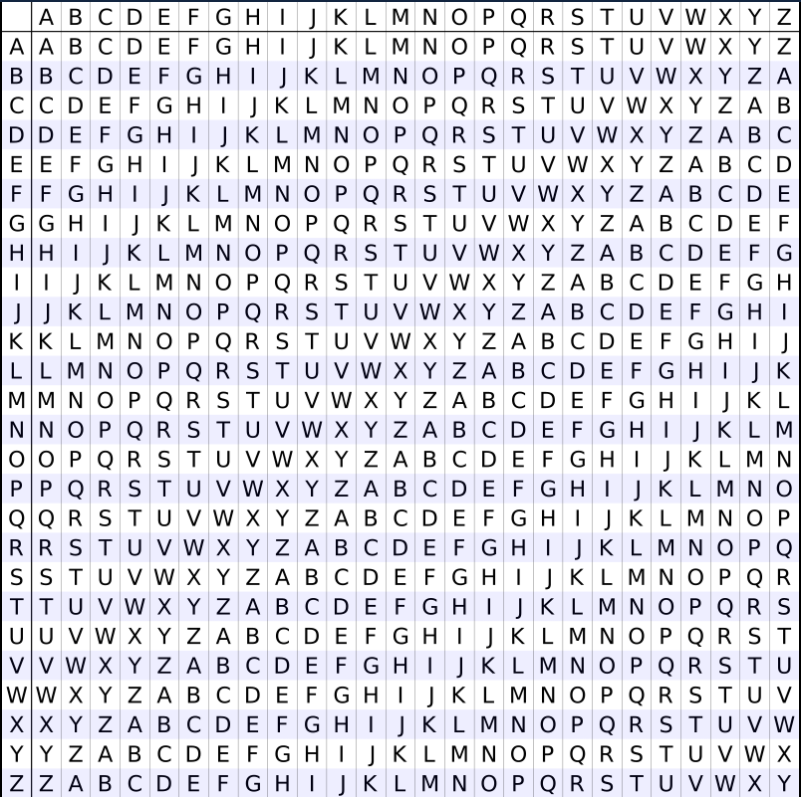

Then simply do: `ciphertext[i]=table[key[i]][plaintext[i]] for i in range(len(plaintext))`.

The idea behind the all polyalphabetic ciphers is to hide the letter frequency to interfere the straight forward application of frequency analysis. The primary weakness of Vigenere cipher is the repeating nature of its key, if a cryptanalyst correctly guesses the key length, then the ciphertext can be treated as interwoven Caesar ciphers, which can be easily broken individually.

### [Stream Cipher](https://en.wikipedia.org/wiki/Stream_cipher)

A symmetric key cipher where plaintext are combined with pseudorandom key stream. Each digit is encrypted one at a time with the corresponding digit of key stream. In practice, a digit is typically a bit and combined with xor operation.

### [Block Cipher](https://en.wikipedia.org/wiki/Block_cipher)

It is a deterministic algorithm that operate on a fixed number of bits called **block**. It uses symmetric key which means a unvarying transformation. A secure block cipher is suitable for the encryption of a single block of data, using a fixed key. In order to encrypt longer data, some people designed some [mode of operation](https://en.wikipedia.org/wiki/Block_cipher_modes_of_operation)s to use block cipher repeatedly in a secure way.

#### Iterated Block Cipher

Most block ciphers are iterated block cipher, which means both plaintext and ciphertext block **has the same size**, via repeated and invertible transformation called **round function**. Round function usually takes different **round key** $K_i$ that derived from the original key as second input. It is fairly easy to construct a cipher that is cryptographically secure by simply using a large number of rounds, but there are some other requirements:

- **Efficiency**: it need to be fast while meeting security requirement.
- **Avoid side-channels attacks**: avoid information in state of the machine, e.g. branch prediction, input-dependent memory access, cache state, execution time, etc.
- **Concise**: for small hardware/software implementation
- **Cryptanalyzable**: The minimum number of rounds for existing attacks work and conversely the rounds needed to be secure.

#### [Substitution-permutation Network (SPN)](https://en.wikipedia.org/wiki/Substitution%E2%80%93permutation_network)

It is a type of iterated block cipher where each alternating round consists of [substitution stage (S-Box)](https://en.wikipedia.org/wiki/Substitution_box) then followed by [permutation stage (P-Box)](https://en.wikipedia.org/wiki/Permutation_box).

#### Design Criteria

- **Completeness**: Each bit of the output should depends on every bit of the input and every bit of the key.
- **Avalanche effect (Diffusion)**
  - Changing one bit in the input should change many (statistically more than half) bits of the output.
  - Changing one bit in the key should change many (statistically more than half) bits of the output.
- **Statistically Independence (Confusion)**: The input and output should appear statistically independent.

#### Feistel Cipher

This is the implementation of the idea of substitution and permutation. It shows that a complex encryption function can be built out of some simple operations (round function) by repeatedly using them. These functions includes: **substitutions**, **permutation**, **xor**, **modular multiplication**. An important advantage of Feistel networks compared to other cipher designs such as [substitution–permutation networks](https://en.wikipedia.org/wiki/Substitution–permutation_network) is the entire operation is guaranteed to be invertible, it allows the round function to be arbitrarily complex and non-invertible. 

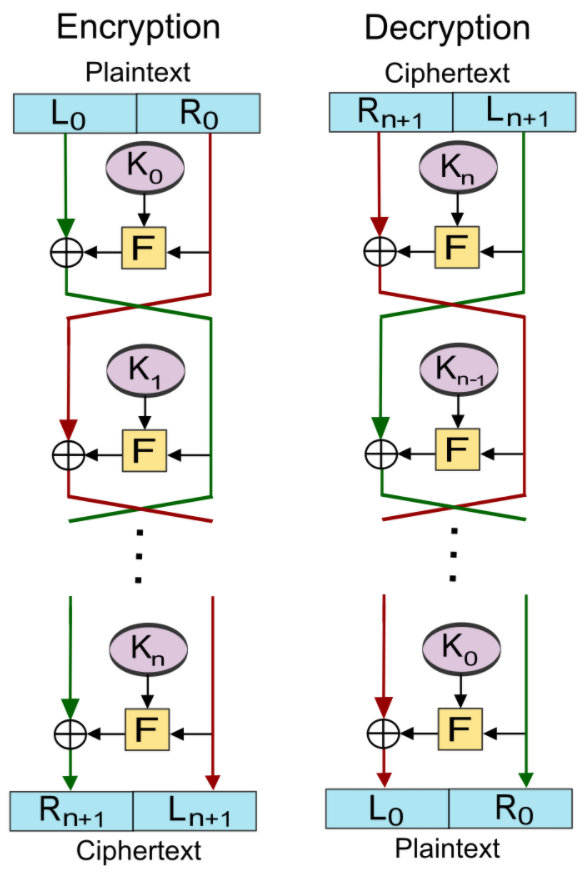

Note that at each round, you encrypt half of the text and xor with the other half, then you pass the xor-ed plaintext for next round to encrypt the current round un-encrypted other half.

- The round function $f$ typically uses substitutions/permutation/modular arithmetic, it takes n-bits and outputs n-bits, each round function uses a different subkey derived from $K$.
- Larger block size offer greater security but slower, typically $n$ is 128-bits or 256-bits.
- Larger key size offer greater security but slower, normally uses 128-bits.
- The number of rounds $r$ is typically $10+$.
- Encryption and decryption is the same, except keys in reverse order.

#### [Data Encryption Standard (DES)](https://en.wikipedia.org/wiki/Data_Encryption_Standard)

It is a Feistel block cipher. The algorithm is public, but the design principle is kept secret. It has a relatively short key size of 56, which publicly broken in 22 hrs and 15 mins in 1999.

- Block length = 64 bits.
- Key length = 56 bits, actually 8 bytes but the last bit is used for parity check.
  - Sub keys are each 48 bits, generated from key.
- Number of rounds = 16.

**Round Function Overview**

1. Expansion Permutation: Right half of input, 32 bits is expanded and permuted to 48 bits. Built-in trapdoors might be placed in secret boxes (?).
2. The 48 bits are xor-ed with the round key.
3. Split the xor-ed 48 bits to 8 slots of 6 bits each.
4. Each 6 bits is indexed to a different S-Box and outputs 4 bits.
   1. S-Box is a table, input's 1st and last bit select row and 2-5 bits select columns, convert the selected value in the table to 4 bits.
5. Permutate the 32 bits with P-Boxes.

#### Triple DES (3DES)

It applies DES cipher three times to each data block. It has key length of 168 bits, but the effective key length is much shorter due to man-in-the-middle-attack. Given a know plaintext pair $(x,y)$, such that $y=E_{K_1}(E_{K_2}(x))$, one can recover the key pair $(K_1,K_2)$ of key length $2n$, in $2^{n+1}$ steps instead of $2^{2n}$ steps. It is designed to have 80-bits security.

#### [Advanced Encryption Standard (AES)](https://en.wikipedia.org/wiki/Advanced_Encryption_Standard)

A call for algorithms to place DES was issued in 1997 with following requirements:

- Stronger & faster than 3DES
- Active life of 20-30 years.
- Provide full specification, and both Java and C implementation.

There are over 15 candidates accepted in 1998, 5 shortlisted in 1999 and Rijndael was selected as the AES in 2000 and formally nominated as AES in 2001. [See process](https://csrc.nist.gov/projects/cryptographic-standards-and-guidelines/archived-crypto-projects/aes-development).

AES is based on substitution-permutation network, it is efficient in both software and hardware, does not use the Feistel network, and it is a variant of Rijndael.

- Block length: 128 bits.
- Key length = 128/192/256 bits, corresponding to 10/12/14 rounds.

It operates on a 4x4 [column-major order](https://en.wikipedia.org/wiki/Row-_and_column-major_order) array of bytes called states.

1. **Key Expansion**: round keys are derived using [AES key schedule](https://en.wikipedia.org/wiki/AES_key_schedule).

2. **1st round**: Add round key: each byte of the state is xor-ed with each byte of the round key.

3. **2-(10/12/14) rounds**

   - Sub bytes: Replace bytes with a global 16x16 look-up table for all 256 8-bit values.

   - Shift rows: Left shift the last three rows.

   - Mix columns: Map each byte of a column to new value that is a function of all four bytes in the column, effectively a matrix multiplication in Galois Field ($2^8$) using a irreducible polynomial $m(x)=x^8+x^4+x^3+x+1\text{ or }11B $. For example:
     $$
     \begin{align*}
     \{02\}\cdot\{87\}\mod\{11B\}&=(0000,0010)(1000,0111)\mod\{11B\}\\
     &=(x)(x^7+x^2+x+1)\mod\{11B\}\\
     &=(x^8+x^3+x^2+x)\mod (x^8+x^4+x^3+x+1)\\
     &=x^4+x^2+1\\
     &=(0001,0101)
     \end{align*}
     $$

   - Add round key: (same as above)

4. **Final round**: sub bytes, shift rows and add round key again, (except mix columns).

#### DES vs AES

| **DES**                       | **AES**                            |
| ----------------------------- | ---------------------------------- |
| Substitution-Permutation      | Substitution-Permutation           |
| Iterated Cipher               | Iterated Cipher                    |
| block size=64-bits            | block size=128-bits                |
| key size=56-bits              | key size=128/192/256-bits          |
| Design optimized for hardware | Design optimized for byte-oriented |
| Closed design process         | Open design & evaluation process   |

#### Modes of Operation (Confidentiality Only)

- **Electronic Codebook (ECB)**: Each block are encrypt independently, using the same key, last incomplete block is padded, usually the last byte indicate how many byte are padded, so that the receiver can remove them. It offers parallelizable encryption/decryption and random read access, but does not hide repeated pattern (lack of diffusion):

  
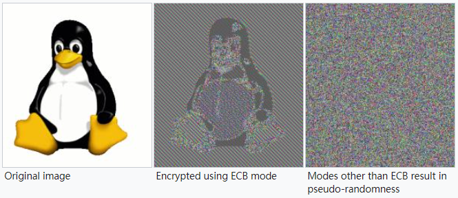

- **Cipher Block Chaining (CBC)**: The encryption of the current block depends on the previous block, thus it does not allow parallelizable encryption, but you still have decryption parallelizable and random read access, because decryption depends on the previous ciphertext which is already available.

  

- **Counter (CTR)**: The encryption uses the encryption function as key generator, remember the repeated keystream problem in stream cipher? This is how they solve this problem. The actual encryption is just the xor, which is same as the stream cipher, that's why some people says that with CTR, the block cipher is transformed into a stream cipher.

  - It has parallelizable encryption/decryption as well as random read access since you can compute the counter value of a block directly.
  - It also does not have error propagation, if one bit in a block is wrong during transmission, it does not affect the following block.
  - Its encryption and decryption function is the same, so you only need one function.
  - You can precompute the value to be xor-ed before you go online which made it fast.
  - Note that block has to be synchronized, if one block is removed then the plaintext cannot be recovered.

### RSA

RSA is a public key cryptographic system used for secure data transmission. It relies on the difficulty of factoring product of two large prime number. It is a relatively slow algorithm, and commonly used to transmit shared keys for symmetric key cryptography, then use for bulk encryption-decryption.

## Attacks

The security of any (modern) cipher is based not on the secrecy of an algorithm, but on the security of the cryptographic key. An attack is completely successful if the corresponding plaintext can be deduced, or even better, the key. But the ability to obtain any information at all about the underlying plaintext beyond what was pre-known to the attacker is still considered a success.

### Amount of Information Available

For the purpose of analysis, we assume the general algorithm is known. This is a reasonable assumption, throughout the history, there are countless examples where secret algorithms falling into wider knowledge.

|                                      | ciphertext | corresponding plaintext | chosen by attacker | choose while attacking | encrypt with two different keys |
| ------------------------------------ | ---------- | ----------------------- | ------------------ | ---------------------- | ------------------------------- |
| Ciphertext-only (Known-ciphertext)   | yes        |                         |                    |                        |                                 |
| Known-plaintext                      | yes        | yes                     |                    |                        |                                 |
| Chosen-plaintext/ciphertext          | yes        | yes                     | yes                |                        |                                 |
| Adaptive chosen-plaintext/ciphertext | yes        | yes                     | yes                | yes                    |                                 |
| Related-key                          | yes        | yes                     | yes                |                        | yes                             |

### Brute-force attack (exhaustive key search)

It is done by trying out all possible keys, three properties is required:

- Encryption and decryption algorithms are known.
- Key space should be small enough.
- The language of plaintext is easily recognizable.

### Frequency Analysis

It is based on the fact that, in any given stretch of written language, certain letters and combinations of letters occur with varying frequencies. If the distribution of frequencies of letters in ciphertext is similar to distribution of plain language, then it can be exploited by the attacker. 

### Man-in-the-middle Attack

... to be finished

### Meet-in-the-middle Attack

It is a time-memory trade-off.

Let us use double DES to explain this attack.

- build a table of keys 
- Compute f(k, M) for every possible key 
  - f is an encryption function, M is a known message 
- Eavesdrop a value f(k’, M)
- If f(k’, M)=f(k, M), then there is a good chance k’=k.

## Public Key

The problem with symmetrical key cipher:

- Two or more parties share the same key, non-reputation cannot be achieve without trusted third party.
- A separate key is needed for each user, or even each session. So if $n$ users wants to communicate with each other, we need $n\times(n-1)/2$ keys, the $n^2$ problem.
- Generating/distributing/maintaining these keys are challenging.

The idea of public key is based on trapdoor (one-way) function $f$:
$$
\begin{align*}
&C=f(K,M)&&\text{easy if K, M are known}&\\
&M=f^{-1}(K,C)&&\text{easy if K, C are known, infeasible if only C is known}&\\
\end{align*}
$$
Commonly used one-way function includes:

- Integer Factorization (RSA): given $N$, find $N=p\times q$ where $p$ and $q$ are prime.
- Discrete Logarithm (DSS & DH): given $a,b,p$, find $x$ in $a^x=b\mod p$ where $x\in \Z$.

### RSA

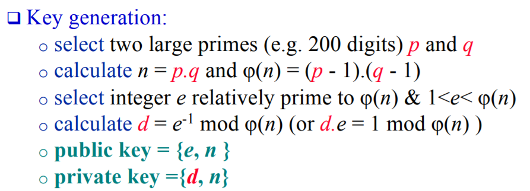

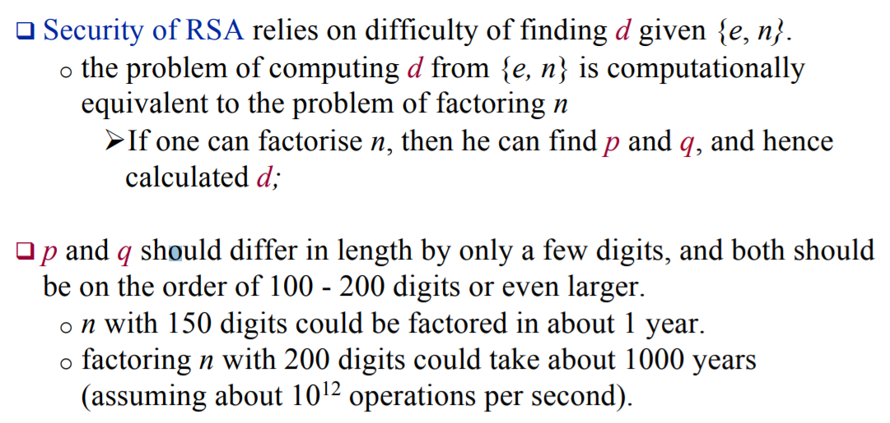

As a receiver, RSA allows you to ensure data integrity, because it is unlikely for anyone except you who has the private key to decrypt the message, but you cannot ensure who sent it to you. As a sender, RSA allows you to ensure only the receiver can see the content of the message because only he has the key that allows him to easily decrypt the ciphertext.

### Applications

- **Confidentiality**: You can encrypt with public key so that you know that message can only be decrypted by the other.
- **Authenticity**: You can encrypt with private key so that others know the message comes from you.

## Digital Envelope (Hybrid Cryptosystem)

1. Generate a random symmetric session key.
2. Use this symmetric key for bulk encryption.
3. Encrypt this symmetric key using receiver's public key. (So that only the receiver can decrypt and get the symmetric key)
4. Concatenate data in step 2 and 3 and send them to receiver.

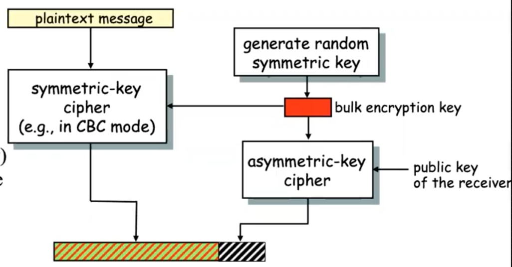

## Cryptographic Checksum

### Reason

- **Symmetric Encryption**: No non-repudiation, sender can deny sending the message and receiver and make up a encryption and say that it is from the sender.
- **Public-key Encryption**: No original authentication, anybody can hold receiver's public key.
- **Digital Signing**: Provides authentication, non-repudiation and anti-replay, it is signed using sender's private key, and anyone can verify the checksum with sender's public key. But it does not provide confidentiality. It is useful for application that only requires authentication, e.g. secure broadcast and source code distribution, as it is hard to forge and tamper-proof.

### Hash Function

A hash function $H$ takes $M$ of any length, and output a fixed size $h$, called checksum/digest/hash/fingerprint with following requirements:

- **Preimage Resistant (one-way function)**: given $h$ and $H$, it is infeasible to find $M$ for $H(M)=h$.
- **2nd preimage Resistant (weak collision-resistant)**: given $x$ and $H$, it is infeasible to find $x'$ for $H(x)=H(x')$.
  - Hard for someone to change the message in transit.
- **Collision Resistant (strong)**: It is infeasible to find any two $x$ and $x'$ for $H(x)=H(x')$.
  - Hard for sender reputation.

Note that it is a many-to-one function and we need to reduce collusion, and strong resistant implies weak resistant.

 Note that the hash function alone only provides data integrity but not authenticity.

### Message Authentication Code (MAC)

The checksum can also be generated using a symmetric block cipher, e.g. CBC-MAC. If only sender and receiver knows that key used for generating MAC, then the receiver knows the message is:

- Integrity protection: MAC matches.
- Origin authentication: only sender and receiver has the key to generate the MAC
- The message is in correct order, if the message includes a sequence number.
- Fresh message, if the message includes a timestamp or a random number created  (fully/partial) by receiver.

Note that MAC is not digital signature and does not provide non-repudiation.

#### HMAC

HMAC is a keyed hash function: $HMAC(K,M)=H(K^+_o,H(K^+_i, M))$, where $K^+_o$ and $K^+_i$ and the key padded to block size and xor-ed with opad (00110110, 0x36) and ipad (01011100, 0x5c).

#### Security

The security of MACs depends on the bit-length $n$, finding collusions costs: $2^{n/2}$. 

### [Approach to authenticated encryption](https://en.wikipedia.org/wiki/Authenticated_encryption)

- **Encrypt-then-MAC**: Encrypt the plaintext for ciphertext, then produce MAC from ciphertext, then send MAC and ciphertext together. Note two different keys are needed to produce MAC and ciphertext.
- **Encrypt-and-MAC**: Encrypt the plaintext for ciphertext, produce MAC from plaintext, then send both ciphertext and MAC.
- **MAC-then-Encrypt**: Produce MAC from plaintext, encrypt plaintext and MAC, then send the ciphertext.

### [Authenticated Encryption with Associated Data (AEAD)](https://en.wikipedia.org/wiki/Authenticated_encryption)

AEAD is a variant of AE that allows recipient to check both encrypted and unencrypted data in the message. AEAD binds the associated data (AD) to the ciphertext and to the context where it is suppose to appear, so that attempt to move ciphertext with another AD will fail. For example, in the network packet, the header needs visibility, body need confidentiality and header and body need integrity and authenticity.

### Mode of Operation (AEAD)

- **Cipher Block Chaining Message Authentication Code (CBC-MAC)**: CBC-MAC is a technique for constructing a message authentication code from block cipher
- **Galois/counter (GCM)**: It combines the well-known counter mode with Galois mode of authentication, it can be easily parallelized.

... to be finished

## Digital Signature

Cryptographic checksum are based on symmetric key, this means that only key holders can verify the authenticity and integrity of the data, but does not allow a third party verification. A digital signature allows third party to use the public key to verify those properties, even if they do not trust the receiver, therefore providing non-repudiation.

A digital signature consists of:

- A key generation algorithm.
- A signature (generation) algorithm.
- A signature verification algorithm.

It uses a hash-and-sign paradigm: sign the hash value of the message. This is because if you sign on the message directly, others can view the plaintext message using public key and the verification algorithm. Below is an example using RSA:

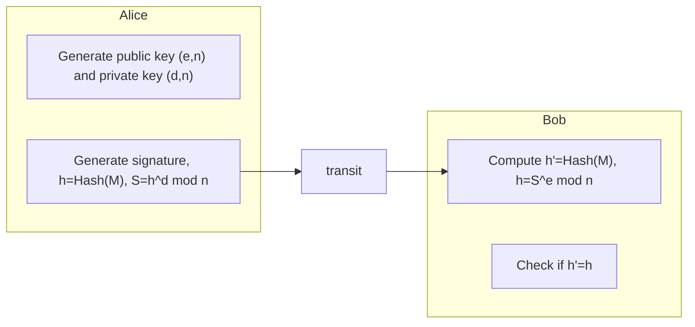
```mermaid
graph  LR
subgraph Alice
keys["Generate public key (e,n) and private key (d,n)"]
sign["Generate signature, h=Hash(M), S=h^d mod n"]
end
subgraph Bob
comp["Compute h'=Hash(M), h=S^e mod n"]
check["Check if h'=h"]
end
sign-->transit-->comp
```

### Digital Signature Standard (DSS) and Digital Signature Algorithm (DSA)

DSA is a algorithm used in DSS, DSA is a digital signature only algorithm.

#### DSA vs RSA

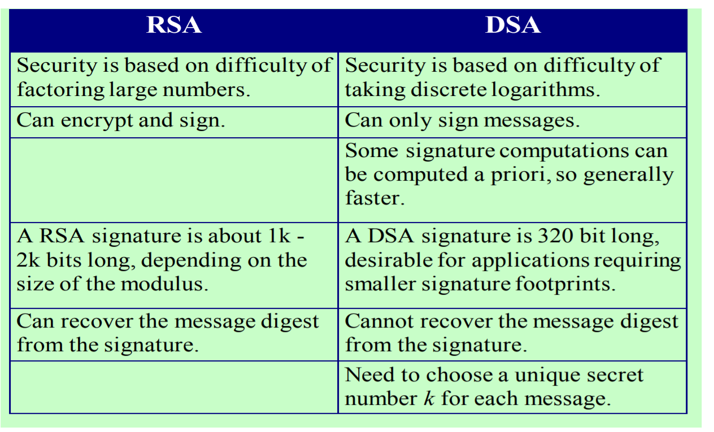

Unlike RSA, DSA is a digital signature only algorithm

... to be finished

## Public Key Infrastructure (PKI) 

### Public Key Certificate

It is an electronic document that used to prove the ownership of a public key, that is, he possesses the corresponding private key. This means when he uses the digital certificate to prove that public key indeed belongs to him, he should demonstrate that he knows the corresponding private key.

- **Registration Authority (RA)**: verify the identity of the user requesting for certificate
- **Certificate Authority (CA)**: issue & manage digital credential.
  - Digital/PKI Credential = PKI certificate + the matching private key. (can be generated by either CA or the requester)
- **Data Repository**: typically a LDAP directory, is where certificates and revocation status are officially stored.

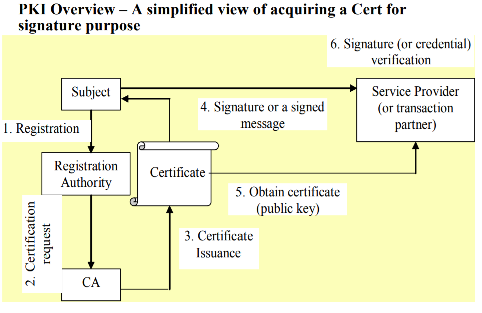

Here we assume the CA is trusted by the subject (requester) and the Service Provider (SP).

### Direct Digital Signature

Direct digital signature refers to a digital signature scheme that involves only the communicating parties (sender and receiver). It is assumed that the destination knows the public key of the source. Note that it is important to sign the message first then encrypt them, because some third parties must view both the signature and the message, if the inner message is encrypted, then you will need to give your private key to third party for verification.

The validity of the scheme depends on the security of the sender's private key, if the private key is lost or stolen then someone else can forge the signature. Administrative controls such as including timestamp and report compromised key can weaken this ploy, but the threat is still there.

## Symmetric Key Distribution

For symmetric encryption to work, two parties must share the same key and it must be protected from access by others. Frequent key changes are desirable to limit the amount of compromised data if attacker learns the key. Therefore the strength of cryptographic system is linked with the key distribution technique.

### Diffie-Hellman Protocol

- can be extends to more than 2 party
- allow parties to compute a shared secret
- it can resist passive attack such as eavesdropper, but vulnerable to active attack such as man-in-the-middle attack, because neither party knows who it shares the secret with.

... to be continued

## User Authentication

### Unix Solution

- salt (12bits) is added to password
  - perturb the DES algorithm, so DES chips cannot be used to guess passwords
  - make precompiled dictionary attack harder by a factor of 2^12=4096.
- hash the salted password
- use the hashed password as key and encrypt some arbitrary plaintext (encrypt by 25 iterations of DES).
- 64 bits output are unpacked into a string of 11 printable characters as encrypted password.

store the encrypted password not in `etc/password` but `etc/shadow` that can only be access by admin. This is done to avoid attacker got access to the encrypted password and try to dictionary attack the encrypted password in free time. Note that attacker can still run the attack if a attacker process with admin privilege is run.

This solution is under one assumption: the local area network (LAN) is secure (wired network), that is we assume the attacker cannot intercept the channel.

Improvements nowadays includes:

- hash function: MD5
- longer password length
- longer encrypted password length
- longer salt
- use Pluggable Authentication Module (PAM) --- A flexible way to support the use of many different authentication method.

### Challenge-Response Auth Protocol

- based on a secret
- demonstrate the knowledge of the secret without revealing the secret, then you are authenticated.
  - A -> B: I am Bob
  - B -> A: nonce
  - A -> B: H(K, nonce), B checks the hash (this hash is served as a OTP)
    - if matches: A is authenticated

can be used on a unsecure channel. MS-CHAP is identical to CHAP, except the password is used instead of key.

There are also other variant, e.g.:

- A -> B: I am Bob
- B -> A: E(K, r)
- A -> B: r

or you can use public key to encrypt and let the requester to decrypt to show that he has the private key, but note that public key has to be verified. Or you can also send a nonce and let requester to encrypt the nonce, if you have the key to verify the encrypted nonce is correct. 

This is used in client-server like cases.

### Enterprise Authentication

This is useful when you need to communicate with multiple servers.

There maybe multiple VPN server serving the client, and each of them has to communicate with the Security Server to check that your password is correct, and you do not have to remember multiple passwords just because your favourite game has multiple game server. From your perspective, you only need Single Sign On (SSO).

Therefore we have a centralised authority (security server/authentication server) in each domain/organization to perform the task of authentication. The servers in the organization that serves clients, do not need to handle authentication, thus making it more secure. A number of systems exists to handle this situation, e.g.:

- Radius - Remote authentication for dial-in user service 

  - Initially designed for remote dial-in, but now extended to handle enterprise-wide AAA services….. 

  

  

  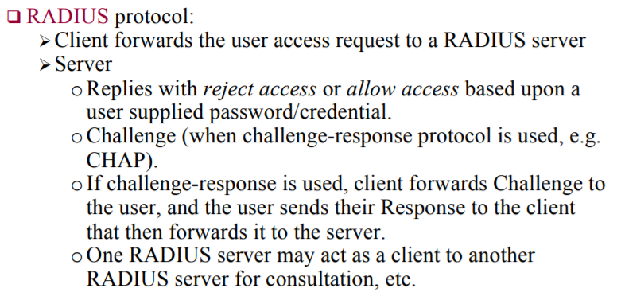

- Kerberos

### Notes

- Passwords are the most basic authentication mechanism.
  - good password means higher security level.
  - vulnerable to guessing unless precaution to ensure large set of possible passwords.
    - salt
    - challenge-response technique allows system to vary the password therefore less vulnerable to guessing attacks (dictionary attack).
- Authentication can be achieve using public key but a public key certificate is needed. There are also other forms:
  - biometrics measures.
  - location
  - etc... System designers have to balance convenience and security to ensure ease-of-use.
- Public key cryptographic application
  - confidentiality: e.g.: encrypt using public key
  - signature & integrity: generate signed token for recipient to verify the origin and content.
  - Identification & authentication: determine the identity of a user & service by demonstrating the ownership of private key.
  - Timestamping: can generate a time stamp to certify a message is indeed sent at a particular time and date.

## PGP

- General purpose application to protect files
- Similar to S/MIME (Secure/Multipurpose Internet Mail Extension), but PGP uses web of trust and S/MIME uses Top-down approach.

- PGP is simpler to use, documentation are on the internet, we have already cover the top-down approach, so we talk about PGP the trust model here.

Email problems:

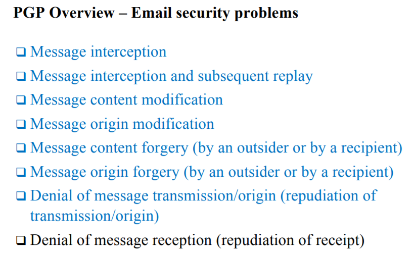

Services by PGP:

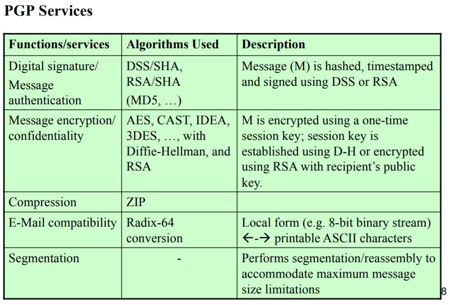

### Confidentiality Only

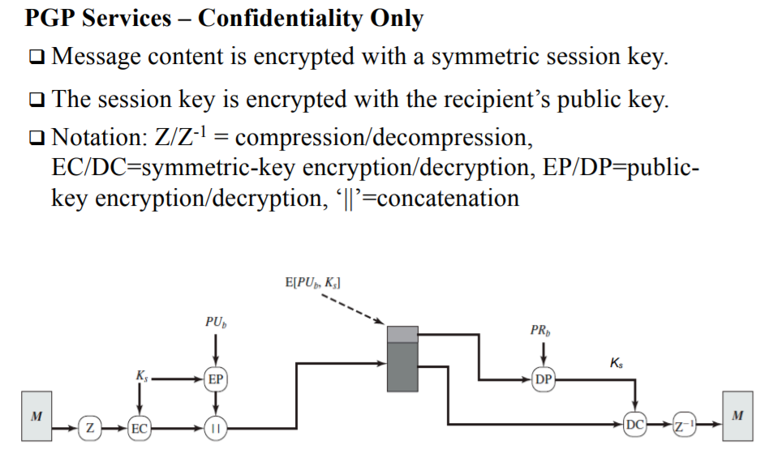

Sender

- compress the content
- generate a symmetric key
- symmetric key encrypt the content
- public key encrypts the symmetric key
- concatenate the encrypted content and encrypted symmetric key and send to receiver.

Receiver

- decrypt the symmetric key using private key
- decrypt the content using the decrypted symmetric key
- un-compress the content

### Confidentiality & Authentication

It is the same as confidentiality, except that the before the content is compressed, its hash value is calculate and encrypted with sender's private key, and appended to the content.

### Message Format

- Key ID is used to fetch the public key from server to verify with the given public key
- Leading two bytes of the message digest is to for receiver to confirm the right public key is used to decrypt the signature.

### Key Rings

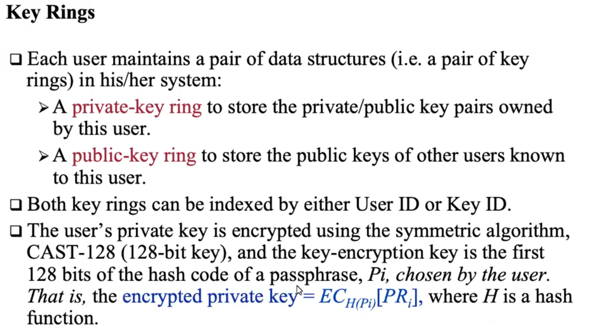

Each entry of this table can be view as a certificate, it is the essence of the trust model used.

- **owner trust**: how much the owner of this key ring trust this user to sign other public key certificate, it is private, assign by owner.
- **signature trust**: how much a user trust another user, it is public, assign by the PGP system.
- **key legitimacy**: the degree to which owner trusts that the public key belongs to the user, it is calculated by PGP system based on some heuristics defined by the user based on signature trust on the (chain of) certificate(s).
  

For example, if you are the owner, you have a certain trust value for Alice, then Alice sign on Bob's public key, we will have:

- Alice will have a owner trust, that is the trust value for Alice.
- Bob's public key will have a signature trust, which value is identical to the owner trust of Alice's, because that is the trust value the owner trust Alice to sign on others' key.

# Lectures (Legacy)

## History & Present

- Very old days, before large-scale application of the internet
  Interest in security were largely confined to military domain.
- 1988: Morris worm brought down a large fraction of the internet.
- late 80s: E-commerce, ATM, financial transactions
- early 90s: Mosaic and Netscape (early search engines)
- Mobile
- Cloud
- Crypto currencies, smart contract signing, getting rid of third parties, block chain
- IoT

## Threats & Challenges

- 444129 ransomware attacks took place worldwide in 2018.
- 300000 new malware are created daily.
- 75 records are stolen every second.
- A consumer account can be as cheap as 1 dollar.
- More than 6000 online criminal marketplace sell ransomware products/services.

Threads in generic context (Confidentiality, Integrity & Availability (CIA))

- Disclosure (confidentiality)
  - Snooping/sniffing
  - Unauthorized access
- Deception
  - Spoofing (identity theft)
  - (integrity)
    - Unauthorized data modification
    - Replay (intercept & retransmit)
    - Repudiation (false denial) of origin/receipt
- Disruption (availability)
  - modification, delay, Denial of Services (DoS)

Specific Threads (Top 5)

1. Social Engineering Attacks: relate to people.
2. Supply Chain Attacks: relate to system, payment, etc.
3. IoT & Infrastructure Attacks: relate to infrastructure, organizations (they usually have their own network).
4. Identity & Mobile Authentication: like Multi-Factor-Authentication (MFA), relate to high value assets.
5. Rise of Zero-Day Threats & Polymorphic Attack: related to malware, this refers to vulnerabilities that is found and fixed, but patch has not been applied to the system.

- Most attack is done through malware.
- There are hacking-as-a-service nowadays
  
- People do not have to be very knowledgeable to launch attacks because there are many available tools.
  
- Spectrum of risks increases as degree of digitization increases.

  - e.g. messaging<storing information<transactional system<technology integration<fully integrated information based business

- Infrastructure relationships in cyberspace

  1. Physical Infrastructures: nuclear plants, hospitals, cable fiber, farms, etc.
  2. Critical Infrastructures/Key Resources(CIKR): comms, water/gas/oil, transportation, emergency, banking, etc.
  3. Cyber Infrastructures: hardware, software, interconnected network (internet), etc.

  

- Naive users: lack of security awareness
- Inadequate management procedures
  - Insecure system set up and configuration
  - Lack of proper policy making, implementation and enforcement procedures.
- Global networks without national boundaries
- Heterogeneous devices, laptop, phones with universal connection
- Anonymous nature of many Internet-based services.

## Lecture 1-3

### Achieving Security

There is three basic security properties that is commonly seen in real life (CIA):

- Confidentiality
  - Keeping data & resources hidden
- Integrity/Authenticity/Authentication
  - Content integrity (detect modification & replay)
  - Origin integrity (data is indeed from claimed source)
- Availability
  - Ensuring data/service is available to authorized users.

There are also other advanced security properties:

- Freshness
  - Ensure data is not a replay/retransmission of old data
- Non-repudiation
  - Protect against false denial.
- Fairness
  - Either all parties are received or no party received something useful.

In order to achieve security we go through following steps:

1. define security goals
   1. threads analysis & identification: what to protect against
   2. policy/requirement specification: define what is/is-not allowed
2. design & implement
   1. decide how to protect as to satisfy the specification
      1. technical measures
      2. procedural measures
3. operation maintenance
   1. assess how well the implementation has achieved the security goal

In term of thread analysis:

- identify assets, threads and vulnerabilities.
- assess the levels of risks on the assets
  - value
  - importance: likelihood of exploitation
  - not all threats is worth defeating
    - cost vs benefit analysis, prevent vs recover vs ignore.

Security measures is a method, protocol, tool or used to address the risks identified (or enforce security policy)

- prevention
  - block attacks by closing vulnerabilities
  - reduce level of risk by making attack harder
  - make other more attractive target (honey pot)
  - e.g. access control (firewalls), encryption, digital signatures, etc.
- detection
  - measures taken before/after the attack
  - e.g. logging, auditing & intrusion detection
- recovery
  - assess & repair damage
  - continue to function correctly even if attack succeeds
- accept
  - accept it and do nothing (if some threats are not worth it).

Operation & maintenance

- assurance
  - testing to check the correct implementation
  - formal evaluation
  - standards
    - US Security Evaluation Criteria (the orange book)
    - European ITSEC (Information Technology Security Evaluation Criteria)
- Human Issue
  - organizational issue
    - power & responsibility
    - financial benefits
  - people problems
    - outsiders & insiders
    - social engineering

Putting together:

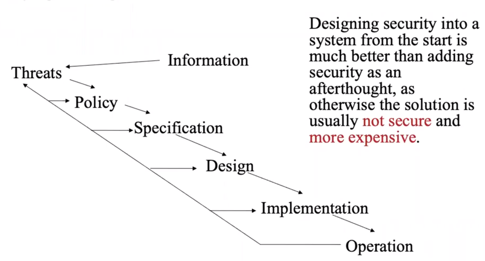

### Security Models

When designing a security model, we have to think what are the security threats in this model and what are the properties/services that are necessary to counter the threats? There are many issue to think of:

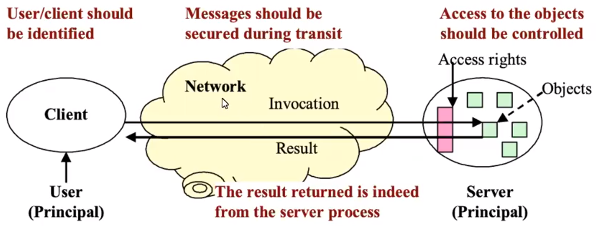

Lets first consider a communication security model. This model emphasis on protecting the data over the channel, security properties we interested are authenticity and confidentiality.

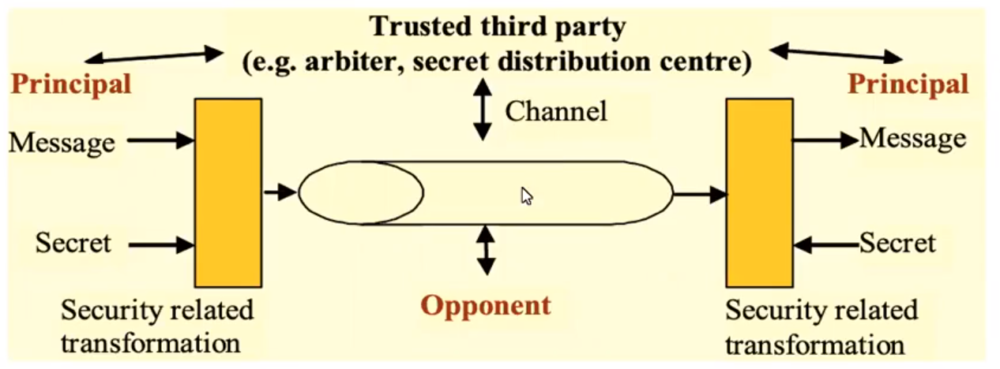

If we only consider the receiver, we have the following multi-layer network security model:

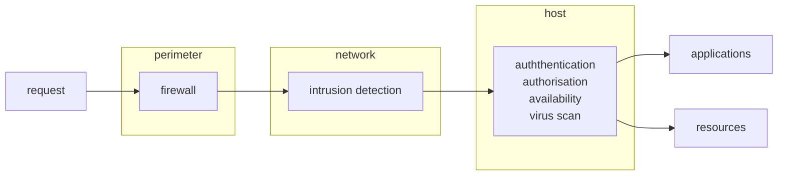
```mermaid
graph LR
subgraph perimeter
fw[firewall]
end

subgraph network
net[intrusion detection]
end

subgraph host
auth[auththentication<br>authorisation<br>availability<br>virus scan]
end

request --> fw --> net --> auth
auth --> applications
auth --> resources
```

We also have other model, such as the E-commerce security model, in this case, the customer and merchant does not trust each other, instead, they introduce a trusted third party (TTP) that offer some services.

### Conclusion

Network & distributed systems are part of our daily lives. Most systems are networked which open to many attacks and threats, security provisioning is a complex task, it consists of computers/software/wired/wireless network/processes, and the weakest link is people.

## Lecture 2-1

Cryptography is the art of keeping messages secure — Scheier

Keeping message secure is done either prevent the unauthorized access or encrypt the message, the later use cryptography, nowadays cryptography is more widely used, it can be found in:

- authentication of an identity
- credential systems: a proof of qualification or competence of a person.
- confidentiality: secrecy and privacy of data in transmission and storage
- integrity of data: data authentication/authenticity in transit and in storage
- digital signatures
- electronic money: cryptocurrency, bitcoins

Application:

- Threshold cryptography: shared decryption key within entities, a subset of entities have to collaborate and perform decryption/digital signature
- Multi-party computation: compute a function together, one party should only know their own input and the output of the function.
- Digital right management: activating software license
- electronic voting
- …

We will focus on achieving confidentiality using encryption

- ciphers (cryptography system)
  - symmetric-key (same key used for encryption and decryption) (conventional ciphers) (before 1976)
  - asymmetric-key (different key used for encryption and decryption) (public-key ciphers)
- ciphertext: message in encrypted form
- cipher/cryptosystem: the system that performs encryption and decryption
- cryptanalysis: attempt to discover plaintext or key

- unconditional secure: cannot be defeated regardless of how much power is available
- conditional secure: perceived level of computation required exceeds the computational resources of the hypothesized adversary. e.g. takes very long time to break.
- provably secure: some solution can be verified that it is secure
- adhoc security: claims of security remain questionable

## Lecture 2-2

classical encryption techniques

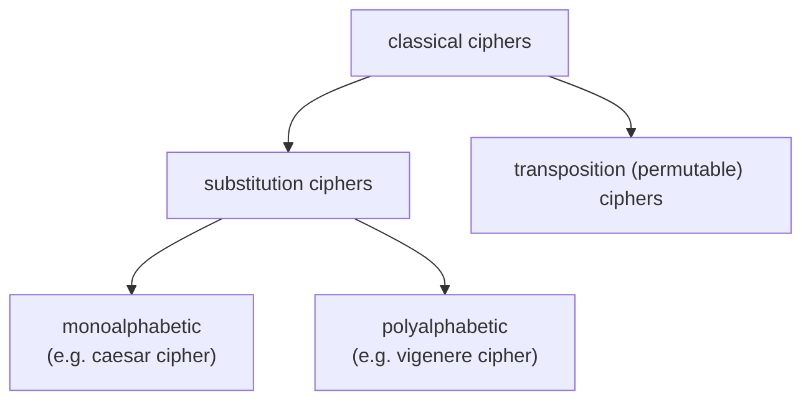
```mermaid
graph TB
cc[classical ciphers] --> sc[substitution ciphers]
cc --> tc["transposition (permutable) ciphers"]
sc --> m["monoalphabetic<br>(e.g. caesar cipher)"]
sc --> p["polyalphabetic<br>(e.g. vigenere cipher)"]
```

- monoalphabetic: a character always replaced by another same character
- polyalphabetic: a character maybe replaced by multiple other characters

classical algorithms uses:

- substitution (confusion): a -> b
  - modern ciphers look up table that transform input: S-Boxes (transforming block of nbits)
- permutation (diffusion): ab -> ba
  - modern ciphers look up table that transform input: P-Boxes (transforming block of nbits)
- XOR operator: efficient in computers
- simple/non-secure ciphers:
  - shift ciphers: caesar cipher
  - vigenere cipher
- secure cipher: one time pad

Note that modern ciphers operates on bits rather than characters

caesar cipher (shift cipher) basically uses addition and modulo, encryption is circular right shift and decryption is circular left shift. This algorithm is very unsecure.

- easily break by brute force (exhaustive key search) 

  - only 25 keys to try
  - algorithm is in public domain
  - language of plain text is easily recognized, not compressed.

  given small amount of plaintext-ciphertext pair, encrypted with key K, K can be recovered by exhaustive key search with in $2^{n-1}$ processing complexity, where n is the bit-length of the key.

  redundancy in plaintext can be exploit, e.g. the letter "e" appear frequently, so the most common letter in encrypted text is likely to be "e". This is called frequency analysis (counting attack), which based on study of frequency of letters in ciphertext.

  With today's computing power, the key should at least be 128 bits long.

## Lecture 2-3

One type of modern cipher is stream cipher and one type of stream cipher is based on one time pad

### Vigenere Cipher

Recall that caesar cipher has the problem of frequency of words which can be exploit by hackers, we should hide this information, this can be done easily by changing just a bit of the algorithm. We can shift each letter by different number, so that the ciphertext does not contains the frequency information. We usually use a keyword, e.g. bed->143 (this shift letters bed by different amount). This is called vigenere cipher. It is significantly more secure than regular cipher, its security level depends on the keyword length.

#### One Time Pad

Ofcourse, instead of using keyword, it can be just a random text, if we use a random text that as long as the password, then we have a cipher with perfect secrecy, when used properly, it is provably unbreakable (Shannon, 1949). This algorithm is proposed by Gilbert Vernam during WWI. It is a special variant of stream cipher. Typically a stream cipher uses mod 2, XOR function.

However, this method is not practical because the storing and distribution of the key can be troublesome.

#### Stream Ciphers

Stream ciphers encode individual bits or character stream with a keystream, usually xor is used, because xor has a nice property: A xor K = B and B xor K = A. Instead of generating random sequence in one time pad, stream ciphers usually only keep a key and use that key to generate pseudo-random sequence for encryption and decryption.

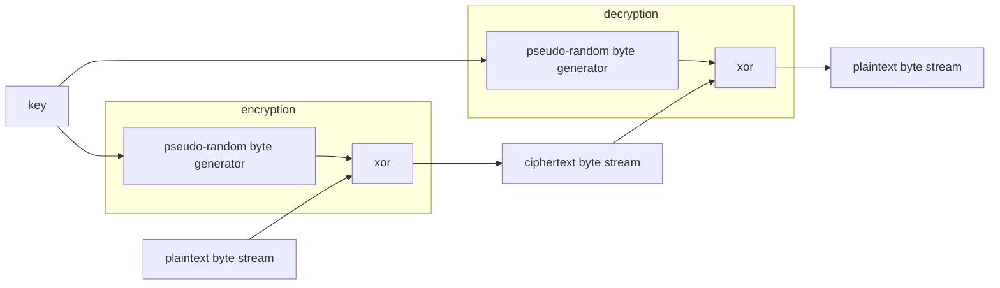
```mermaid
graph LR
subgraph encryption
g1[pseudo-random byte generator] --> xor1[xor]
end
subgraph decryption
g2[pseudo-random byte generator] --> xor2[xor]
end
xor1 --> c[ciphertext byte stream]
c --> xor2
k --> g2
pt[plaintext byte stream] --> xor1
k[key] --> g1
xor2 --> pt2[plaintext byte stream]
```

#### Transposition Cipher

It generate ciphertext by reordering the plaintext. e.g. write row by row and read column by column

#### Attacks

Note that modern cipher is based on the security of the key, not the secrecy of the algorithm itself.

- frequency attacks: break by spotting flaws in algorithms
- brute force/exhaustive key search: try every possible key
- dictionary attacks: run encryption algorithms on a massive amount of plaintext until the same ciphertext appears.

When it comes to password, it usually has a problem: do we use the password as key or plaintext? The latter creates more problems because now we have to think of another key and we have to ensure its security, so password is often the key. This way, the ciphertext is not reversible unless hacker knows the password.

- ciphertext-only attack (e.g. frequency attack): attacker knows ciphertext of several messages encrypted with the same key, then from here they try to find the key.
- known-plaintext attack (e.g. dictionary attack)
   ciphertext attack + they know the plaintext of these messages,
- chosen-plaintext attack: attacker choose some plaintext and have their corresponding ciphertext, from here they find the key. E.g. attacker change some letters and observe the change of power consumption of the encryption process.

Cryptographic attack often exploit the redundancy of natural language, so lossless compression before the encryption is often used before encryption to remove redundancy

## Lecture 3-1

#### Block Cipher

divide plaintext into blocks and encrypt one at a time, padding is added for incomplete block (?potential exploit?)

Criteria

- **completeness**
  every bit of the output should depend on every input bit, so that the output will change even if only 1 bit is changed in input.
- **avalanche effect (diffusion)**
  one bit change in message/key should change many bits in output
- **statistical independence (confusion)**
  input and output should be statistically independent. So that the attacker cannot guess certain text with probability

Claude Shannon identified that confusion can be achieve by substitution and diffusion can be achieve by permutation. Horst Feistel later then design a block cipher structure that implement this idea, in this structure he also prove that complex encryption function can be built out of some simple operation by repeatedly using them. e.g. substitutions/permutations/xor/modular multiplication. Network that use substitution and permutation are also called SP-network.

##### Feistel Block Cipher

- permutation
- spilt into 2 halves
- 16 rounds of identical operations with different keys (subkey/round key)
- inverse permutation

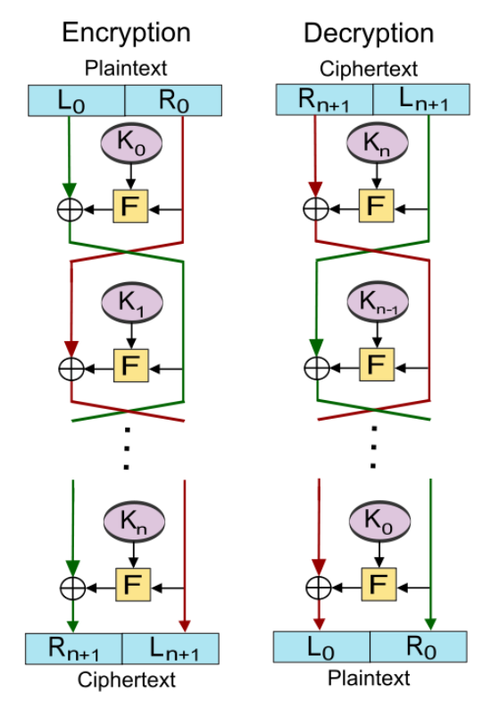

Its important advantages is that the encrypted message can be decrypted even if the round function F is invertible. It also has other advantages, includes only xor is needed and encryption and decryption is almost identical, so implementing it is simpler than the usual SP-network.

- The function F takes n bits and output n bits, usually permutations, substitutions or modular arithmetic.
- larger block size usually means greater security but make encryption/decryption slower, typically 128/256 bits.
- key size is usually 128, larger the better but reduced speed as well.
- number of rounds is usually 10+, wikipedia says 4 rounds are enough for a strong pseudorandom permutation. 

### Lecture 3-2

des is a feistel block cipher, block length is 64, but 8 bits (every 8th bit) are used for parity check, so effectively 56bits. Key is 56bits, subkey is 48bits
50%;" />

Round Function f:

1. expansion permutation: right half (32bits) is expanded to 48bits
   - use a permutation table, e.g. 4->8bits: 41232341, this is to achieve avalanche effect.
   - 32->6x4bits, 6 -> 1and6th bits for row, 2-5th bits for col, row and col then can be used to index a 2x16 table, each cell contains a 4bits number, so each 6bits generate new 4bits, so we have generated 4x4=16 new bits
2. use of round key: 48 bits are xor with the round key
3. splitting: 48-> 8 x 6 bits each
4. S-box: each 6 bits is indexed against a S-box to produce 4bits result
5. P-box: permute the 32bits from S-box = output of f

Strength of des:

des's weakness is the key size, which is 56 bits, with the increasing computational power, this is no longer secure. We have two options:

- repeat: triple des

  - two variens, 2 keys (112bits) or 3 keys(168bits)
  - $C=E_{k1}(D_{k2}(E_{k3}(M)))$, the reason for using decryption in the middle is just for backward compatibility, a user using the old des method can simply set the keys to be the same to communicate with another user that uses triple des.
  - people found that they can use meet in the middle attack to break the algorithm within shorter time than 2^bits:
    - build a table of keys, k
    - compute encryption(k, M)
    - eavsdrop a value f(k', M)
    - if f(k,M)=f(k',M) then it is likely that k=k'
    - Precondition for this attack is that attackers have to have pairs of (M, C)

- new standard: aes

  - US NIST issued call for DES replacement in 1997 with requirements:
    - stronger & faster
    - active life 20-30 years
    - provide full specification & design details
    - both c & java implementation
  - 15 accepted in 98, 5 shortlisted in 99, Rijndael was selected in 2000 and nomiated as AES in 01

  like des, aes is a symmetric block cipher, same key for E and D, plaintext and ciphertext has the same size.

  different from des, aes is iterative rather than feistel cipher, its block size is 128, others allowed but not recognized by the standard, key lengths are 128/192/256, i.e. the standard consists of three block ciphers. It is a substitution=permutation cipher incolving r rounds, 128->r=10, 192, r=12 and 256->r=14

  aes has fixed block size of 128bits(16bytes) called a state.

  Each round has 4 operations:

  - substitute bytes (subBytes)
    - S-box that replace each byte by another byte, stored in a single 16x16 (256) matrix (left 4 bits for row and right 4 bits for column)
  - shift rows (shiftRows)
    - it is a simple circular byte shift, 1st row -> no change, 2nd row -> 1-byte circular left shift, 2-byte circular left shift, 4th row -> 3-byte circular left shift. It permutes bytes between the columns. 
    - decryption just use right shift instead
  - mix columns (mixColumns)
    - a matrix multiplication in GF(2^8) (Galois Field), using irreducible polynomial m(x)=x8+x4+x3+x+1. if result is more than 8 bits, the extra bits is cacelled out by xor with the 9 bit string 100011011.
      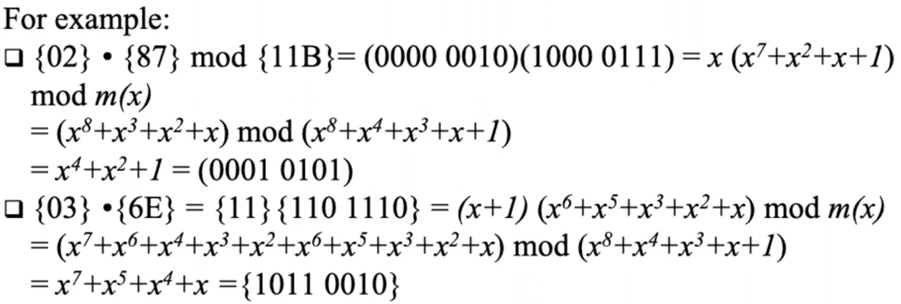
    - Together with shift rows, it achieve diffusion.
  - add round key (addroundKey)

  It is a seqential and light weight schedule

  we can see that the mix-column output each byte output based on all four columns in the previous state, so it has good avalanche effect (diffusion).

  the decryption is different from the encryption algorithm, where inverse of each operation is used.

  There are two ways of implementing decryption, we need to investigate.
  

### Lecture 3-4

If message is longer than block size, we need a way to encrypt these blocks, there are three standardlized modes:

- **ECB**: Electronic Code Book.
  Each block are encrypt independently, using the same key, last incomplete block is padded, usually the last byte indicate how many byte are padded, so that the receiver can remove them. It offers parallelizable encryption/decryption and random read access, but does not hide repeated pattern (lack of diffusion):
  
  Thus it is not recommeded for encrypting data more than the block size.
- **CBC**: Cipher Block Chaining.
  $C_i=E_k(M_i\ XOR\ C_{i-1})$. The encryption of the current block depends on the previous block, thus it does not allow parallelizable encryption, but you still have decryption parallelizable and random read access, because decryption depends on the previous ciphertext which is already available.
  
- **CTR**: Counter. It uses the encryption function as key generator, remember the repeated keystream problem in stream cipher? This is how they solve this problem. The actual encryption is just the xor, which is same as the stream cipher, thats why some people says that with ctr, the block cipher is transformed into a stream cipher.
  - It has parallelizable encryption/decryption as well as random read access since you can compute the counter value of a block directly.
  - It also does not have error propagation, if one bit in a block is wrong during transmittion, it does not affect the following block.
  - Its encryption and decryption function is the same, so you only need one function.
  - You can precompute the value to be xor-ed before you go online which made it fast.
  - Note that block has to be synchronized, if one block is removed then the plaintext cannot be recovered.
  - 

Block vs Stream:

- Block cipher encrypts blocks of characters, stream cipher encrypt individual character or bit streams.
- Stream cipher is usually faster than block cipher, used in real-time/continuous communication/applications.
- Stream cipher have limited or no error propagation, so advantage when bit error are probable.
- Can be built using block cipher with CTR mode.

## Lecture 4-1

Public key cryptography

Up to this point we are just learning about cryptography schemes based on shared secret (symmetric). There are some problems with this approach:

- two/more parties share the same key, non-repudiation cannot achieved without involvement of a trusted third party.
- A distinct key is needed for every pair of users, or even for each session/encryption. So n-users system requires n \* (n-1) keys (n^2 problem).
  - It is hard to maintain security of these keys.

Public Key Cipher are different, they are based on one-way/trapdoor functions which based on mathematically hard problems. These function is hard to compute the reverse if the secret is unknown. Some hard problem includes:

- integer factorization: given n, find prime p and q such that p \* q = n. Used in RSA.
- discrete logarithm: given a,b,c, find x such that a^x=b mod c. Used in DSS and DH.

among proposed pk algorithms, some are suitable for encryption (+ key distribution), some are useful for digital signatures, e.g. DSA and DSS, some are for key agreement, e.g. DH algorithm. Only RSA, ElGamal and Rabin works well for both encryption and digital signatures.

#### Confidentiality (保密性)

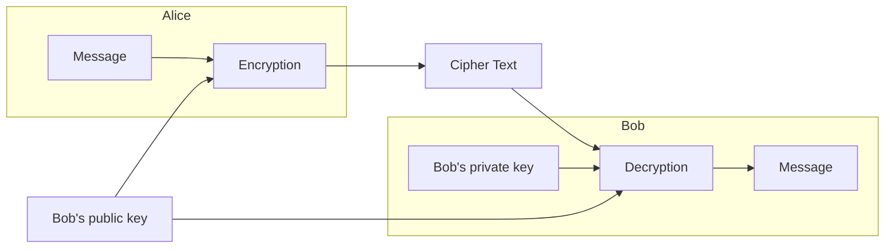
```mermaid
graph LR

subgraph Alice
m1[Message] --> Encryption 
end
Encryption --> ct[Cipher Text] --> Decryption
p[Bob's public key] --> Encryption
subgraph Bob
Decryption --> m2[Message]
prk[Bob's private key] --> Decryption
end
p --> Decryption
```

It is secure (only Bob can receive) because only with Bob's private key can decrypt the message.

Note that this confidentiality should only be applied to short messages, e.g. symmetry key (?).

#### Authenticity (真实性)

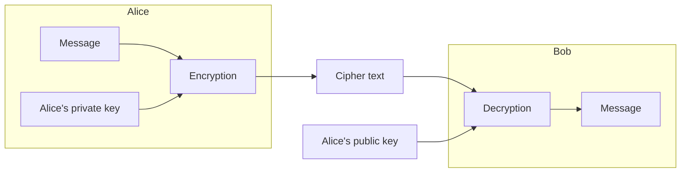
```mermaid
graph LR
subgraph Alice
m1[Message] --> Encryption
aprk[Alice's private key] --> Encryption
end
Encryption --> ct[Cipher text] --> Decryption
apuk[Alice's public key] --> Decryption
subgraph Bob
Decryption --> m2[Message]
end
```

Signature is signed on the hash value of M, and a timestamp should be included, to avoid attacker to send the same message twice. Can be used for signature.

It is authentic (must from Alice) because only Alice's public key can decrypt that message.

### Modular Arithmetic

if a = b mod n, then we have a = k\*n+b

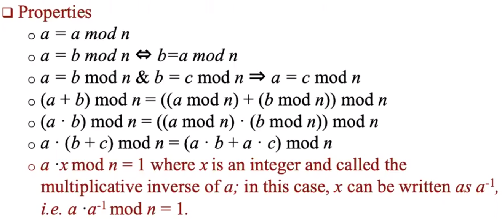

#### Euler's Theorem

if n is prime then $\phi(n)=n-1$, where $\phi$ refers to the number of integers less than n is relatively prime to n.

if p,q are prime and n=p\*q then $\phi(n)=\phi(p\times q)=(p-1)\times(q-1)$

$a^{\phi(n)}=1\mod{n}$.

## Lecture 5-1

### Checksum

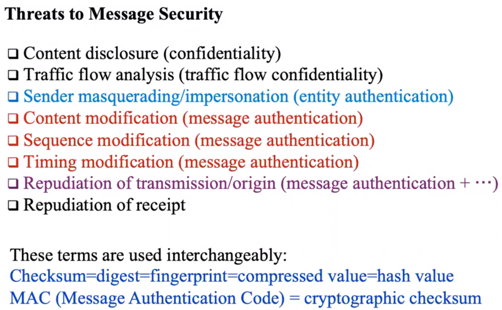

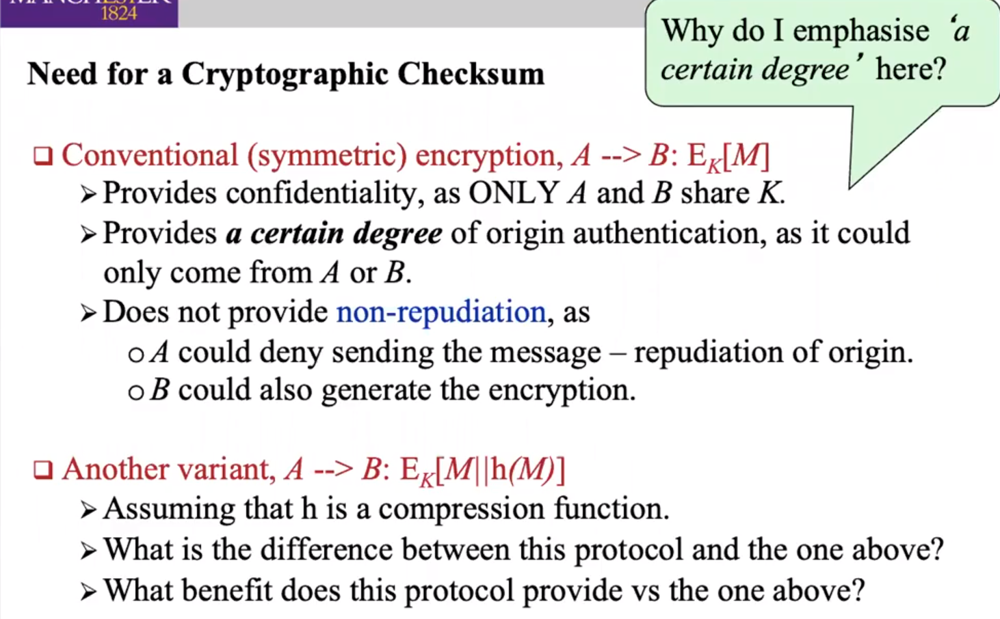

- a certain degree: e.g. if M is binary file then it is hard for B to check if M is altered or not, the variant has a checksum, we can use this to verify if M is correct.

- strong is different from weak collision, the weak collusion says that given a hash value, find another input that has this hash value, the strong collusion  says that find any two inputs that has the same hash value.
  - if not weak collusion, then someone can intercept your message and send another message with the same hash function
  - if not strong collusion, then someone can find two different messages, send one of them and later claim that it is the other one, e.g. pay \$10 for an item, then ask for \$100 refund, because they have the same signature.

SHA-1 is no longer secure by today's computing power.

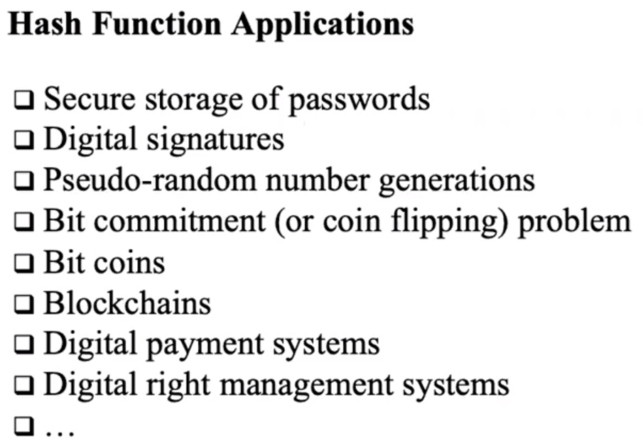

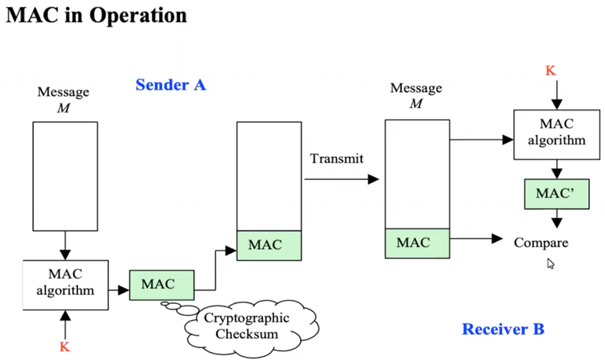

### MAC

Message Authentication Code, HMAC= hash function based MAC. 

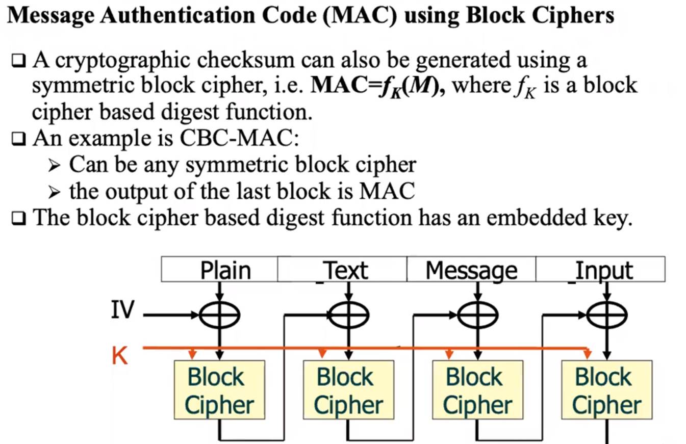

The origin is ensured/authenticated, you can use block cipher to generate it.

k1 and k2 is derived from the input key.

MAC cipher (symmetric key) is designed for encryption and hash function is designed as one way function for digesting, so hash is generally faster.

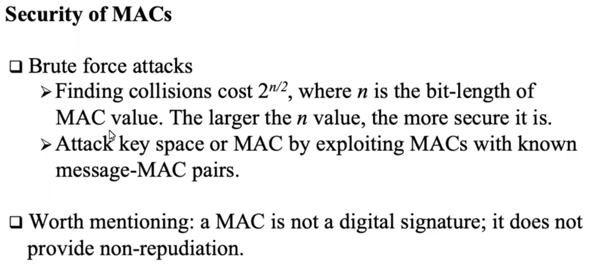

Note that MAC does not provide repudiation (it is not encrypted using private key).

### Authenticated Encryption

For authentication and confidentiality. Tag is for authentication

- hash-then-encrypt: E(K, (M||H(M)))
- MAC-then-encrypt: E(K2, (M||MAC(K1,M))) or Tag=(MAC(K1, M)), E(K2, (M||Tag)) –> used in SSL
  - you do not need 2 keys, but you can
- encrypt-then-MAC: C=E(K2,M), Tag=MAC(K1,C) –> used in IPSec
- encrypt-and-MACC=E(K2,M), Tag=MAC(K1,M) –> used in SSH

If you MAC then encrypt, then receiver will have to decrypt before he can check the hash value, so we need to consider use case. if receiver can check mac first, then it is more resilient to DDOS attack.

### AEAD

Different data may requires different protection:

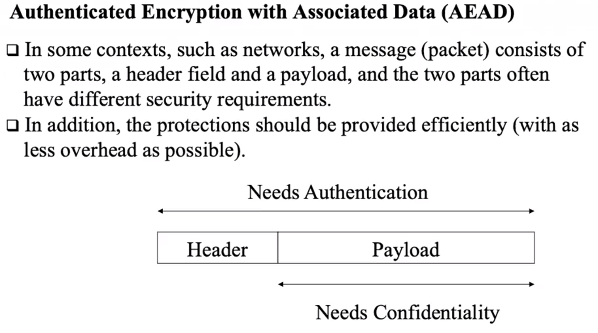

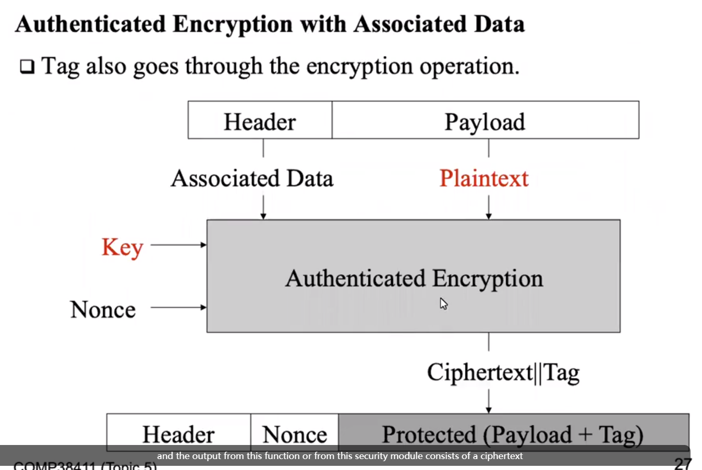

### CCM

counter mode with CBC-MAC

CBC encrypt data sequentially, it is slow, so we want to use GCM

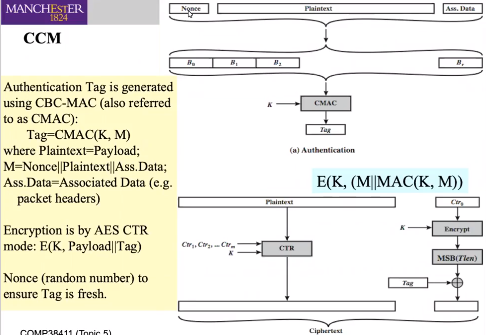

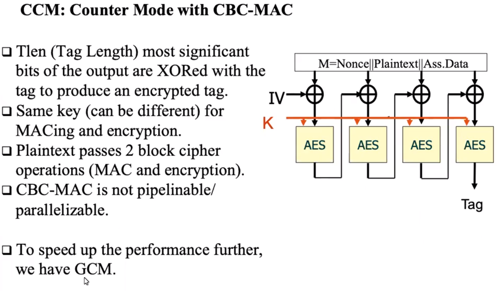

### GCM

Galois/Counter Mode

nonce=random number

A=authentication data, C=ciphertext, T=authentication tag

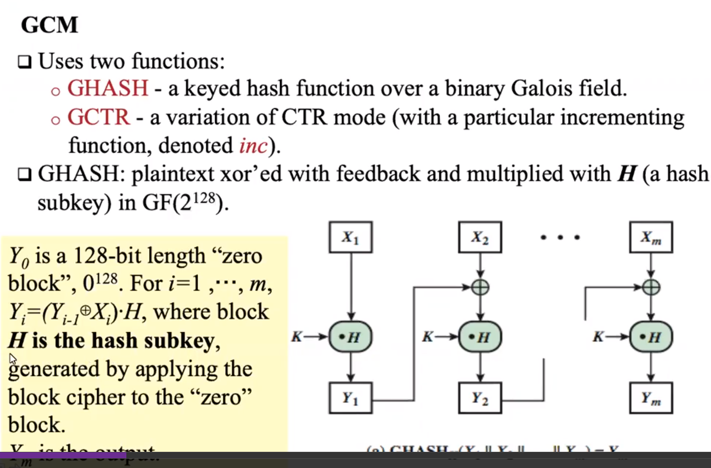

The H hash value only depends on the K, so it is fast. The Galois field in AES is 8 bit, here is 128 bits.

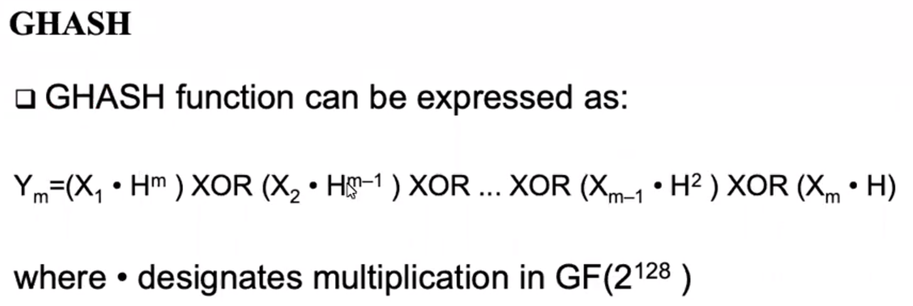

All we do is xor in sequential which is fast, each value in bracket can be computed independently.

This is stream cipher, so you do not have to pad it, if the encrypted message is longer than the remaining message, then you just take the most significant bits (MSB).

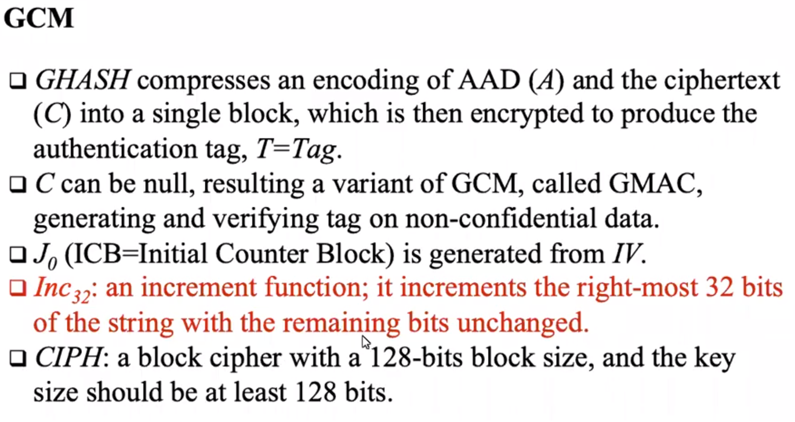

We only increment the right most 32 bits. This is to can keep sender and receiver counter value synchronized and the inc function is not increased sequentially which make it more secure.

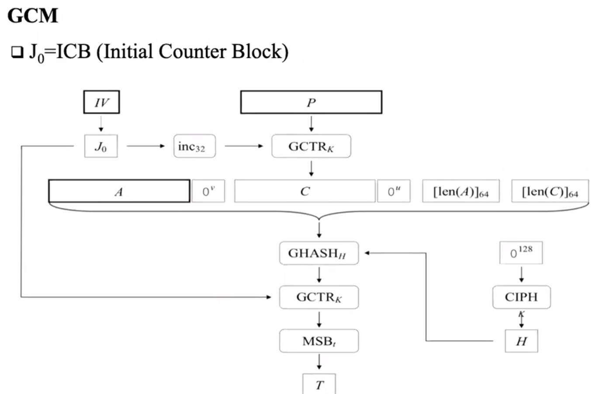

# Miscellaneous

|                     | Confidentiality | Integrity | Authenticity | Non-repudiation |      |
| ------------------- | --------------- | --------- | ------------ | --------------- | ---- |
| Symmetric (DES/AES) | yes             |           |              |                 |      |
| RSA                 | yes             |           | yes          | yes             |      |
| hash                |                 | yes       |              |                 |      |
|                     |                 |           |              |                 |      |
|                     |                 |           |              |                 |      |

### Why Encryption Standard

So that everyone can try to attack and break this algorithm. Keeping the same standard can offer ease of communication between different parties using the same encryption. Normally we want algorithm to achieve security goal and be as fast as possible, increasing the bit size will make the algorithm slower and maybe another algorithm will be better, so people do not just increase the bit size, they come up with new standard. For today's computer power, bit size should be at least 128.

### 3DES is broken

When a cryptographer says "broken," that means something very specific: that an attacker can break the key in better-than-brute-force time. 3DES has a key length of 168 bits, which is reduced to 112 bits by some meet-in-the-middle attack cleverness. And, to quote Wikipedia, "it is designated by NIST to have only 80 bits of security."

### Authenticity and Non-repudiation

- Authenticity is sender verifying to receiver that he is the people who sent the message.
- Non-repudiation is a proof to anyone verifying that sender had sent the message to receiver, even if the person does not trust the receiver.

Non-repudiation implies authentication. Authentication can be done more efficiently using method like MAC, but non-repudiation requires a digital signature, it is more mathematically involved and more on the legal side, therefore it makes sense to use authenticity as a separate concept.

### Does Encryption guarantee Integrity

[No](https://stackoverflow.com/questions/3655516/does-encryption-guarantee-integrity).

### Attack Tree

It is a conceptual diagrams (usually tree-like) showing how an asset, or target, might be attacked. Child nodes are conditions that must be satisfied to make the direct parent node true. Conditions can be OR or AND. When the root is satisfied, the attack is said to be completed.

Attack tree can be used to identify the assets, threats and vulnerabilities by assessing the levels of risk on the assets.

### Ask

- Replace sender/receiver?
- Replay?
- Denial of sending/receiving?
- Can middle man view/alter it?

# Exercises

## E1

### E1.1

> Comment on the implications to risks (i.e. whether risks are increased or decreased) in terms of Confidentiality, Integrity and Availability in each of the following cases: 
>
> i) Disconnect a computer from the Internet

Disconnecting a computer from the Internet reduces risks to confidentiality, but availability suffers. Integrity may also suffer due to loss of updates. (? disconnect while transmission).

> ii) Have extensive data checks by different people/systems

Have extensive data checks by different people/systems can reduce risks to integrity, but confidentiality suffers as more people will be able to see the data. Availability will also suffer due to locks on data under verification.

### E1.2

> i) In this exercise, you are asked to identify, via literature research, potential cyber attack threats to mobile banking (i.e. perform banking transactions using your mobile phone). You are expected to be able to explain the attacking mechanism of each of your identified threats (i.e. how the attack is performed) and try to name any countermeasures to your identified threats.

 **This is a research question, so I will leave you to do the reading and research.

> (ii) Draw a threat tree for ‘Read your mate’s email’

**With regard to this question, you should consider: (a) client side security threats, (b) server side security threats and (c) channel security threats. For each of (a), (b) and (c), it is going to be a sub-tree.

## E2

### E2.1

> Given the following ciphertext which has been generated using the Caesar cipher (but a different key), use the frequency analysis method to work out the encryption key and the corresponding plaintext.
>
> Ciphertext: bpmzm wvkm eia iv cotg lckstqvo eqbp nmibpmza itt abcjjg ivl jzwev … 
> Key: ?? 
> Plaintext: ??
>
> 

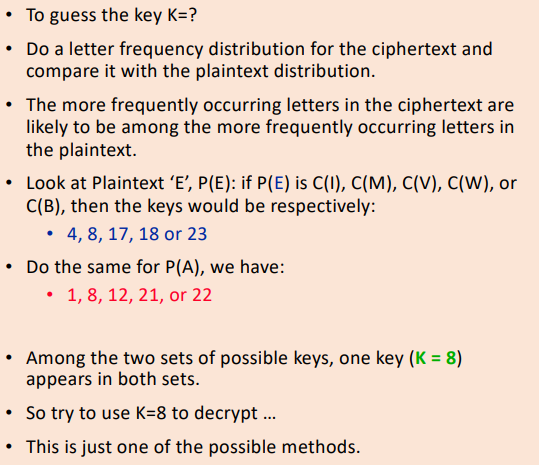

Plaintext: There once was an ugly duckling With feathers all stubby and brown …

### E2.2

> The stream cipher diagram given earlier shows that a key stream used for encryption/decryption is generated by using a pseudorandom generator that is ‘seeded’ with a (shorter) key, K. This key, K, is usually called encryption/decryption key.
>
> (i) Comment on the benefit(s) of this approach, i.e. why is the key stream generated from K? 

By using key stream generated by K, we address:

- The key stream must be unique for each encryption, i.e. a key stream must not be used twice, as, otherwise, the encryption will not be secure: 
  - K = M xor C => M’= K xor C’ = (M xor C) xor C’
- This is a dangerous property and we must never ever reuse the same keystream to encrypt two different messages.
- To ensure a key stream non-repeating can be challenging: (a) their distributions are expensive – a key stream should be as long as the message to be protected and this is too expensive for long messages; (b) managing and storing a large number of key streams may also be problematic; (c) there is an synchronisation issue too – the key stream used by a sender/receiver pair for a particular message must be the same. 

> (ii) How to ensure (or to minimize the chances) that the output of the pseudo-random generator (i.e. the key stream) is nonrepeating?

(a) Use a strong mixing function as the pseudorandom generator. 
(b) add another input into the function, a counter, which changes (e.g. increment by 1) for each iteration. 
(c) If the counter value reaches its maximum, then change the key, K.

## E3

### E3.1

> By applying DES twice using two different 56-bit keys, K1 and K2, to encrypt a message, M, i.e. C=EK2[EK1[M]], where C is the ciphertext, we have a double DES encryption. Would this double DES encryption scheme double the security level of a single DES scheme? Justify your answer.

- Assuming n1 and n2 are, respectively, the lengths of K1 and K2 and n1 = n2 = n. 
- Case 1: without using meet-in-the-middle method, i.e. by using brute-force attack The anticipated number of attempts before compromising the encryption is: 22n/2=22n-1
- Case 2: using meet-in-the-middle method With the Meet-in-the-Middle attack, the attacker first computes EK1(M) for all values of K1 and DK2(C) for all possible values of K2. He then compares the results from the two sets. If the result from any of the EK1(M) set matches with a result from the DK2(C) set, the pair of K1 and K2 is probably the correct keys. In this case, the anticipated number of attempts before compromising the encryption is: 2n+ 2n=2n+1. 
- As 2n+1 <22n-1 (when n>2), so: an attacker can use the Meet-in-the-Middle attack to attack the double DES scheme more efficiently than the brute-force attack.

### E3.2

> The diagram given in the slides illustrates an early version of the ATM (Automatic Teller Machine) solution. From the diagram, it can be seen that:
>
> - Cash card stores the ciphertext of the user’s Identity (ID) and PIN that are encrypted using a symmetric key, Kcard/ATM. 
> - The communication between ATM and bank backend office is secured using another symmetric key, KATM/Bank. 
>
> (i) Identify any vulnerability in this solution, and propose a solution to address any vulnerability that you have identified.

The vulnerability was that PIN verifications were carried out in ATMs. In the current solution, the PIN is encrypted using a key shared with the bank backend office, i.e. ATM does not unwrap the PIN – the PIN verification is done at the backend office, not at ATM! ALSO 3DES is used to replace DES.

> (i) Are there any other issues that you could identify from this application of symmetric ciphers?

Key management problem: 

- either all the cards (issued by a particular vendor) and ATM machines (in this case, ATM machines would need to be vendor dependent) share the same key - once a key is compromised, then all the cards using the same key will be put at risks, 
- or different cards use different keys - is this viable? How about user mobility requirement? 

## E4

### E4.1

> Name three application scenarios or cases where using RSA is preferable than using AES and name one application scenario where the use of AES is necessary.

- Scenarios for using RSA (Public-key cipher) 
  - Two or more communication entities have not established an AES key. 
  - Communication/interacting entities do not trust each other.
  - One entity needs to send out a signed document to another entity, or message authentication and non-repudiation protection is required.
- Scenarios for using AES (Symmetric-key cipher)
  - The encryption of video or other stream/real-time/bulk data.

### E4.2

> You are a recipient of p = 5, q = 7. You make the modulus n = 35 public. You also choose an exponent e = 5 and make that public too. 
>
> Messages are sent to you, one letter at a time. Letters are coded into numbers as: A -> 0, B -> 1, and so on. 
>
> Now, the following message has arrived for you: 17 19 7 9 0 12 24  	
>
> Decrypt this message.

$$
\begin{align*}
n&=p\times q = 35\\
\phi&=(p-1)\times (q-1)=4\times 6=24\\
\end{align*}
$$

$e=5$, so $e\times d=1\mod 24 \rightarrow e\times d=24\times k+1$, where $k$ are integers. We need to find the smallest integer of d that satisfies this equation, which is $5$.

Take the first letter $17$, $M=17^d \mod 35=17^5\mod 35=(((((17\times17)\mod35)\times 17\mod 35)\times 17\mod 35)\times17)\mod 35=12\mod 35$, the 12th letter is $m$, therefore the first decrypted letter is $M$.

Using the same method, we can get the plaintext: "my heart".

## E5

### E5.1

> For a hash value to be used as a cryptographic checksum, it must be protected with a secret, as it is clear, from the above, that a hash function does not have an embedded key. Assuming that a sender, s, is to send a message, M, to a receiver, r. 
>
> Propose as many different methods as you can to protect the hash value of M to assure the authenticity of M. 
>
> Comment on the suitability/applicability of each of the methods you propose.

1. M||Tag, where Tag=H(M||K) -> commonly used in router, gateway that has mutual trust, we just need to ensure that data is not modified, confidentiality is not required. This is faster as no encryption is needed.
2. M||Tag, where Tag=E(K, H(M)) -> similar to above, where you have symmetric key, but more expensive.
3. M||Tag, where Tag=E(PRs, H(M)) -> used in email, no trust between two parties, you need to sign the email, provide non-repudiation.
4. E(K, M||H(M)) -> this method also protect confidentiality

M||Tag, where Tag=E(PUr, H(M)) -> note this does not ensure authenticity, because everyone has the public key

### E5.2

> For each of the following applications, please identify what property(ies) the hash function needs to have to ensure the security of the application.
>
> (i) Secure storage of passwords

 UNIX passwords stored as hash(password) One-wayness: hard to recover password, although weak collision resistance can make the system stronger.

> (ii) Protection against viruses 
>
> - A software manufacturer wants to ensure that the executable files are received by users without modification. 
> - They send out each file to users and publish its hash value on an authentic website.

 Integrity of software distribution. Weak collision resistance. But software images are not really random… maybe need full collision resistance. Idea: given goodFile and hash(goodFile), it is very hard to find badFile such that hash(goodFile)=hash(badFile)

> (iii) Digital signatures 
>
> One party can sign a message, M, and many parties can verify. Such applications include contract signing, code signing, etc. A raw signature scheme only signs a few hundred (e.g. 160) bits. What properties do we need?

Digital signature requires both one-way and strong collision resistance properties to counter signature forgery and repudiation.

### E5.3

> This is a Coin Flipping Over the Telephone problem. 
>
> (i) Assuming there is only one car, and Alice and Bob have to decide who can have this car (only one of them can have it, i.e. they cannot share it). Alice and Bob cannot see each other, and they do not trust each other. So they have decided to make a decision by flipping a coin over the telephone. Design a protocol to support this using a hash function. 
>
> hint:
>
> Assumption: Alice and Bob agree that if the outcome is 1 then Bob takes the car, if it is 0 then the car goes to Alice. Solution 1 (an insecure solution):
>
> - Alice generates a random bit b: 0=heads, 1=tails.
> - Alice asks Bob: heads or tails?
> - Bob sends Alice his choice_B: heads (or tails).
> - Alice compares b with choice_B: if b=choice_B, then outcome=1; if not, outcome=0.
> - Alice sends the comparison outcome to Bob. What is wrong with this solution? Please fix the flaw.

Here are the protocol steps: 

1. Alice generates a random number, r (the first bit, b: 0=heads, 1=tails).
2. Alice computes commitment, x=hash(r). 
3. Alice sends x to Bob and also asks Bob: heads or tails?
4. Bob sends Alice his choice_B: heads (or tails).
5. Alice compares b with choice_B: if b=choice_B, then outcome=1; if not, outcome=0.
6.  Alice sends r and the comparison outcome to Bob.

> (ii) Identify any factors that you should consider to ensure the security of this protocol.

The random number generator used by Alice should be truly random. Otherwise, Bob could guess r, putting Alice in a disadvantaged position. The hash function used should be secure, i.e. one-way and collision resistant. Otherwise, if it is not one-way, Bob could benefit; if it is not collision resistant, Alice could benefit.

## E6

### E6.1

> Discuss, at the generic level, what are the factors that impact on the security of a digital signature. 

|                                                              |                                                              |
| ------------------------------------------------------------ | ------------------------------------------------------------ |
| Factors Justifications Security of the signature algorithm   | If not, signature keys may be inferred.                      |
| Security of the signature algorithm                          | Otherwise, the origin of a signature may not be assured      |
| Whether the signature verification key is trustworthy        | Otherwise, the origin of a signature may not be assured.     |
| The security of the hash function used                       | If a hash function is not weak-collision resistant, then the signature is vulnerable to selective forgery; if a hash function is not strong-collision resistant, then the signature is vulnerable to existential forgery. |
| Whether the source of time is tamper-proof and multiple sources are synchronised | If not, the integrity of the signature cannot be assured.    |

> (ii) Assuming that the RSA algorithm is used for signature signing, identify all possible ways of forging a signature

- Use a signature signing key (private key) with a decent length.  
- Use a secure/strong hash function.
- Timing sources tamper-proof and synchronised, or include a random number (nonce) contributed by the verifier in the signature.
- Obtain someone else’s private signature key
- In a digital signature scheme “you are your private key”.
- Persuade others that someone else’s public verification key belongs to you.

### E6.2

> A digital signature scheme may also be implemented using a symmetric-key cipher, but with the assistance of a trusted third party, an Arbitrator. 
>
> (i) Design a digital signature protocol using symmetric-key encryption and an arbitrator, but do not expose the content of a message to be signed to the arbiter. 

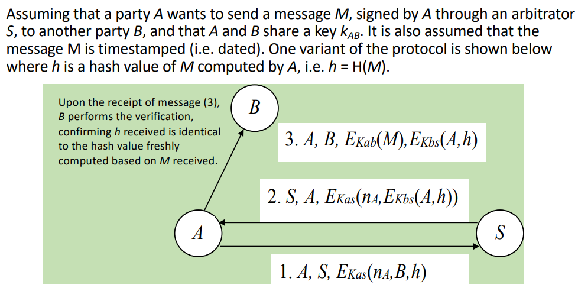

> (ii) Compare the signature protocol designed in (i) with the RSA based signature scheme.

The main difference between the two schemes are:

- The RSA signature scheme only requires an off-line trusted third party (TTP), whereas this one requires an on-line TTP.
- The RSA scheme does not require a shared secret, rather the signer needs to have a key pair, and the signature verification key must be certified by trustworthy CA, whereas the above signature protocol requires a method for symmetric key distribution.
- With the RSA scheme, the signer experiences more computational cost, but less communicational costs, than the symmetric scheme.

## E7

### E7.1

> (i) Investigate an on-line CA and find out what process or procedures that are necessary for you to acquire a public key certificate, how many classes of certificates and what each class can be used for. 

Answer to this question is dependent on a particular PKI or CA.

> (ii) X.509 is a top-down approach to public key management. Investigate and describe a bottom-up approach to public key management.

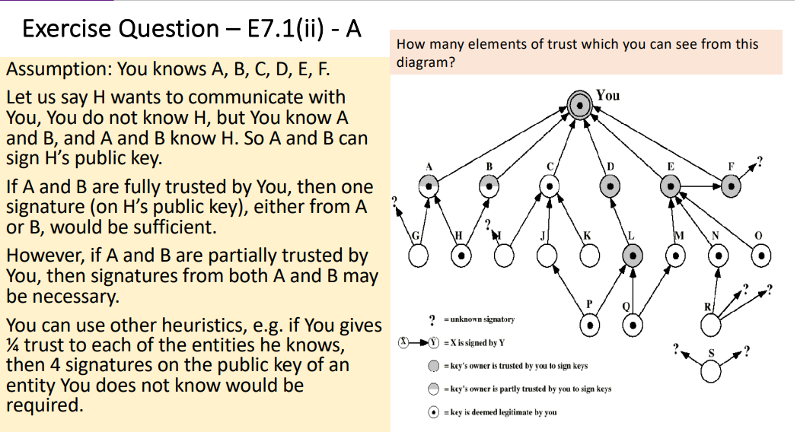

### E7.2

> Assuming that Alice has sent a signed message to Bob. 
>
> (i) Highlight the steps for verifying a digital certificate.

- Check validity period to see if it is expired.
- Check CRL list to see if the certificate has been revoked.
- Verify the signature on the cert:
  - Calculate a message digest for the certificate 
  - Use the CA’s public key to decrypt the digital signature and recover what is claimed to be the original message digest embedded within the certificate
  -  Compare the two resulting message digest values to ensure the integrity of the certificate 

> (ii) Highlight the steps Bob takes to verify the authenticity of the message from Alice.

- Verify the certificate or chain of certificates
- Verify Alice’s signature

## E8

### E8.1

> Assuming that Alice is to send a message, M, to Bob. M is encrypted with a shared key established using the DH protocol. Explain whether Eve could access this message M. If so, explain how, and propose a solution to address this vulnerability

How: This is an active attack. The attacker intercepts and substitutes Ya and Yb with Ye. So at the end of the message exchanges, Eve will have Kae, Kbe, Alice will have Kae and Bob will have Kbe. Any messages encrypted with Kae will be decrypted and read by Eve and then re-encrypted with Kbe and vice versa without the knowledge of Alice and Bob.

There are two solutions as detailed below: 

- Fixed DH 
  Server’s and client’s public key certificates contain their respective DH public key parameters. In other words, the DH public keys are certified by a CA. But there has to be a way that Alice and Bob could prove to each other that they are the rightful owners of the corresponding certificates (unless the identity of one entity is already known to the other). With this method, the established symmetric key is not really a session-valid key. So the security level is not as high as the second method.
- Ephemeral DH
  DH public keys are exchanged, signed using the sender’s private DSA key; the receiver uses the corresponding public keys (certified in the certificates) to verify the signatures. The certificates are used to certify the DSA keys, and DH shares are signed using DSA by the respective signers. This is the so called DH-DSA method, used to create a temporary, one-time session key.

### E8.2

> The following is an extremely simple protocol proposed for symmetric key distribution. It is assumed that A and B has never met before (or there is no key established prior to this communication).
>
> i. Identify as many problems/flaws as you can.

This simply protocol does not provide mutual authentication: it does not show that the public key has been certified and that the demonstration of private key associated to the public key in the certificate is missing. 

- Eve can intercept the message, creates its own public/private key pair {PUe, PRe} and transmits PUe||IDA to Bob. 
- Bob generates a secret key, Ks, and transmits E(PUe, Ks). 
- Eve intercepts the message and learns Ks by computing D(PRe, E(PUe, Ks)). 
- Eve transmits E(PUa, Ks) to Alice. The result is that both Alice and Bob know Ks and are unaware that Ks has also been revealed to Eve. 
- Alice and Bob can now exchange messages using Ks. Eve no longer actively interferes with the communications channel but simply eavesdrops. Knowing Ks, Eve can decrypt all messages, and both A and B are unaware of the problem.

> ii. Modify the protocol to fix the problems/flaws you have identified.

Both A and B need to authenticate to each other by demonstrating they are indeed A and B; this requires each of the parties to use their certified public keys AND demonstrating that they each know the corresponding private keys associated to the public keys.

### E8.3

> 
>
> This is the Needham-Schroeder protocol. Answer the following questions:
>
> i. What are the benefits for A to forward the session key to B (i.e. step 3), rather than letting KDC to directly send the session key to B?

- reduced involvement of KDC, thus less overhead not just for KDC also for B;
- This protocol (designed in this way) can also be used for authentication purpose, in addition to confidential communication between A and B. 

> ii. TRY to identify two application areas of the Needham-Schroeder protocol and to elaborate the benefits of using the Needham-Schroeder protocol in these application areas. 

- Two applications: one is establishing a secure communication channel; and the other is for authentication service.
  - Party A (i.e. user) does not need to remember many keys while being able to use a different key for a different correspondent;
  - When used for authentication, the protocol supports single sign-on, i.e. a user only need to remember a single password, but is able to use different short-term secrets for different servers and the users’ master secrets (i.e. long-term passwords) are only managed by one entity, i.e. KDC.

## E9

### E9.1

> Many authentication protocols are based on the use of a symmetric key/secret. What if that ‘trust relationship’ has not been established? Using nonce (random number) and a public-key cipher can be a solution. Is the following authentication protocol secure? Justify your answer.
>
> 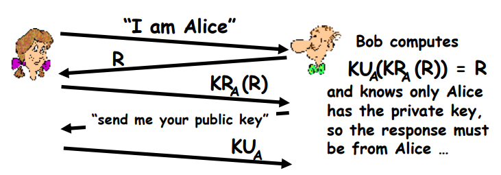

Man-in-the-middle-attack: Trudy poses as Alice (to Bob) and as Bob (to Alice)

### E9.2

> Design two different X.509 certificate based authentication protocols to support mutual authentication between two entities, Alice and Bob. 

## E10

### E10.1

> In secure email systems, such as PGP (pretty good privacy), the order of message protection operations performed by a sending entity is to 
>
> - first sign the outgoing/email message, 
> - then compress the signed message, 
> - and finally encrypt the compressed message. 
>
> Answer the following questions:
>
> (i) What are the justifications (or benefits) for using this order of operations, and

- Signature verification can only be carried out after two decryption operations and this makes the solution vulnerable to DoS attacks. However, as this is an end user to end user communication, so the issue of DoS attacks is considered not as important as users’ preference of record-keeping a signed email (on plaintext). 
- Compression-then-encryption can bring two benefits, one is security (harder to break a text that is not recognisible) and the other is performance (cheaper to encrypt a shorter message)

> (ii) Would this order of operations be suitable for all cases of applications?

This order of operations is not suited to the cases where the operations are carried out by intermediary devices, as this would impact on the performance – reducing throughput and vulnerable to DoS attacks.

> (iii) Assuming that Alice sends Bob an email, M. Express the whole message that is sent by Alice using protocol notation format.

[ID of KUb]||E[KUb, Ks]||E[Ks, Compressed(TS||ID of KUa||2- bytesofSig||Sig(H[TS||M)||FileName||TS||Data]

### E10.2

> Contrast the two trust models in terms of their respective merits and weaknesses:
>
> - PKI X.509
> - PGP web-of-trust

PGP:

- the one significant advantage that PGP had, was that no certification infrastructure was needed before anyone could use PGP.
- Not scalable when a large number of users are involved.
- Certificates do not have a period of validity (they are infinitely valid), and their revocations are left to the user not by the CA.
- The certificate structure gives no indication of any authorization associated with key; again, this is left to the users