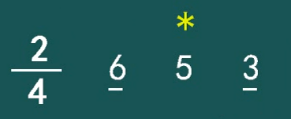
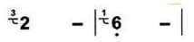
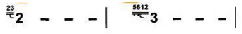
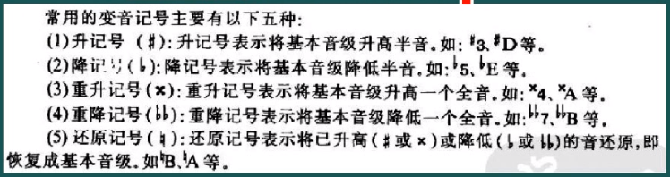

> #### [原视频学习地址](https://www.bilibili.com/video/BV1jW411J765)

#### 高低

- 简谱：**1   2   3   4  5  6  7**
- 唱名：**do re mi fa so la si**
- 音名：**C   D  E   F  G  A  B**

| 名字   | 符号                                        |
| ------ | ------------------------------------------- |
| 倍低音 | $\underset{\bullet}{\underset{\bullet}{1}}$ |
| 低音   | $\underset{\bullet}{1}$                     |
| 中音   | $1$                                         |
| 高音   | $\overset{\bullet}{1}$                      |
| 倍高音 | $\overset{\bullet}{\overset{\bullet}{1}}$   |
| 休止符 | 0                                           |

#### 长短

| 名字     | 节拍         | 标记                   |
| -------- | ------------ | ---------------------- |
| 全音符   | 4拍          | $x---$                 |
| 2分音符  | 2拍          | $x-$                   |
| 4分音符  | 1拍          | $x$                    |
| 8分音符  | 1/2拍        | $\underset{-}{x}$      |
| 16分音符 | 1/4拍        | $\underset{=}{x}$      |
| 32分音符 | 1/8拍        | $\underset{\equiv}{x}$ |
| 附点音符 | 被附点的半拍 | $x\ .$                 |

#### 连音

表示第一个音演奏，第二个音不演奏。异音/嵌套连接则表示平滑些的变换。

#### 切分音符

简谱前面会有一个分数，用来表示这个曲子的拍子信息，比如$\frac{2}{4}$ 表示每个小节有2拍，以4分音符为一拍。

这里$\underset{-}{6}$和$\underset{-}{3}$是8分音符，$\overset{*}{5}$是2分音符且为连音。注意8分音符是不够4分音符的，所以5是被切开的连音。

#### 强弱拍，小节线，终止线

| 名字   | 符号                                     |
| ------ | ---------------------------------------- |
| 强拍   | $\bullet$                                |
| 弱拍   | $\circ$                                  |
| 小节线 | \|                                       |
| 终止线 | $\rule{0.5pt}{10pt}\ \rule{1.5pt}{10pt}$ |

小节第一个拍永远是强拍，最后一个拍永远是弱拍。终止线表示乐曲的结束。

#### 反复记号

| 类型     | 标记                                                         | 顺序                                                         |
| -------- | ------------------------------------------------------------ | ------------------------------------------------------------ |
| 从头反复 |  | $A\rightarrow B\rightarrow C\rightarrow A\rightarrow B\rightarrow C$ |
| 从头反复 |  | $A\rightarrow B\rightarrow A\rightarrow B\rightarrow C$      |
| 部分反复 |  | $A\rightarrow B\rightarrow C\rightarrow D\rightarrow C\rightarrow D$ |
| 部分反复 |  | $A\rightarrow B\rightarrow C\rightarrow D\rightarrow C\rightarrow D$ |
| 结尾不同 |  | $A\rightarrow B\rightarrow C\rightarrow D\rightarrow A\rightarrow B\rightarrow E\rightarrow F$ |
| 跳跃反复 |  | $A\rightarrow B\rightarrow C\rightarrow D\rightarrow A\rightarrow B\rightarrow E\rightarrow F$ |

#### 倚音 （装饰音）

没有实际长度，越快越好。

| 类型   | 记号                                                         | 大概效果                                                     |
| ------ | ------------------------------------------------------------ | ------------------------------------------------------------ |
| 单倚音 |  |  |
| 复倚音 |  |  |

#### 音程

两个乐音之间的音高关系。音程又分旋律音程（先后发音）和和声音程（同时发音）。其中旋律音程又分上/下/平行，分别代表从低音（根音）到高音（冠音），高音到低音和同一个音。

高低音用"度"为测量单位，度数则是两个音之间包含音级的数目。比如$1-3$包含$1,2,3$所以也叫$3$度。相同的音的度数叫$1$度或者同度。

音程也分单/复音程。单音程指的是八度以内的音程（$1-5,2-7$），八度以外则称为复音程（$1-\dot{6},2-\dot{5}$）。

音数指的是两个音之间包含的全音和半音的数目。每个音和相邻的音距离有所不同：

比如$1-3$之间有两个全音，所以音数为$2$。而$2-4$之间有一个全音一个半音，所以音数为$1\frac{1}{2}$。

| 度数                    | 音数           |
| ----------------------- | -------------- |
| 纯一度                  | $0$            |
| 小二度                  | $\frac{1}{2}$  |
| 大二度                  | $1$            |
| 小三度                  | $1\frac{1}{2}$ |
| 大三度                  | $2$            |
| 纯四度                  | $2\frac{1}{2}$ |
| 增四度/减五度（三全音） | $3$            |
| 纯五度                  | $3\frac{1}{2}$ |
| 小六度                  | $4$            |
| 大六度                  | $4\frac{1}{2}$ |
| 小七度                  | $5$            |
| 大七度                  | $5\frac{1}{2}$ |
| 纯八度                  | $6$            |

把音程的根音和冠音互换即为音程的转位。比如$\overset{\textstyle2}{1}$变成$\overset{\textstyle\dot{1}}{2}$就是$\overset{\textstyle2}{1}$音程的转位，从大二度变成纯八度。

#### 变化音

#### 和弦

##### **三和弦**

由两个连续的音程组成。

- **大三和弦**由大三度到小三度。常用的有$CM(1-3-5)$，$FM(4-6-\dot{1})$，$GM(5-6-\dot{2})$。作为标记时$M$可能省略。
- **小三和弦**由小三度到大三度，比如$D_m(2-4-6)$，$E_m(3-5-7)$，$A_m(6-\dot{1}-\dot{3})$。
- **增三和弦**由大三度到大三度，比如$C_{aug}(1-3-\#5)$，把$5$升半个音。但是增三和弦的音响效果不是很好，所以很少见到。
- **减三和弦**由小三度到小三度，比如$C_{dim}(1-b3-b5)$，$B_{dim}(7-\dot{2}-\dot{4})$。

##### 七和弦

七和弦是在三和弦的基础上加一个七度根音。我们知道三和弦有四种，但是增三和弦效果不好不常用所以我们这里不考虑它。另外增七的音搭配起来会有矛盾，实际上并没有这种搭配所以我们也不考虑它。

- **大七和弦**是大三和弦加大七度，比如$CM7(1-3-5-7)$，$FM7(4-6-\dot{1}-\dot{3})$。$M$也可能记做$_{maj}$。

- **大小七和弦**（aka**属七和弦**）是大三和弦加小七度，比如$C_7(1-3-5-b7)$，$G_7(5-7-\dot{2}-\dot{4})$。

- **小大七和弦**是小三和弦加大七度，比如$D_mM_7(2-4-6-\#\dot{1})$，*$A_{m}M_7(6-\dot{1}-\dot{3}-\#5)$。这个见得比较少。

  *原视频$A_mM_7$是$A_{m7}$不过我觉得可能是老师不小心说错了，不然就跟下面的$A_{m7}$重叠了。

- **小小七和弦**是小三和弦加小七度，比如$D_{m7}(2-4-6-\dot{1})$，$E_{m7}(3-5-7-\dot{2})$，$A_{m7}(6-\dot{1}-\dot{3}-\dot{5})$。

- **减小七和弦**是减三和弦加小七度，比如$B_{dim7}(7-\dot{2}-\dot{4}-\dot{6})$。

- **减减七和弦**是减三和弦加半减七（？），比如$B_{m-5}(7-\dot{2}-\dot{4}-b6)$。

##### 九和弦

九和弦是在七和弦的基础上加一个九度音。常见的有两种。注意在吉他谱中这两种和弦常常会被混淆。

- **属九和弦**$C_{9}(1-3-5-b7-\dot{2})$。
- $C_{add\ 9}(1-3-5-\dot{2})$。这个九和弦是直接加在$b7$上的，并没有额外的音符。

##### 三和弦转位

- 我们以三和弦$C(1-3-5)$为例子。它的**第一转位**是$(3-5-\dot{1})$，记做$C_6$，这个$6$既表示了最低音$3$到根音$\dot{1}$是$6$度的关系，也表示了最低音$3$到最高音$\dot{1}$也是$6$度的关系。根音和最高音是同一个音，所以我们只用一个$6$来表示。
- 它的**第二转位**是$(5-\dot{1}-\dot{3})$，记做$C_4^6$，$4$代表了低音$5$到根音$\dot{1}$是纯四度，$6$代表低音$5$到高音$\dot3$是六度关系。

有时会用$C/E$和$C/G$来表示第一转位和第二转位，$E$和$G$分别代表了各个转位的最低音$3$和$5$。

##### 七和弦转位

- 我们以大小七和弦$G_7(5-7-\dot{2}-\dot{4})$为例子。他的**第一转位**是$大小_5^6(7-\dot{2}-\dot{4}-\dot{5})$。
- **第二转位**是$大小_3^4(\dot{2}-\dot{4}-\dot{5}-\dot{7})$。
- **第三转位**是$大小_2(\dot{4}-\dot{5}-\dot{7}-\dot{\dot{2}})$。

##### 挂留和弦

- $C_{sus\ 2}(1-2-5)$，用$2$来代替$3$。
- $C_{sus\ 4}(1-4-5)$，用$4$来代替$3$。

#### 调与调式

调就是伴奏的调式，唱歌起伏如果不跟着调式就是跑调。

调式分大调式和小调式，其中分别有自然，和声和旋律调。

| 调式     | 音                                                        |
| -------- | --------------------------------------------------------- |
| 自然大调 | $1-2-3-4-5-6-7-\dot{1}$                                   |
| 和声大调 | $1-2-3-4-5-b6-7-\dot{1}$                                  |
| 旋律大调 | $1-2-3-4-5-b6-b7-\dot{1}$                                 |
| 自然小调 | $6-7-\dot{1}-\dot{2}-\dot{3}-\dot{4}-\dot{5}-\dot{6}$     |
| 和声小调 | $6-7-\dot{1}-\dot{2}-\dot{3}-\dot{4}-\#\dot{5}-\dot{6}$   |
| 旋律小调 | $6-7-\dot{1}-\dot{2}-\dot{3}-\#\dot{4}-\#\dot{5}-\dot{6}$ |

大调通常以大和弦开头，比如$C,D,E$。小调通常以小和弦开头，比如$A_m,B_m,E_m$。

大调通常以$1$结尾，小调以$6$结尾。

大调中通常第六第七个音会有降音。小调中第六第七个音会有升音。- 

- 听音模唱，听某个音然后试图唱出它的音高。
- 音阶
- 撞音训练
- 音程训练

