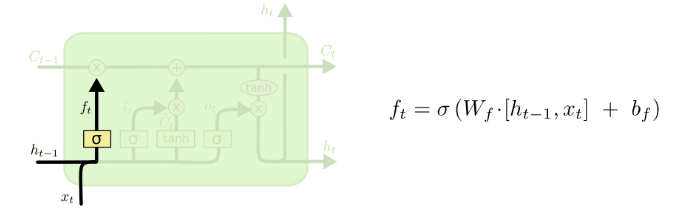
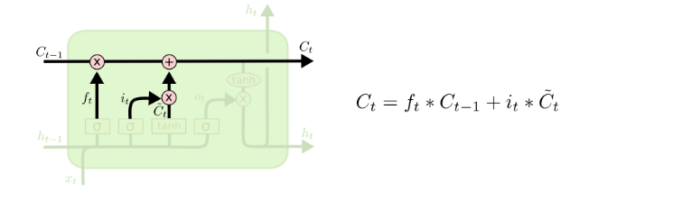
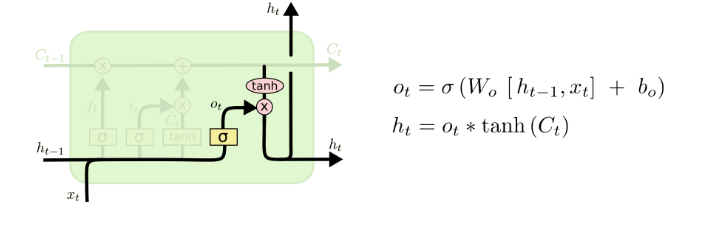
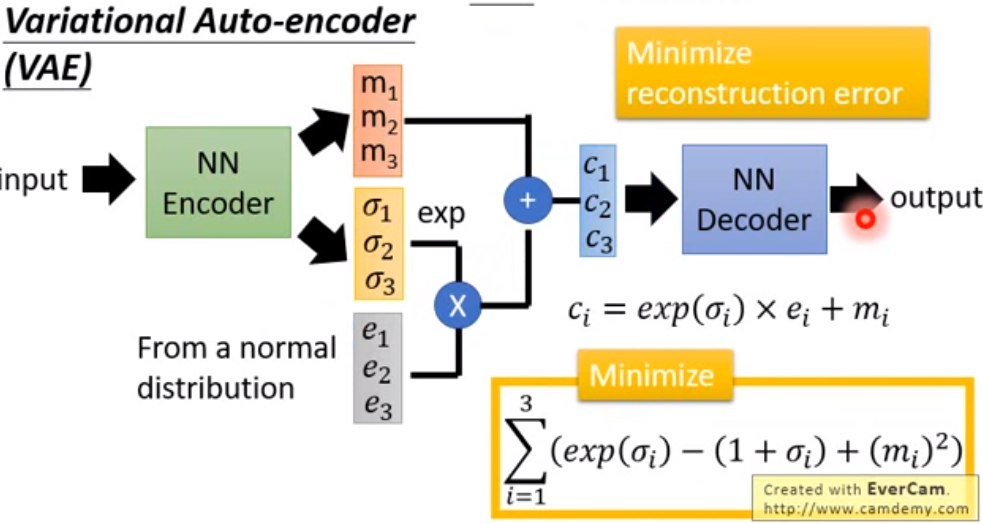
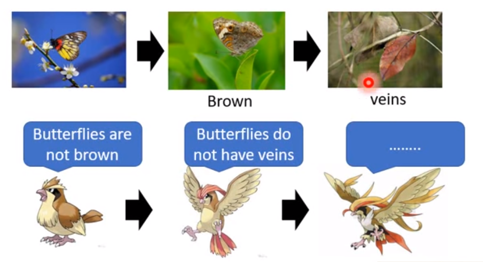
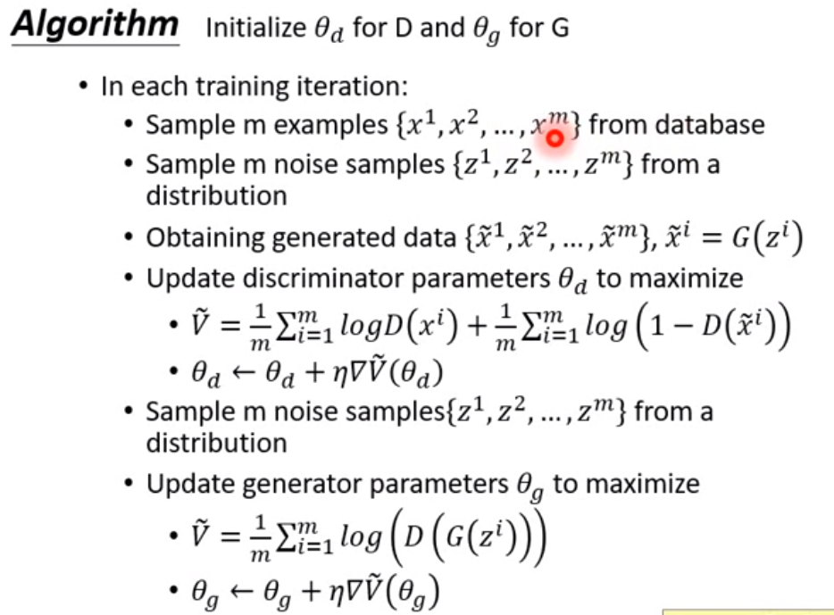

## Andrew Ng's Lectures

### Evaluation Index

#### Classification

- TP: number of correct classification of positive samples
- TN: number of correct classification of negative samples
- FP: number of wrong classification of negative samples
- FN: number of wrong classification of positive samples

**Precision** (精确度)

Number of correct classification in all samples which is classified as positive.

How many selected item is relevant?

**Recall** (召回率)

Number of samples correctly classified in all positive samples.

How many relevant item is selected?

**Receiver Operating Characteristic (ROC)**

It is graphical plot of the performance of a binary classification system as its decision threshold varies.

- Area Under ROC (AUR)

  AUR is the area under ROC curve, it represents the ratio of having a correct classification for a random positive and negative sample.

  - AUC = 1. This is a perfect classifier and in practice this is very unlikely.
  - AUC > 0.5. This is better than flipping a coin so it is kind of useful.
  - AUC = 0.5. This is same as flipping a coin. No value at all.
  - AUC < 0.5. This is bad but we can just invert the answer to obtain an AUC > 0.5, so no AUC < 0.5 exists.

### Linear Regression

#### Gradient Descent

- If cost is not decreasing for an iteration, it maybe overshoot and we can try to decrease learning rate. In theory, the cost should decrease after every iteration.

**Feature Scaling**

Scale every feature to same range (e.g. 0 ~ 1).

**Mean Normalization**

Replace $x_i$ with $x_i - \mu_i$ to have approximately zero mean.

**Automatic Convergence Test**

Stop if Cost Function decrease less than a certain threshold, (e.g. 1e-3). But choosing this threshold can be tricky.

**Choice of Feature**

We can choose/create different function for feature to create line that fits data better, for example we can use $x^2$ or $\sqrt{x}$ for curve.

#### Normal Equation

For some problems in machine learning, we often want to find a $W$ such that for input $X$ and output $Y$ we have $XW=Y$. Rearranging this we get $W=\frac{Y}{X}$. Note that this requires us to find the inverse of $X$ which only exists if $X$ is a square matrix. We can multiply $X$ by its transpose to get a square matrix, thus the equation becomes:
$$
\begin{align*}
XW=&Y\\
W=&\frac{Y}{X}\\
=&\frac{YX^T}{XX^T}\\
=&(X^TX)^{-1}X^TY
\end{align*}
$$
This is called normal equation, note that even though we ensured that it is a square matrix, there may not be a inverse for it (non-invertible / singular matrix), but luckily we have something called [p-inverse](https://en.wikipedia.org/wiki/Moore%E2%80%93Penrose_inverse) which guaranteed to return an inverse for the given matrix.

Normal equation can compute the optimal weights directly, no training is needed but it only works for small $X$ because finding the inverse is computationally inefficient $O(n^3)$.

Note that if $X^TX$ is non-invertible, this is often due to redundant(linearly dependent)/too many features (#features is more than #examples).

- **Regularization**

  With regularization, it is possible to prove that matrix exists an inverse even if there is too many features:
  $$
  (X^TX+\lambda I)^{-1}
  $$
  where $I$ is the identity matrix and $\lambda$ is the regularization term strictly greater than 0.

### Logistic Regression

Linear Regression can be useful but what if we want to classify data into classes? For binary classes we could apply a threshold to the output but finding this threshold can be tricky as the output can be any number, therefore logistic regression is developed similar to linear regression but it output values ranged from 0 to 1 and we can apply a threshold of 0.5 to the output and get the predict class easily.

The answer turns out to be simple, we can plug the output of the original linear regression to the sigmoid function and we will get a value ranged from 0 to 1.

#### Cost Function

If we use the cost function in the linear regression, it will look something like:
$$
J(\theta)=\frac{1}{m}\sum_{i=1}^{m}\frac{1}{2}(h_\theta(x^i)-y^i)^2
$$
where $h_\theta(x^i)$ is our linear regression output plugged into the sigmoid function and $y^i$ is always $1$ or $0$. But our $h_\theta$ has some nonlinearity and it causes our cost function to be non-convex which means there can be local optimal solutions. We want our function to be convex because it ensured that our result will always be global optimal.

The solution is to make use of the negative log function and get an cost function:
$$
Cost(h_\theta(x),y)=-y\log(h_\theta(x))+(1-y)\log(1-h_\theta(x))
$$
Note that if $y=1$ then only LHS of $+$ is evaluated and if $y=0$ then only RHS of the $+$ is evaluated. Their graph looks like:

Also note that since $h_\theta(x)$ is ranged from $[0,1]$, the result of the cost function will be ranged from $[0, \inf)$ determined by how far the output from its target value is.

This cost function has some nice properties including it is convex.

### Neural Network

#### Initialization

If we initialize al weights as zero, some weights maybe updated with the same function and can result in highly redundant unit. Therefore we should initialize parameters as random values (or use other better technique).

### SVM

#### Kernels

Kernels goes particularly well with svm, you can use kernels on other algorithm as well but it will not be as good as it goes with svm because there are computational tricks with svm to make it faster.

### Implementation Notes

- Graph of gradients/updates of any variable.
- Try big/small learning rate.
- Gradient Checking is useful for debugging implementation of back prop (the gradient of a parameter of a point should be similar to (grad of a point - $\epsilon$ + grad of a point + $\epsilon$) / 2$\epsilon$)

## Recurrent Neural Network (RNN)

Let say we want to translate text using neural network, how do we do it? Text come with different size so we do not have a fixed size input, instead of using a normal cell let's use a cell that will remember what it saw, called RNN cell.

Traditional cell simply keep a weight matrix and process like $\alpha(x_i \cdot w_i)$, where $\alpha$ is activation, $x_i$ is the $i$-th input and $w_i$ is $i$-th weight. Let's add an additional matrix in the cell that no other can access it, represent the memory of the cell called $h_i$, now we have $\alpha(x_i \cdot w_i + x_i \cdot h_i)$. Yeah that's it! We have a cell that remember what had been fed to it. But this is far from what we want to achieve.

#### LSTM

Okay nice, we can train it using back propagation through time but it has a problem, we have to repeatedly multiply the weight matrix during $w$ during training, this is bad because if the value in $w$ is less/more than 1, then repeatedly multiplication will cause it to be very small/large, resulting in gradient vanishing/exploding problem. So some people come up with a variant of RNN cell called LSTM.

The LSTM added some capabilities to traditional RNN. (//TODO: what is $C_t$ for?)

1. Remove some data from the previous state, called **forget gate layer**. The coefficient is calculated using sigmoid function $\sigma$.

   

2. Add only parts of the new data, called **input gate layer**. But there is a candidate value $\tilde{C}_t$ which multiply with the value we want to keep. // TODO: what this candidate is for?

   

    - Forget/Add operation happens here.

      

3. Filter the final output (//TODO: why do we need to filter?).

   

Assume we finished training and have the last hidden state to represent the current **context** of the input sentence (this is called the **encoder** part), we can try to infer from this state (this is called the **decoder** part) but it is turns out to be a bottleneck of this system as it does not hold enough information. So some people propose a solution to use all the past $h_i$ to infer the new sentence. Now we have a lot of information, more than we need, so we calculate a score (//TODO: how to calculate the score?) for each $h_i$ apply softmax (to signify higher value) and sum them: $h_i \cdot \text{softmax}(\text{score}_i)$ let's call this $hs_i$. During decoding, the same RNN cell takes in a $<end>$ input, producing the next $h_i$ and concatenate with $hs_i$ to form the final output (//TODO: why do we do this concatenation?).

But this does not solve the problem completely because people notice that gradient starts to vanish again around 2000 words. (//?)

#### CNN

https://www.youtube.com/watch?v=ugWDIIOHtPA

Some people proposed use CNN method to find long term dependency, this kind of works but not as good as attention mechanism, it allows parallel computation.

#### Attention

https://www.youtube.com/watch?v=ugWDIIOHtPA

First use in computer vision 2014, highlight parts of the image that contribute to desire output

#### Self-Attention

$$
\begin{align*}
a^i&=x^i\cdot W^i(\text{embbeding})\\
q^i&=a^i\cdot W^q(\text{query})\\
k^i&=a^i\cdot W^k(\text{key})\\
v^i&=a^i\cdot W^v(\text{value, information})\\
\alpha_{ij}&=\frac{k^i\cdot q^j}{\sqrt{dimension}}(\text{attention}^*)\\
\hat{\alpha_{ij}}&=\text{softmax}(\alpha_{ij}), (\text{softmax}(x_i)=\frac{exp(x_i)}{\sum_{i=0}^n exp(x_i)})\\
b_i&=\sum_{k=0}^n \hat{\alpha_{ij}}\cdot v_k (\text{attentioned value})
\end{align*}
$$

*The [reason](https://nlp.seas.harvard.edu/2018/04/03/attention.html) we divide by $\sqrt{d}$ is if both $k^i$ and $q^j$ matrix has mean=0 and std=1, then their dot product will have mean=0 and std = $\sqrt{d}$, by dividing $\sqrt{d}$ we can normalize the matrix. Note that each $b_i$ can be computed parallelly. Multi-head self attention is just multiple self-attention, same $a^i$ but now we have different $W$ matrix and have different $q,k,v$, multi-head attention allows different head to extract different kinds of information.

Note that we do not have positional information, so we need to add a positional vector (//what it is) to $a^i$ before computing $a^i = a^i+e^i$, $e^i$ is not learned from data. Li Hung-Yi teacher suggest to change adding $e^i$ to concatenate a position vector where $n^{th}$ dimension is $1$ and others $0$, because he thinks that it is hard to find positional information if we do addition.

Masked refers to decoder covers up some part of the input attention because we cannot allow the system to make use of information in the future.

#### Transformer

// lazy

## Auto Encoder

One of its problem is that if a code-matrix represent $1$, another code-matrix represent $3$, then add these code matrix together and divide by 2 does not necessarily output an image of $2$, it maybe just noise. So Some people propose **Variational Auto-Encoder (VAE)**.

add some noise to the input and hope that it can still learn how to produce correct output.

## GAN

> Lectures on YouTube, by 李宏毅 Hung-yi Lee

Train two networks, one called **Generator** which produce result, another called **Discriminator** which tries to discriminate the result of generator. As they evolved, better result will be produced by the generator and hopefully we will get result where the discriminator can no longer discriminate.

You first combine them into one single network, generator at the front and discriminator at the back. During training you will freeze one of them and improve another iteratively. For generator, it should try to maximize the score (gradient ascent) with random input and for discriminator it should produce a low score for generated image and high score for real image.

Generator is like the decoder part of an auto-encoder

// ? transform input to a style-matrix, use attention mechanism to convert style to different area of the image

// called content-matrix, finally generate image from content matrix?

