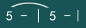
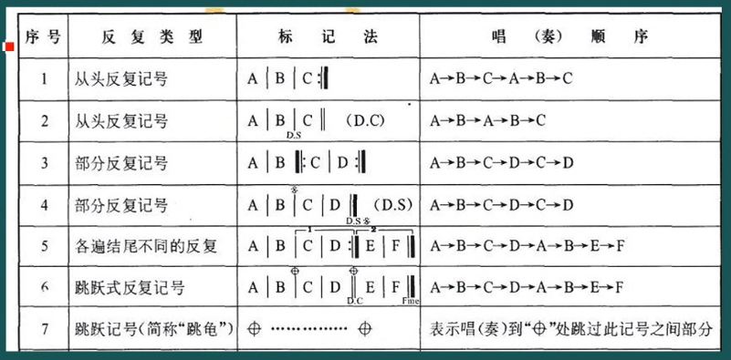

### 认识简谱

https://www.bilibili.com/video/BV1jW411J765

##### 高低

- 简谱：**1   2   3   4  5  6  7**
- 唱名：**do re mi fa so la si**
- 音名：**C   D  E   F  G  A  B**

| 名字   | 符号                                        |
| ------ | ------------------------------------------- |
| 倍低音 | $\underset{\bullet}{\underset{\bullet}{1}}$ |
| 低音   | $\underset{\bullet}{1}$                     |
| 中音   | $1$                                         |
| 高音   | $\overset{\bullet}{1}$                      |
| 倍高音 | $\overset{\bullet}{\overset{\bullet}{1}}$   |
| 休止符 | 0                                           |

##### 长短

| 名字     | 节拍         | 标记                   |
| -------- | ------------ | ---------------------- |
| 全音符   | 4拍          | $x---$                 |
| 2分音符  | 2拍          | $x-$                   |
| 4分音符  | 1拍          | $x$                    |
| 8分音符  | 1/2拍        | $\underset{-}{x}$      |
| 16分音符 | 1/4拍        | $\underset{=}{x}$      |
| 32分音符 | 1/8拍        | $\underset{\equiv}{x}$ |
| 附点音符 | 被附点的半拍 | $x\ .$                 |

##### 连音

表示第一个音演奏，第二个音不演奏。异音连接则表示平滑些的变换。

##### 切分音符

简谱前面会有一个分数，用来表示这个曲子的拍子信息，比如$\frac{2}{4}$ 表示每个小节有2拍，以4分音符为一拍。

这里$\underset{-}{6}$和$\underset{-}{3}$是8分音符，$\overset{*}{5}$是2分音符且为连音。注意8分音符是不够4分音符的，所以5是被切开的连音。

##### 强弱拍，小节线，终止线

| 名字   | 符号                                     |
| ------ | ---------------------------------------- |
| 强拍   | $\bullet$                                |
| 弱拍   | $\circ$                                  |
| 小节线 | \|                                       |
| 终止线 | $\rule{0.5pt}{10pt}\ \rule{1.5pt}{10pt}$ |

小节第一个拍永远是强拍，最后一个拍永远是弱拍。终止线表示乐曲的结束。

##### 反复记号

